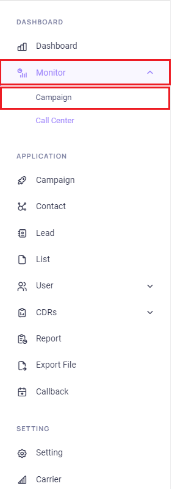
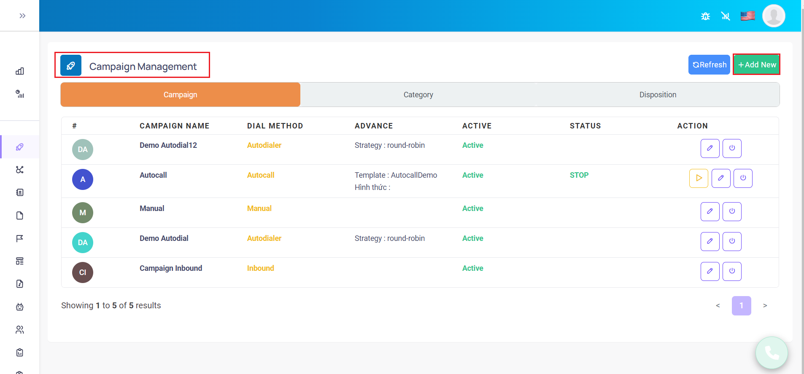
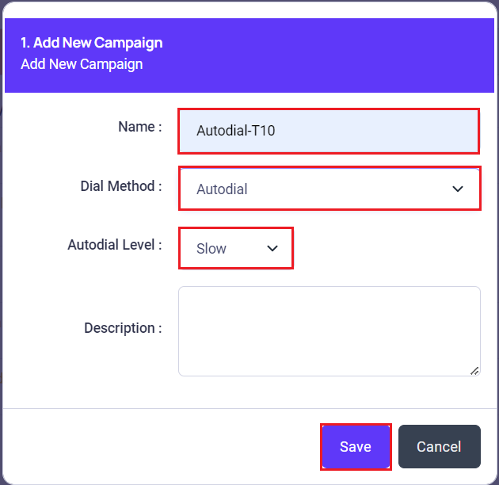
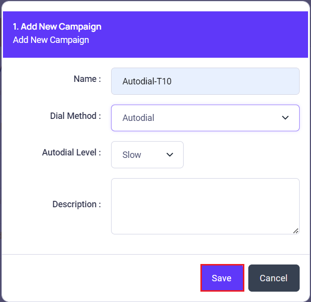
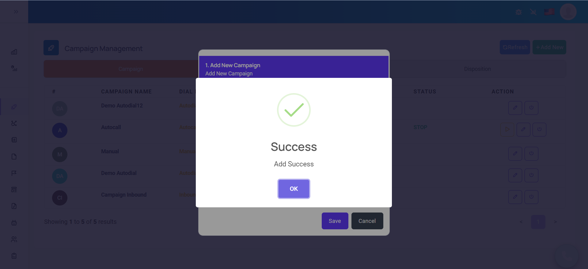
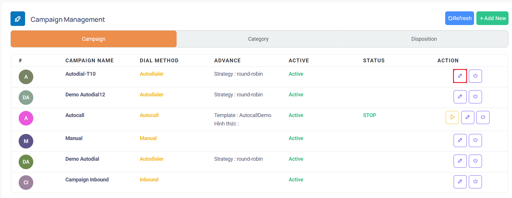
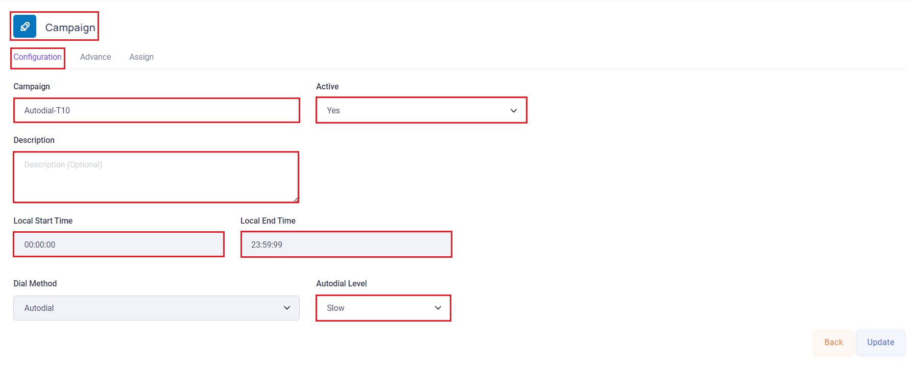
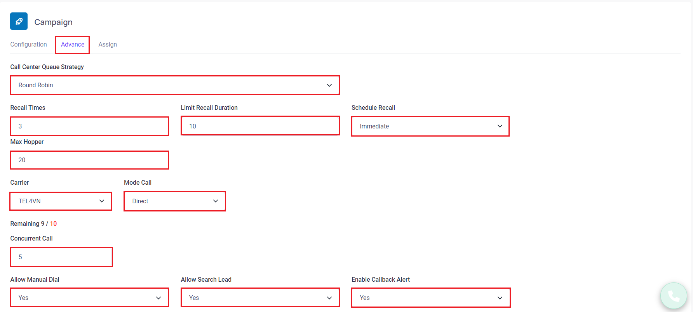
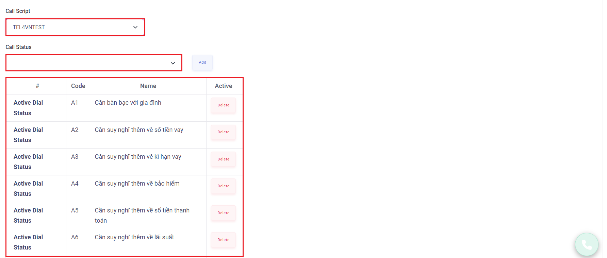
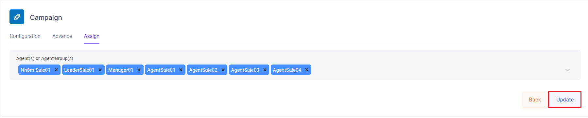

# Create Campaign

## Bước 1: Chọn vào menu Campaign


## Bước 2: Trong menu Campaign Management, chọn vào Add New để tạo thêm chiến dịch


## Bước 3: Trong bảng Thông tin Chiến dịch, nhập thông số của Chiến dịch


```jsx title="Giải thích thông số"
- Name: là tên chiến dịch
- Dial Method: có 3 loại là Manual, Inbound, Autocall và Autodial 
 + Manual là gọi thủ công, Agent click2call hoặc bấm gọi manual để gọi.
 + Autodial là hệ thống gọi tự động, Agent click **Sẵn Sàng** để vào trạng thái nhận cuộc gọi,
hệ thống sẽ tự động gọi ra nếu di động pickup thì sẽ được kết nối với Agent.
 + Inbound là chế độ để vừa gọi ra manual và gọi vào - Agent cần click **Sẵn Sàng** để vào trạng thái nhận cuộc gọi để có thể nhận cuộc gọi khi có cuộc gọi vào campaign.
- Autodial Level: được dùng để đặt tốc độ gọi của Autodial ( nếu Dial Method là Autodial thì cần phải setup)
 + Slow (x1) mỗi phút sẽ có số lượng cuộc gọi đổ ra phụ thuộc vào số lượng Agent đã chọn vào **Sẵn Sàng** (Agent trong trạng thái Ready), ví dụ có 3 Agent đã login vào hệ thống và ấn vào **Sẵn sàng**, mỗi phút sẽ có 3 cuộc gọi đổ ra, nếu có 1 Agent đang đàm thoại và 1 Agent Pause lại thì mỗi phút chỉ còn 1 cuộc gọi đổ ra
 + Normal (x2) mỗi phút sẽ có số lượng cuộc gọi đổ ra phụ thuộc vào số lượng
Agent đã chọn vào **Sẵn Sàng** (Agent trong trạng thái Ready), ví dụ có 3 Agent đã
login vào hệ thống và ấn vào **Sẵn Sàng**, mỗi phút sẽ có 6 cuộc gọi đổ ra, nếu có 1
Agent đang đàm thoại và 1 Agent Pause lại thì mỗi phút chỉ còn 2 cuộc gọi đổ ra
 + High (x3) tương tự Slow và Normal nhưng hệ số là x3
 + Advance dùng để tùy chỉnh tốc độ theo ý muốn. Có các mức độ: 1.0, 1.5, 2.0, 3.0, 4.0 và 5.0 (x1, x1.5, x2, x3, x4, x5)
- Concurrent Call: là số cuộc gọi tối đa được thực hiện tại 1 thời điểm. Dùng để đặt giới hạn số lượng cuộc gọi đồng thời cho các = Chiến dịch (nếu Dial Method là Autocall thì cần phải setup)
- Type Autocall: loại autocall, có 3 loại: Personalize (cá nhân hóa), VoiceOTP, Audio File Fixed (Tập Tin Âm Thanh Cố Định) - nếu Dial Method là Autocall thì cần phải chọn
- Description: mô tả chiến dịch, có thể có hoặc không (optional)
```

## Bước 4: Sau khi đã thiết lập các thông tin cơ bản, chọn Save để tạo chiến dịch


:::caution
Hệ thống sẽ popup báo tạo chiến dịch thành công
:::


## Bước 5: Sau khi tạo chiến dịch thành công, chọn vào Edit chiến dịch vừa tạo để tiếp tục thiết lập chi tiết cho chiến dịch


## Bước 6: Thiết lập chi tiết cho Chiến dịch

### Campaign Autodial
:::note
Trong bảng Configuration, tùy chỉnh thay đổi các thiết lập cơ bản của chiến dịch
:::


```jsx title="Giải thích thông số"
- Campaign Name: là tên chiến dịch
- Description: mô tả chiến dịch, có thể có hoặc không
- Active: Bật (yes) hoặc tắt (no) campaign
- Local Start Time: thời gian sẽ bắt đầu chiến dịch (bắt đầu đẩy số điện thoại vào hopper)
- Local End Time: thời gian kết thúc chiến dịch( sẽ ngưng không cho số điện thoại vào hopper)
- Dial Method: đặt chế độ gọi cho chiến dịch - được tùy chỉnh trong lúc tạo Chiến dịch và không thể thay đổi sau khi tạo chiến dịch
- Autodial Level: được dùng để đặt tốc độ gọi của Autodial ( nếu Dial Method là Autodial thì cần phải setup)
 + Slow (x1) mỗi phút sẽ có số lượng cuộc gọi đổ ra phụ thuộc vào số lượng Agent đã chọn vào **Sẵn Sàng** (Agent trong trạng thái Ready), ví dụ có 3 Agent đã login vào hệ thống và ấn vào **Sẵn Sàng**, mỗi phút sẽ có 3 cuộc gọi đổ ra, nếu có 1 Agent đang đàm thoại và 1 Agent Pause lại thì mỗi phút chỉ còn 1 cuộc gọi đổ ra
 + Normal (x2) mỗi phút sẽ có số lượng cuộc gọi đổ ra phụ thuộc vào số lượng
Agent đã chọn vào **Sẵn Sàng** (Agent trong trạng thái Ready), ví dụ có 3 Agent đã
login vào hệ thống và ấn vào **Sẵn Sàng**, mỗi phút sẽ có 6 cuộc gọi đổ ra, nếu có 1
Agent đang đàm thoại và 1 Agent Pause lại thì mỗi phút chỉ còn 2 cuộc gọi đổ ra
 + High (x3) tương tự Slow và Normal nhưng hệ số là x3
 + Advance dùng để tùy chỉnh tốc độ theo ý muốn. Có các mức độ: 1.0, 1.5, 2.0, 3.0, 4.0 và 5.0 (x1, x1.5, x2, x3, x4, x5)
```
:::note
Trong bảng Advance, tùy chỉnh thay đổi các thiết lập nâng cao và đầu số gọi cũng như số cuộc gọi đồng thời của chiến dịch
:::



```jsx title="Giải thích thông số"
- Call Center Queue Strategy: chế độ đổ chuông các Agent trong CallCenter của campaign đang READY. Cần setup khi Dial Method của chiến dịch là Autodial. Có các chế độ đổ cuộc gọi vào agent như Round Robin (xoay vòng có nhớ thứ tự), Ring All (xoay vòng có nhớ thứ tự), Agent có ít cuộc gọi ( Ưu tiên agent có ít cuộc gọi nhất), Từ trên xuống ( ọi agent từ trên xuống), Ngẫu nhiên (đổ cuộc gọi vào ngẫu nhiên các agent trong nhóm).
- Recall Times: tổng số lần gọi lại của campaign
- Recall When Billsec Smaller: Được tính theo đơn vị “giây”, thời lượng cuộc gọi tối thiểu trong một cuộc gọi, nếu ít hơn sẽ đưa vào danh sách gọi lại.
- Schedule Recall: có 2 chế độ là ngay lập tức (Immediate) và sau khoảng thời gian (tính theo phút - After ? minutes(s)). Chế độ ngay lập tức thì sẽ tự push ngược lại vào hopper ngay sau đó, còn sau khoảng thời gian thì sau số phút quy định đó hệ thống sẽ push ngược lại vào hopper/
- Minutes: được tính theo đơn vị “phút”, chọn khi Lập lịch gọi lại là sau khoảng thời gian (Cần setup nếu Lập lịch gọi lại setup Sau khoảng thời gian - After ? minutes(s))/
- Max Hopper: Số lead tối đa sẽ được load vào hàng đợi của campaign trong mỗi lần hệ thống load lead. Mặc định là 20
- Allow Manual Dial:  cho phép user login campaign được thao tác gọi manual/
- Allow Search Lead: cho phép Agent sử dụng chức năng Search Lead - Nhập số để gọi thì có lấy thông tin cũ, thông tin đã upload hiển thị lên giao diện của Agent hay không/
- Enable Callback Alert: cho phép Popup thông báo đến lịch Callback mà agent đã set khi đến thời gian Callback
- Dial Status: các trạng thái cuộc gọi, category - disposition agent có thể chọn sau mỗi cuộc gọi. Ngoài các Dial Status mặc định khi tạo, có thể thêm các Dial Status mới theo ý muốn hoặc xóa đi các Dial Status không cần thiết/
```

:::note
Trong bảng Assign, tùy chỉnh thay đổi các user agent được phân bổ vào chiến dịch để gọi, user leader hoặc user manager có quyền quản lý chiến dịch vào chiến dịch
:::


Sau khi hoàn thành các thiết lập tùy chỉnh của chiến dịch, chọn vào Update để lưu lại thiết lập hoặc chọn Back để bỏ qua thiết lập và chuyển về màn hình Campaign Management
