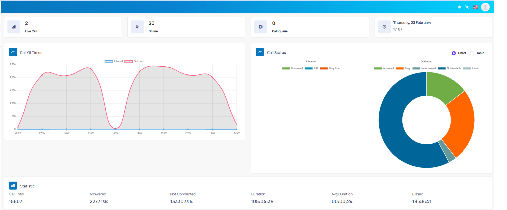

# Dashboard

Trong dashboard sẽ mô tả tổng quan web quản trị




```jsx title="Giải thích thông số"
Live Calls: Tổng số cuộc gọi đang diễn ra.
Online: Số agent đang online.
Queues: Số cuộc gọi đang trong hàng chờ khi gọi Autodialer, Inbound.
Trạng thái cuộc gọi - Call status: có 2 dạng thể hiện trạng thái cuộc gọi là Biểu đồ (Chart) và Bảng (Table).
Thống kê - Statistics: Mục này thống kê tổng số cuộc gọi (Call total), số cuộc gọi đã kết nối (Connected), chưa kết nối (Not connected), cuộc gọi hợp lệ - không sai số (Valid), thời lượng (Duration), thời lượng trung bình (Average duration), … của các cuộc gọi trong ngày.
```