# Giám sát - Monitor Call Center

## Bước 1: Chon vào menu Giám sát - Monitor, sau đó chọn vào menu Call Center

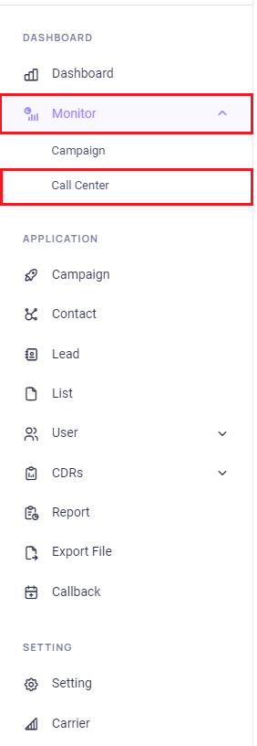

## Bước 2: Tích chọn biểu đồ cần hiển thị 
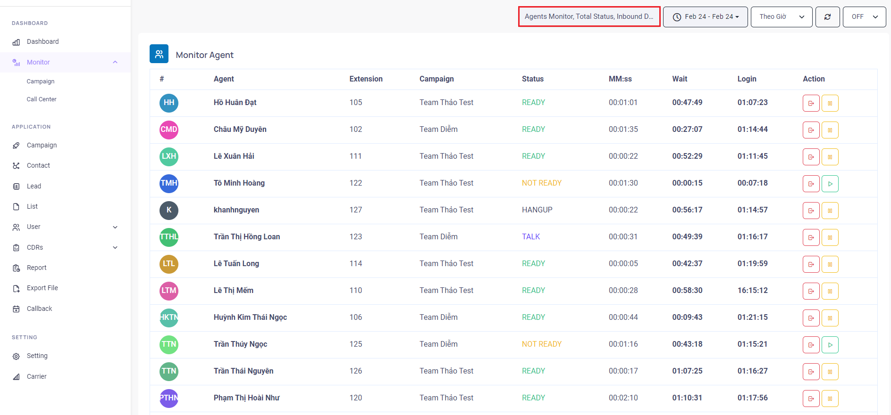

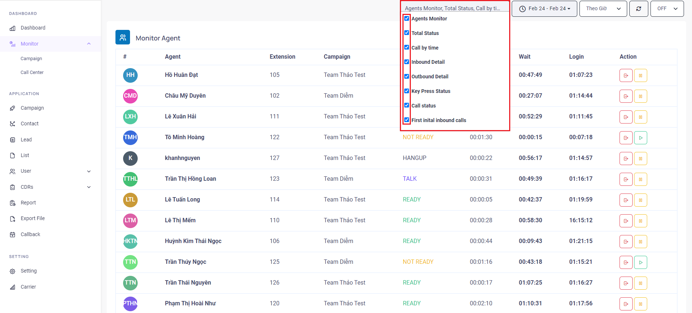

## Bước 3: Chọn thời gian cần giám sát, sau đó chọn Apply
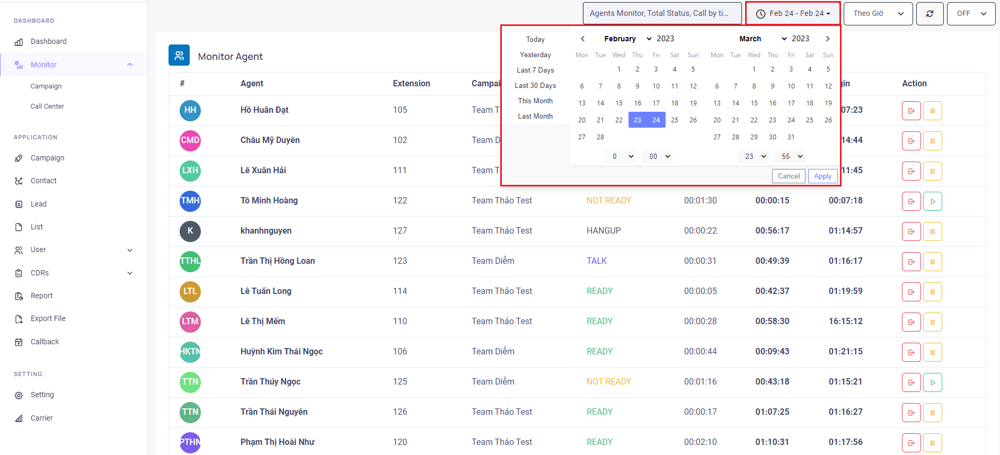

## Bước 4: Chọn đơn vị thời gian cần filter
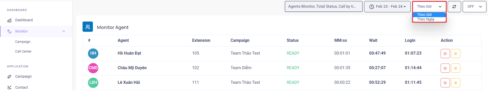

:::note
Giải thích: nếu chọn giá trị filter là giờ thì hệ thống sẽ hiển thị thống kê theo giờ. Nếu chọn giá trị filter là ngày thì hệ thống hiển thị thống kê theo từng ngày ngày.
:::

## Bước 5: Nhấn vào nút Refresh để làm mới dữ liệu ngay
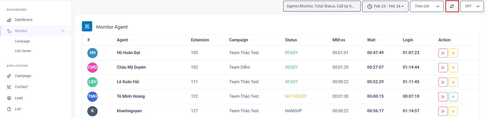

## Bước 6: Tùy chỉnh thời gian hệ thống tự làm mới dữ liệu
Chọn thời gian mong muốn

## Bước 7: Các thống kê sẽ được hiển thị với 2 tùy chọn Biểu đồ và Bảng
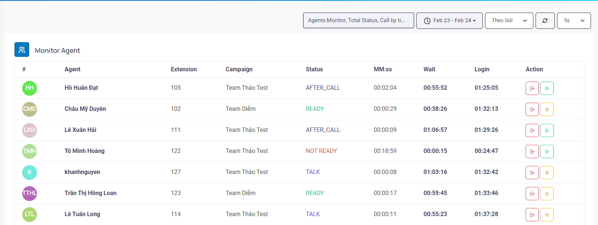
:::info
Monitor Agent Realtime
:::

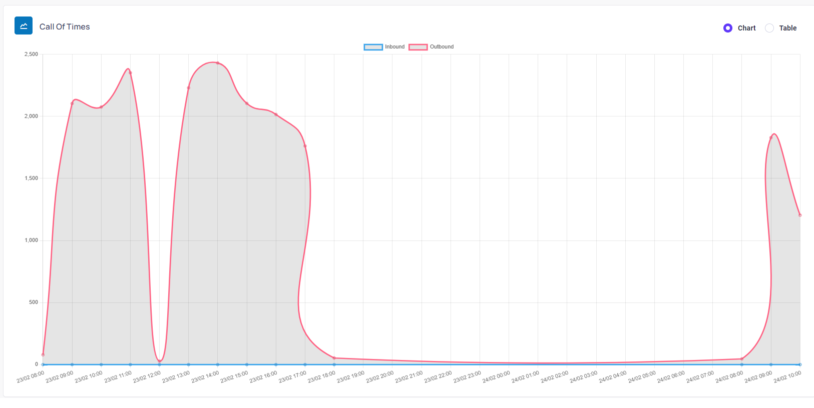
:::info
Report Call Of Time
:::

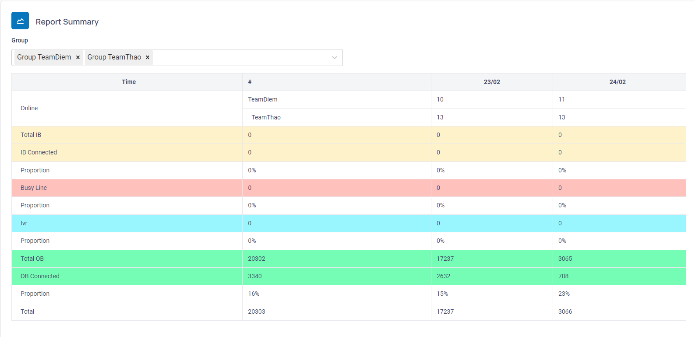
:::info
Report Summary CallCenter
:::

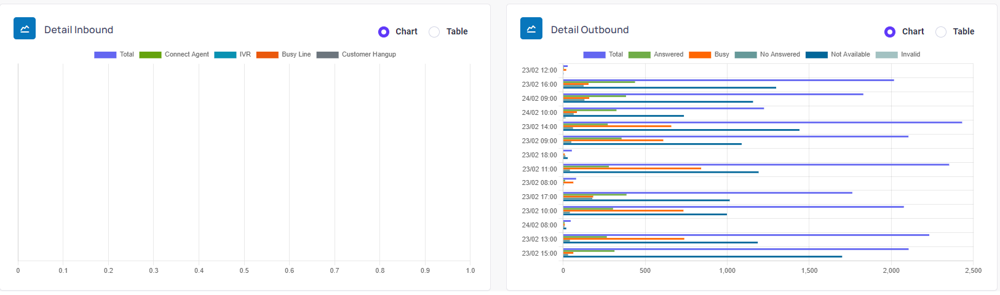
:::info
Detail Inbound & Outbound
:::

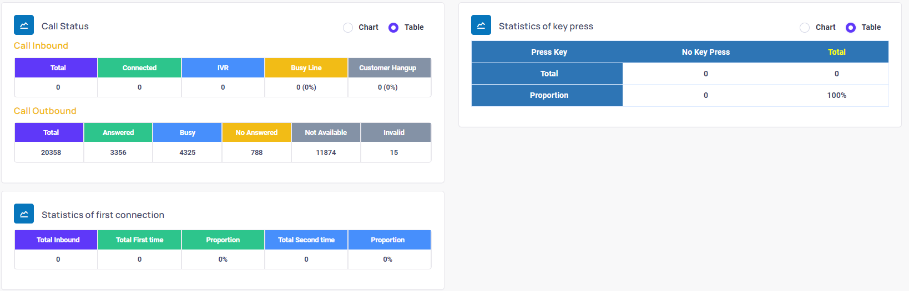
:::info
Report Call Status, Statistics & Press Key
:::

## Các chức năng thống kê, giám sát Call Center

### a. Giám sát agents - Agent Monitor

   Trong menu Agent Monitor, sẽ bao gồm các thông tin: Agent (tên Agent), Extension (Máy nhánh Agent sử dụng), Campaign (Chiến dịch Agent login), Status (trạng thái của Agent), MM:SS (thời gian Agent đang nhập trong Campaign, sẽ được làm mới khi agent logout/login), Wait (thời gian chờ cuộc gọi), Login (tổng thời gian Login của Agent), Action Remote Logout Agent (kích agent logout từ xa), Action Remote Pause/Resume Agent (chuyển trạng thái agent từ xa)

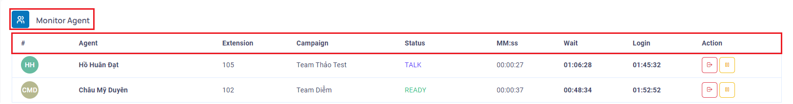

#### a.1. Remote Logout Agent
Để thực hiện action Remote Logout Agent, click vào biểu tượng logout tại Agent muốn kích. Sau khi click chuột hệ thống sẽ tiến hành kích Agent ra khỏi campaign.

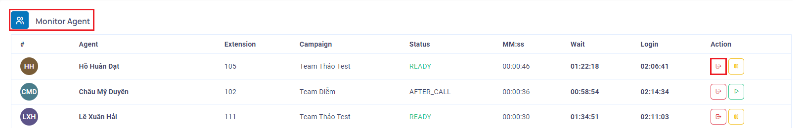

Phía Agent sẽ hiện thông báo bị logout và tự logout khỏi campaign

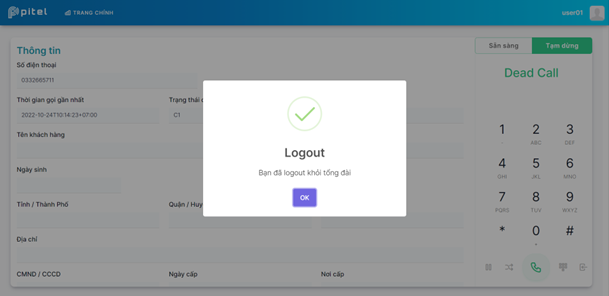

#### a.2. Remote Pause/Resume Agent 
Để thực hiện action Remote Pause/Resume Agent, click vào biểu tượng chuyển trạng thái tại Agent muốn kích. Sau đó chọn vào Yes trong popup hiện lên để chuyển trạng thái Agent

:::note
Pause Agent 
:::

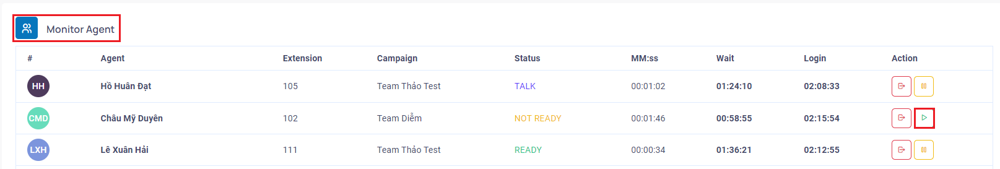
:::note
Resume Agent 
:::
### b. Thống kê tổng hợp - Report Summary
Bao gồm các thông tin: Tổng SL IB (Tổng SL Inbound), IB Connected (Inbound Connected), Tỉ trọng (tỉ lệ connect), Busy Line (cuộc gọi nhỡ), Tỉ trọng (cuộc gọi nhỡ), OB (Outbound), OB Answered, Total trong ngày đã chọn

Để thực hiện thống kê tổng hợp theo thời gian, thao tác như sau:

#### b.1. Chọn nhóm cần tổng hợp
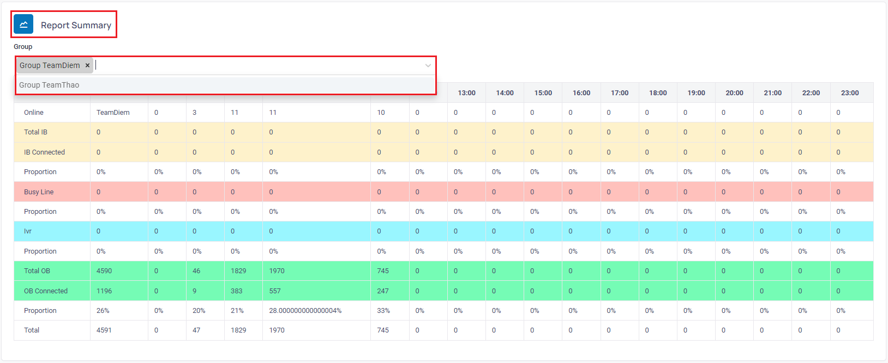
#### b.2. Nhấn vào nút Refresh để làm mới dữ liệu ngay hoặc sau thời gian tùy chỉnh
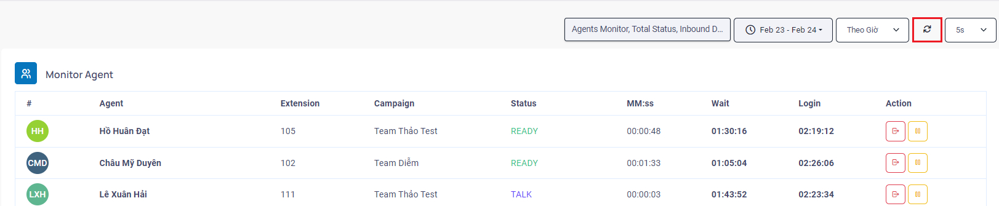
#### b.3. Dữ liệu thống kê sẽ được cập nhật
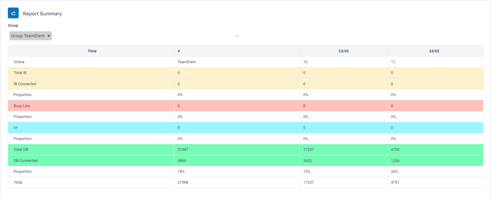

### c. Cuộc gọi theo thời gian - Call by time
Thống kê cuộc gọi Inbound và Outbound theo thời gian. Có 2 dạng hiển thị thống kê:
#### c.1. Thống kê dạng Chart (Biểu Đồ)
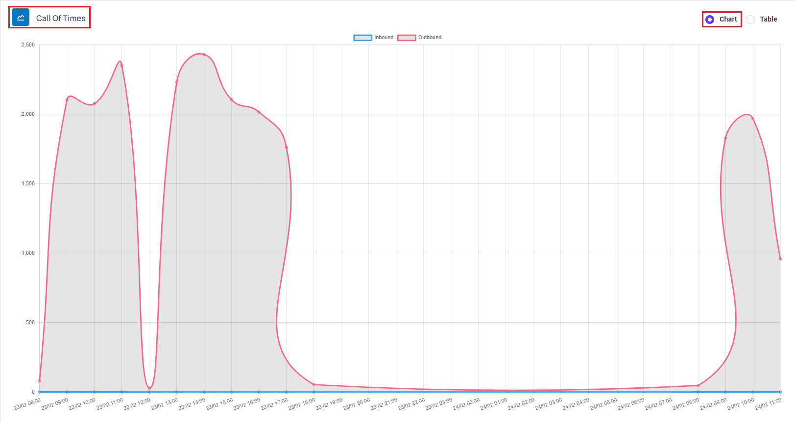
#### c.2. Thống kê dạng Table (Bảng)
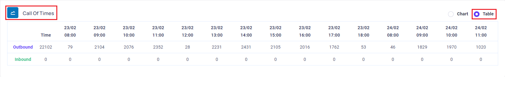

### d. Chi tiết cuộc gọi vào - Inbound detail
Thống kê chi tiết theo từng trạng thái của cuộc gọi Inbound theo thời gian trong một khoảng thời gian, bao gồm: Total (tổng SL), Kết nối Agent, IVR, Busy Line, KH ngắt máy
Thống kê chi tiết cuộc gọi Inbound theo thời gian có 2 dạng hiển thị thống kê:
#### d.1. Thống kê dạng Chart (Biểu Đồ)
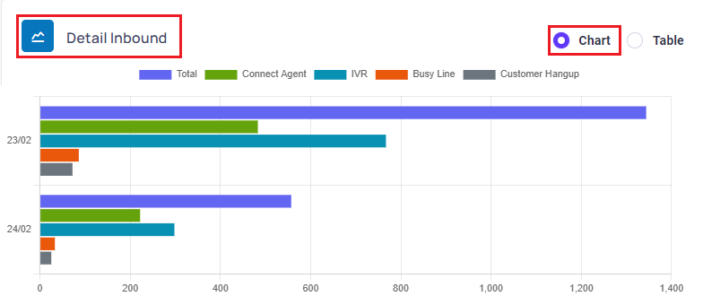
#### d.2. Thống kê dạng Table (Bảng)
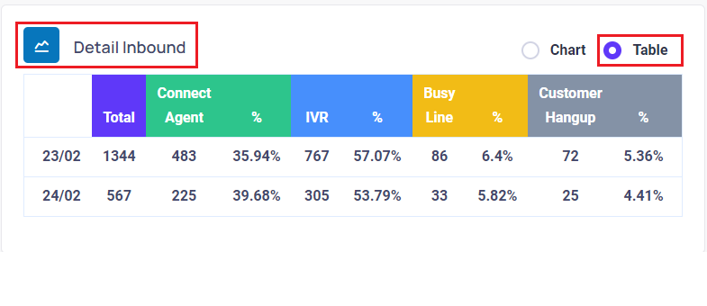

### e. Chi tiết cuộc gọi ra - Outbound detail
Thống kê chi tiết theo từng trạng thái của cuộc gọi Outbound theo thời gian trong một khoảng thời gian, bao gồm: Total (tổng SL), Kết nối Agent (Kết nối), Bận, Không nghe máy, Không liên lạc được và Lỗi
Thống kê chi tiết cuộc gọi Outbound theo thời gian có 2 dạng hiển thị thống kê:
#### e.1. Thống kê dạng Chart (Biểu Đồ)
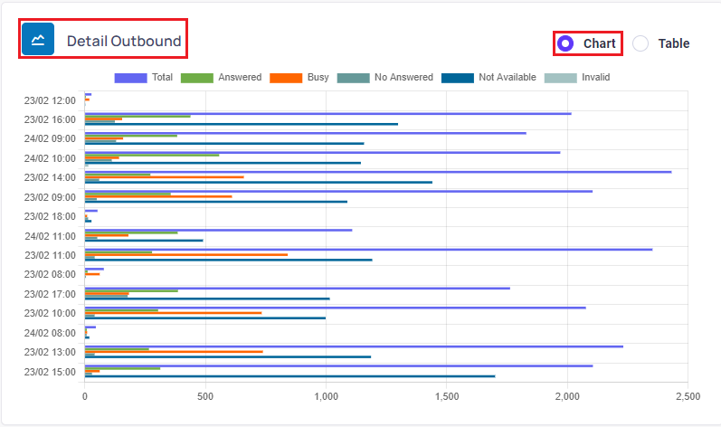
#### e.2. Thống kê dạng Table (Bảng)
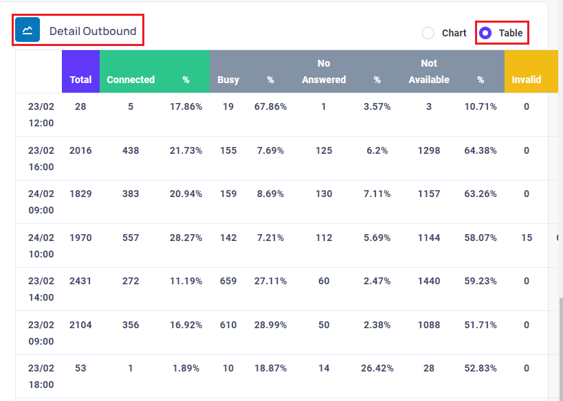

### f. Trạng thái cuộc gọi - Call Status
- Thống kê số lượng các trạng thái cuộc gọi trong một khoảng thời gian. 
- Bao gồm cuộc gọi Inbound (Tổng SL, Kết nối Agent, IVR, Busy Line) và Outbound (Tổng SL, Kết nối, Bận, Không nghe máy, Không liên lạc được, Lỗi)
- Thống kê trạng thái cuộc gọi có 2 dạng hiển thị thống kê:
#### f.1. Thống kê dạng Chart (Biểu Đồ)
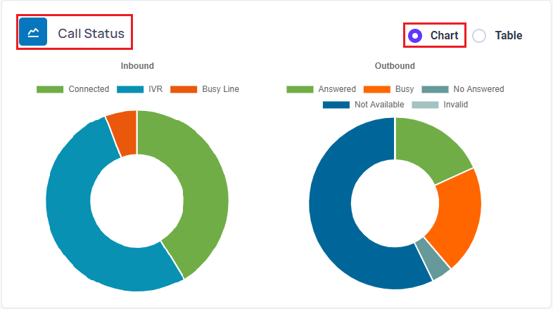
#### f.2. Thống kê dạng Table (Bảng)
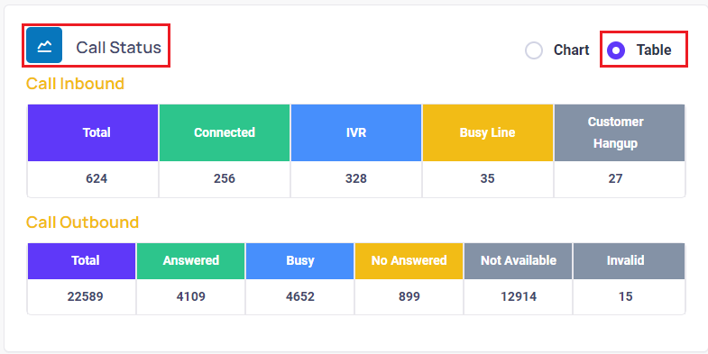

### g. Thống kê phím bấm - Key press statistics
- Thống kê trạng thái bấm phím tại IVR trong một khoản thời gian, bao gồm: Phím 1, Phím 2, Phím 3, Phím 4, Phím 5, Phím 6, Phím 7, Phím 8, Phím 9, Phím 0, ... và Không nhấn phím. Trong các dữ liệu trên, nếu thống kê nào không có dữ liệu sẽ không hiển thị vào thống kê
- Thống kê trạng thái bấm phím có 2 dạng hiển thị thống kê:
#### g.1. Thống kê dạng Chart (Biểu Đồ)
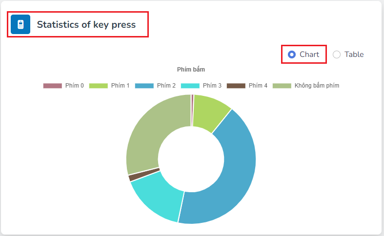
#### g.2. Thống kê dạng Table (Bảng)
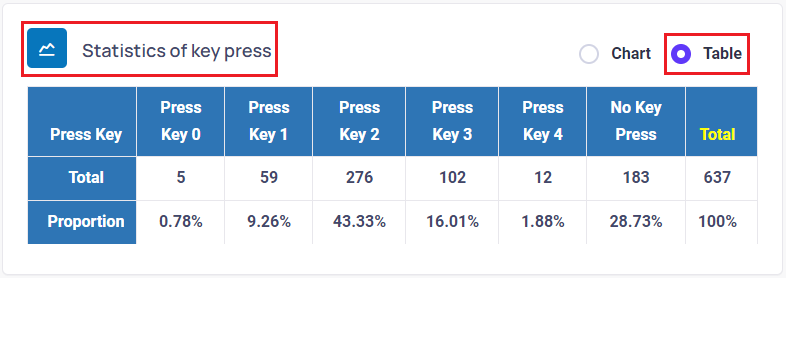