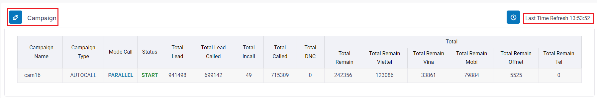
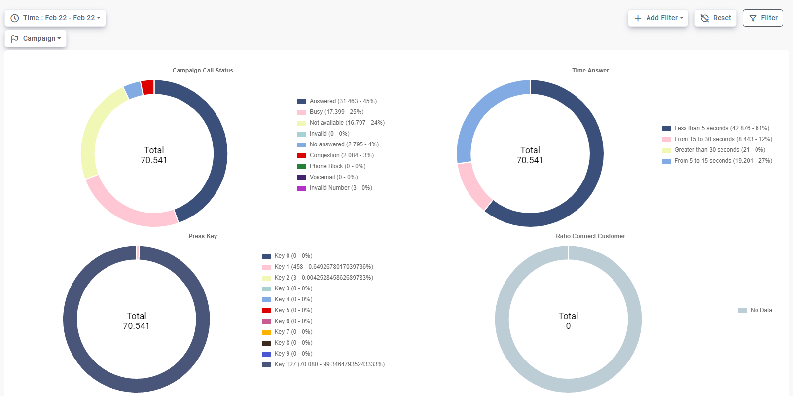
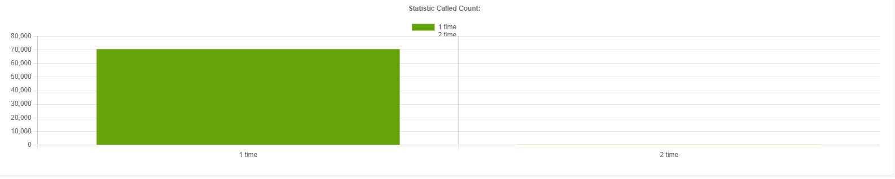
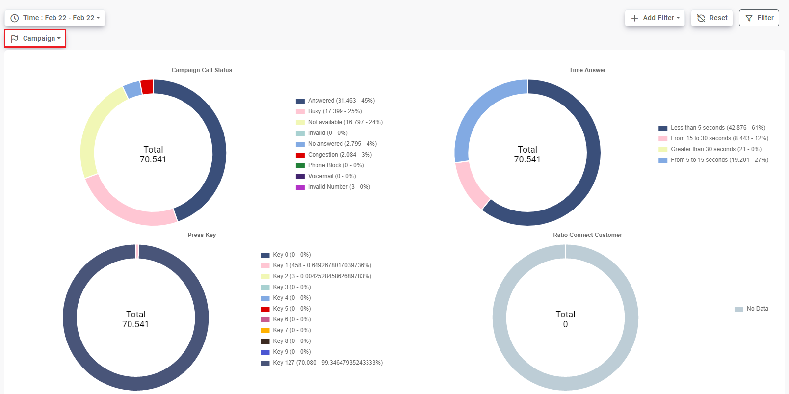
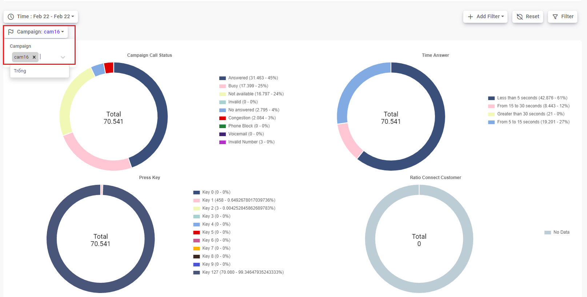
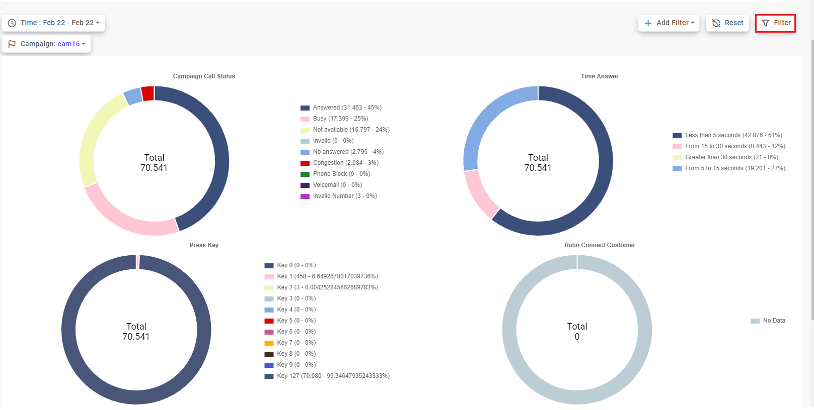
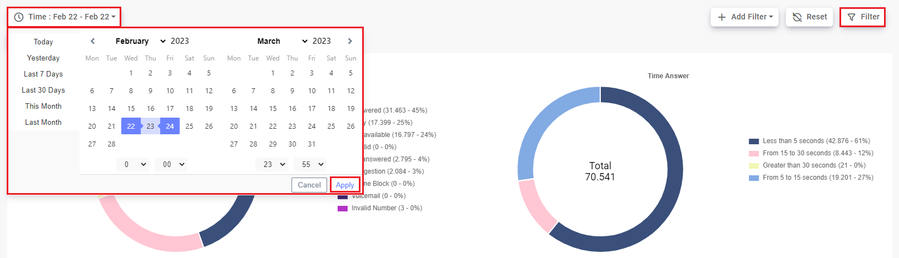

# Monitor Campaign Autocall


## Chọn vào menu Monitor, sau đó chọn vào menu Campaign


Tại menu Monitor Campaign sẽ hiển thị các chiến dịch có trong hệ thống


```jsx title="Giải thích thông số"
- Campaign Name: Tên chiến dịch.
- Campaign Type: Loại chiến dịch, có các loại chiến dịch: AUTOCALL, AUTODIALER, INBOUND, MANUAL.
- Mode Call: chế độ gọi của chiến dịch, có các chế độ gọi: SIM PARALLEL, SIM SERIAL, SIP, SIP SERIAL.
- Status: trạng thái của chiến dịch, có các trạng thái: START, STOP, PAUSED.
- Total Lead: tổng số lead của chiến dịch.
- Total Lead Called: tổng số lead đã gọi của chiến dịch.
- Total Incall: số cuộc gọi đồng thời hay tổng số cuộc gọi đang gọi ở thời điểm hiện tại.
- Total Called: số cuộc gọi đã gọi của chiến dịch.
- Total DNC: số lead DNC trong chiến dịch.
- Total Remain: số lead còn lại trong chiến dịch.
- Total Remain Viettel: số lead Viettel còn lại trong chiến dịch.
- Total Remain Vina: số lead Vina còn lại trong chiến dịch.
- Total Remain Mobi: số lead  Mobi còn lại trong chiến dịch.
- Total Remain Offnet: số lead Mạng khác còn lại trong chiến dịch.
- Total Remain Tel: số lead số bàn còn lại trong chiến dịch.
```

:::tip
Ngoài việc monitor realtime các campaign trên hệ thống, menu Monitor Campaign còn cung cấp một số thống kê 
:::



```jsx title="Giải thích thông số"
- Campaign Call Status: thống kê theo trạng thái cuộc gọi của chiến dịch.
- Time Answer: thống kê theo thời gian nghe máy mỗi cuộc gọi trong chiến dịch.
- Press Key: thống kê bấm phím của chiến dịch.
- Ratio Connect Customer: tỉ lệ kết nối với khác hàng.
- Statistic Called Count: thống kê theo số lần gọi.
```
#### Để thống kê theo campaign chọn vào bộ lọc Campaign và chọn Campaign muốn thống kê. Sau đó nhấn Filter
Chọn vào bộ lọc Campaign



Chọn Campaign muốn thống kê



Nhấn filter 


#### Ngoài ra, có thể chọn thời gian thống kê bằng cách chọn thời gian bắt đầu và thời gian kết thúc thống kê rồi nhấn Apply. Sau đó nhấn Filter
