## Advanced Setup - Thiết lập nâng cao

### Bước 1: Truy cập vào thanh menu góc phải màn hình và nhấp chọn menu Campaign. 
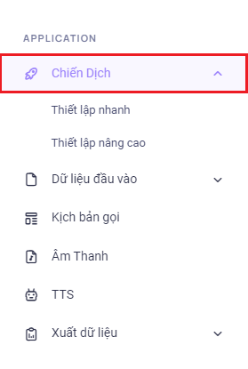
### Bước 2:  Chọn vào Thiết Lập Nâng Cao.
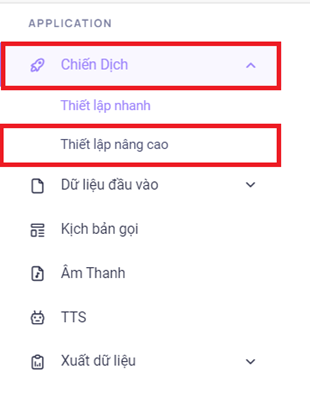
### Bước 3: Sau khi ấn chọn Thiết Lập Nâng Cao, hệ thống sẽ chuyển tới màn hình Quản Lý Chiến Dịch. Menu này được dùng để tiến hành tạo mới chiến dịch, điều chỉnh và thay đổi cấu hình chiến dịch đã tạo rồi.
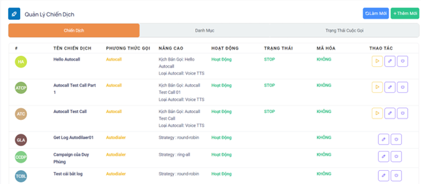
### Bước 4: Để tạo mới một chiến dịch ấn vào Thêm Mới sau đó tiến hành điền tên chiến dịch mong muốn và chọn loại Autocall
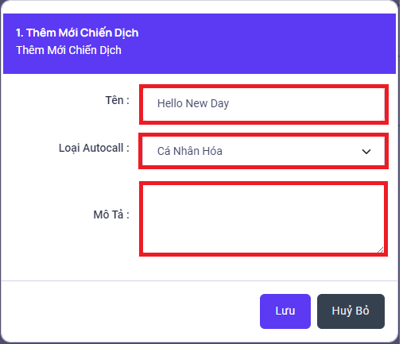
### Bước 5: Để tiến hành điều chỉnh chiến dịch vừa tạo mới hoặc những chiến dịch đã tạo ấn vào biểu tượng bút chì ngay cột Thao Tác
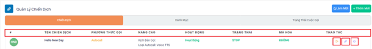

```jsx title="Giải thích thông số"
- Tên chiến dịch: hiển thị tên chiến dịch đã đặt.
- Phương thức gọi: Autocall
- Nâng cao: hiển thị kịch bản gọi nếu có và loại Autocall là file voice hoặc Text To Speech (chuyển đổi thoại).
- Hoạt động: trạng thái hoạt động của chiến dịch có hai loại là Hoạt Động chiến dịch có thể đổ cuộc gọi ra thuê bao và Huỷ Kích Hoạt thì chiến dịch không thể đổ cuộc gọi ra được.
- Trạng thái: trạng thái của chiến dịch hiện tại có ba kiểu trạng thái là Start, Stop và Pause.
 + Start: ở trạng thái này chiến dịch sẽ cho gọi dữ liệu mà khách hàng đã tải lên từ đầu.
 + Stop: ở trạng thái này chiến dịch sẽ không thể gọi dữ liệu mà khách hàng đã tải lên từ đầu. Bên cạnh đó, nếu chiến dịch đang ở trạng thái Stop thì sẽ dừng hoàn toàn và không tự động đổ cuộc gọi mặc dù chiến dịch đã thiết lập thời gian bắt đầu.
 + Pause: ở trạng thái này chiến dịch sẽ không thể gọi dữ liệu mà khách hàng đã tải lên từ đầu. Bên cạnh đó, nếu chiến dịch đang ở trạng thái Pause thì vào đúng thời gian lập lịch bắt đầu trước đó chiến dịch sẽ tự động chuyển thành start và đổ cuộc gọi ra.
- Thao tác: bao gồm 3 thao tác là nút chuyển trạng thái Start/Stop/Pause, Chỉnh Sửa Chiến Dịch và Kích Hoạt/ Huỷ Kích Hoạt Chiến Dịch.
 + Nút chuyển trạng thái được ký hiệu là tam giác nằm ngang dùng để thay đổi trạng thái của chiến dịch.
 + Chỉnh sửa được ký hiệu là cây bút chỉnh sửa các thông số cấu hình của chiến dịch hiện có.
 + Kích hoạt được ký hiệu biểu tượng công tắc dùng để kích hoạt chiến dịch hoạt động hoặc hủy kích hoạt. Ngoài việc huỷ kích hoạt không cho chiến dịch gọi ra thì sau khi huỷ có thể thực hiện thêm thao tác xóa chiến dịch. 
```
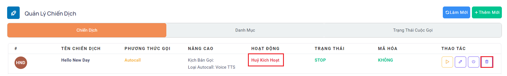

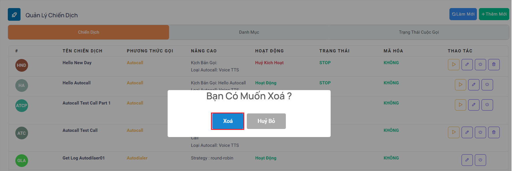

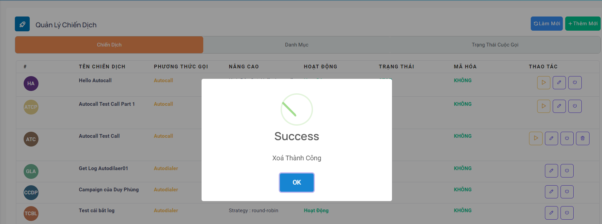

### Bước 6: Thực hiện chỉnh sửa sau khi ấn vào biểu tượng cây bút ở cột Thao Tác. Ở Menu Cấu Hình sẽ bao gồm các thông tin như tên Chiến Dịch, Trạng Thái Hoạt Động, Mô Tả và Lập Lịch
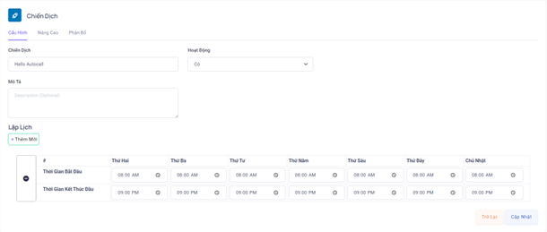

### Bước 7: Di chuyển qua Menu Nâng Cao để tiến hành điều chỉnh các cấu hình liên quan đến phương thức đổ cuộc gọi của chiến dịch. Sau khi điều chỉnh hoàn tất ấn Cập Nhật để áp dụng các cấu hình mới
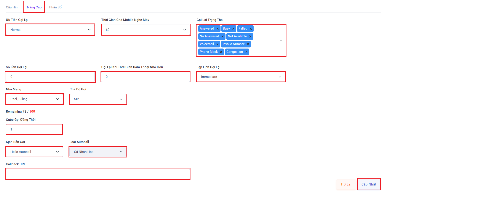

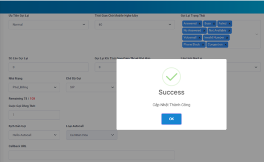

```jsx title="Giải thích thông số"
- Chiến dịch: tên chiến dịch
- Hoạt động: bật/tắt hoạt động của chiến dịch
- Ưu tiên gọi lại: gồm hai loại ưu tiên cuộc gọi Normal, Recall
 + Normal: các cuộc gọi sẽ được ưu tiên theo thứ tự cuộc gọi trạng thái new đổ trước sau đó mới cho đổ các cuộc gọi được cấu hình gọi lại (recall).
 + Recall: các cuộc gọi sẽ ưu tiên cho các cuộc gọi được cấu hình gọi lại. Tuỳ vào thời gian thiết lập các cuộc gọi lại sẽ đổ ra và gọi ngay trong khi cuộc gọi mới đang đổ nếu chức năng Recall này được bật. 
- Trạng thái gọi lại: các trạng thái của một cuộc gọi, ấn chọn ở đây để gọi lại các cuộc gọi có trạng thái tương ứng.
 + Answered: Mobile nghe máy.
 + No Answered: mobile không nghe máy.
 + Busy: mobile từ chối cuộc gọi bằng cách chủ động ngắt máy hoặc chặn số trên thiết bị.
 + Not Available: mobile ở chế độ máy bay, không liên lạc được, thiết bị di động hư hỏng, hết pin.
 + Invalid Number: gọi ra tới nhà mạng nhưng nhà mạng báo sai số (số mobile sai).
 + Phone Block: số mobile khách hàng bị khóa.
 + Congestion: đầu số gọi auto call bị nhà mạng chặn, bị khóa.
 + Fail: template lỗi, script lỗi, script bị xoá, hết key zalo.
- Kịch bản gọi: có thể là một file audio được ghi âm sẵn hoặc một mẫu Text To Speech (chuyển đổi thoại). 
- Số lần gọi lại: số lần một thuê bao được gọi tới.
- Gọi lại khi thời gian đàm thoại nhỏ hơn: thời gian đàm thoại của những cuộc gọi được mobile nghe máy nào thấp hơn thời gian quy định trong menu này thì đều được gọi lại.
- Lập lịch gọi lại: gồm 2 chế độ là Ngay lập tức và Sau bao nhiêu phút. Ở bao nhiêu phút có thể thiết lập số thời gian quy định để gọi lại. Ví dụ chỉnh là 5 phút thì 5 phút sẽ thực hiện gọi lại thuê bao đó 1 lần.
- Nhà mạng: đầu số được dùng để gọi ra
- Chế độ gọi: bao gồm 3 chế độ gọi là SIP Direct, SIM Nối Tiếp và SIM Song Song
 + SIP Direct: chế độ này cho phép gọi ra một cách trực tiếp cho tất cả các nhà mạng mà không phải chia kênh cho từng nhà mạng cụ thể. Trong khi chạy chế độ này cần quan tâm đến việc quy định số lượng cuộc gọi đồng thời đã đăng ký với nhà quản trị vì nếu điều chỉnh không đúng sẽ không đạt được kết quả như mong muốn. Chỉnh thấp hơn thì không tận dụng được tài nguyên có sẵn và cao hơn thì hệ thống không được thiết lập để đáp ứng sẽ ảnh hưởng đến quá trình sử dụng.
 + SIM Song Song: chế độ này gọi trực tiếp cho các nhà mạng thông qua việc phân chia kênh thoại trên hệ thống. Khi gọi với chế độ này hệ thống sẽ tự động đẩy call với số lượng cuộc gọi đồng thời theo thiết lập của người dùng.
 + SIM Nối Tiếp: chế độ này gọi trực tiếp cho các nhà mạng thông qua việc phân chia kênh thoại trên hệ thống.Khi gọi với chế độ này hệ thống sẽ tự động luân chuyển các kênh trống qua lại giữa các chiến dịch nhằm đảm bảo hiệu suất tối ưu và không gây lãng phí tài nguyên.
- Thời gian mobile nghe máy: thời gian đợi cho thuê bao nghe máy nếu quá thời gian này hệ thống sẽ tự động ngắt máy.
- Số cuộc gọi đồng thời: số lượng cuộc gọi đổ ra cùng một lúc.
- Lập lịch: thiết lập thời gian bắt đầu và kết thúc của một chiến dịch theo các ngày trong tuần.
- Callback URL: đường dẫn webhook nhận event CDR sau mỗi cuộc gọi.
```
### Bước 8: Sau khi Cập Nhật hoàn tất ấn thao tác chuyển trạng thái chiến dịch sang Start để đổ cuộc gọi ra.
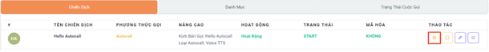

Ở mục Nâng Cao khi ấn Start sẽ hiển thị Menu Chạy Chiến Dịch có thể ấn chạy mỗi chiến dịch không cần xét chiến dịch đó có dữ liệu khách hàng hay chưa hoặc có thể upload bằng cách ấn mũi tên để hiện ra lựa chọn tải lên.
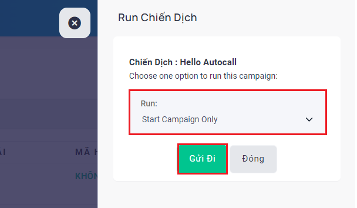

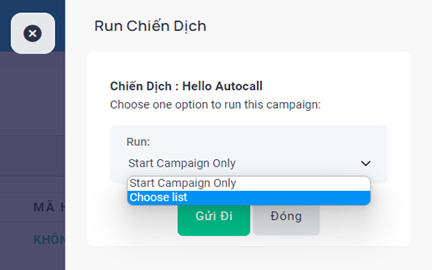

Ấn vào lựa chọn Choose List để thực hiện tải dữ liệu lên từ thiết bị cá nhân
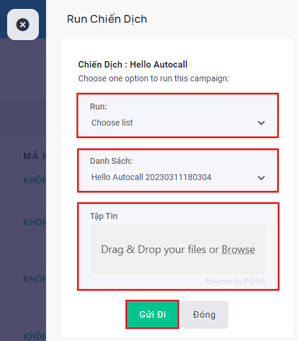

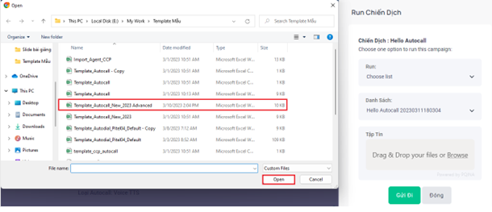
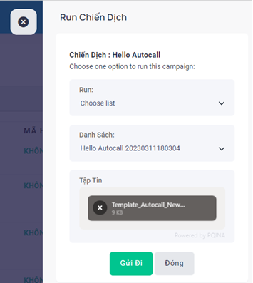
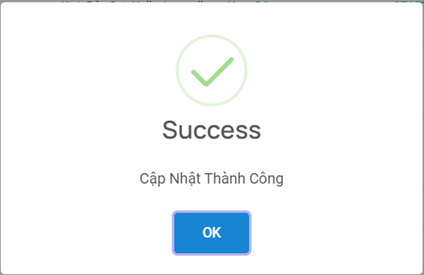