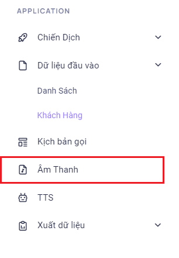
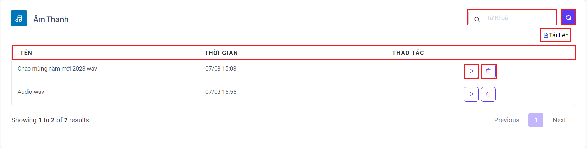
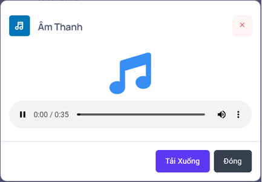
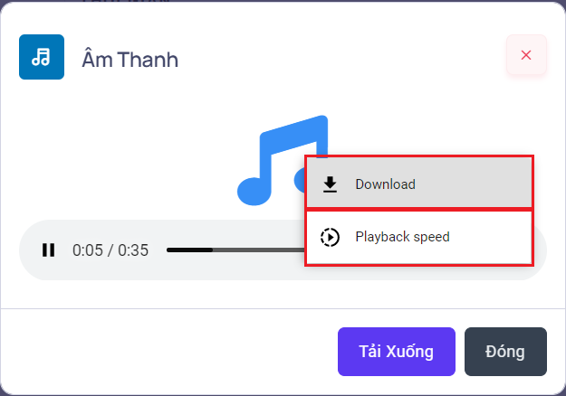
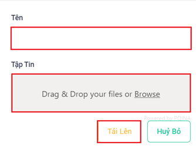
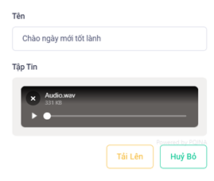
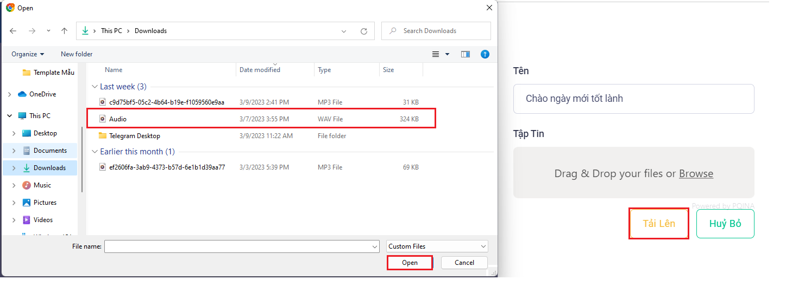
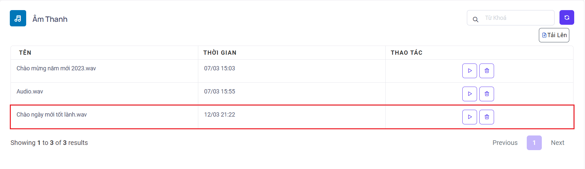

## Audio - File Âm Thanh

Menu âm thanh được dùng để tải lên những tệp âm thanh, đoạn nội dung, nhạc đã được chuyển đổi theo đúng các thông số 16 Bit, 8000Hz, Mono. Sau khi tải lên có thể sử dụng các tệp âm thanh, đoạn nội dung trên để làm kịch bản cho chiến dịch.

### Bước 1: Truy cập vào thanh menu góc phải màn hình và nhấp chọn menu  Âm Thanh


### Bước 2: Ở menu Âm Thanh sẽ lưu trữ các tệp âm thanh, đoạn nội dung, nhạc và dùng để tải lên các file trên đồng thời có thể chỉnh sửa, xoá tuỳ vào nhu cầu sử dụng


```jsx title="Giải thích thông số"
- Tên: hiển thị tên của tệp âm thanh.
- Thời gian: thời gian tải lên của tệp âm thanh.
- Thao tác: bao gồm 2 thao tác phát tệp âm thanh được kí hiệu là tam giác nằm ngang và xoá tệp âm thanh ký hiệu thùng rác. Ấn vào nút ba chấm để tải xuống tệp âm thanh đang nghe và điều chỉnh tốc độ phát.
```




```
- Từ khoá: được dùng để tìm kiếm tên tệp âm thanh.
- Tải lên: tải các tệp âm thanh từ thiết bị cá nhân
```





### Bước 3: Sau khi tải lên thành công tệp âm thanh được hiển thị ở đây.
