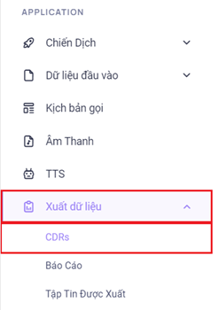
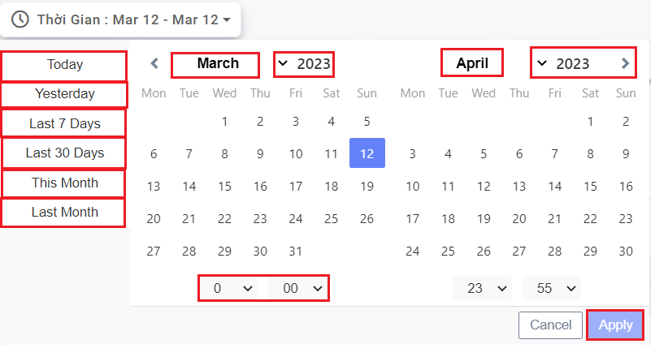
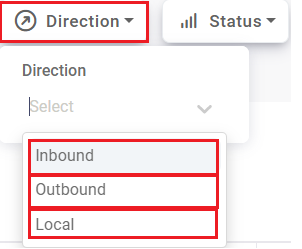
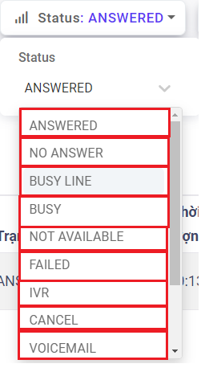
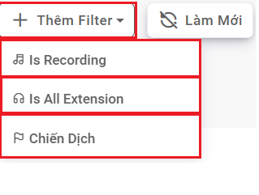
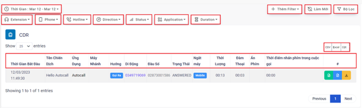
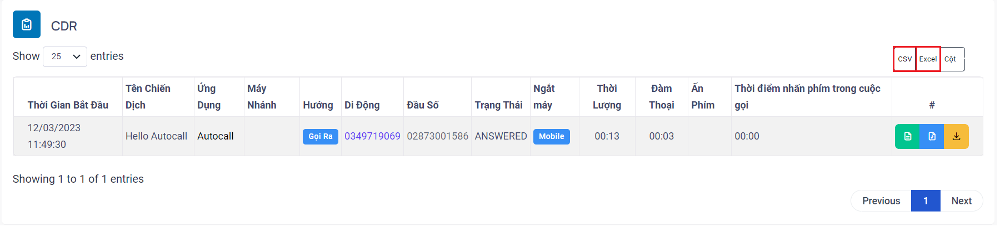
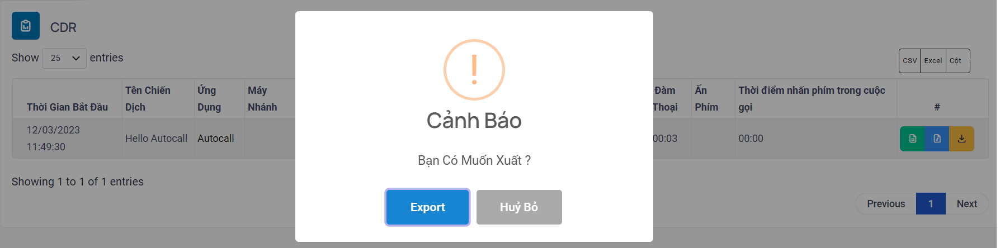
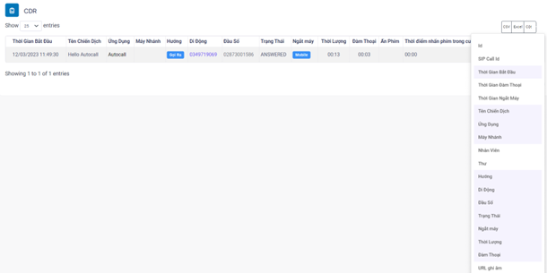

## CDRs - Lịch Sử Cuộc Gọi

CDRs viết tắt là Call Detail Records là nơi lưu trữ thông tin chi tiết cuộc gọi. Ở đây bao gồm nhiều trường thông tin xoay quanh một cuộc gọi như thời gian bắt đầu cuộc gọi, thời lượng cuộc gọi, thời lượng đàm thoại…. Ngoài ra có thể tải xuống các thông tin cuộc gọi ở menu này bao gồm cả ghi âm.

### Bước 1: Truy cập vào thanh menu góc phải màn hình và nhấp chọn menu Xuất dữ liệu sẽ bao gồm các menu. Ở đây có 3 menu liên quan là CDRs, Báo Cáo, Tập Tin Được Xuất. Ấn chọn vào menu CDRs.


### Bước 2:  Sau khi ấn chọn CDRs, hệ thống sẽ chuyển tới màn hình CDRs. Menu này được dùng lưu trữ thông tin chi tiết cuộc gọi







:::note CÁC BỘ LỌC - FILTER TRÊN HỆ THỐNG
- Thời gian: bộ lọc thời gian dùng để điều chỉnh thời gian mong muốn xem thông tin cuộc gọi. Hệ thống hỗ trợ các khung thời gian cố định và thời gian có thể điều chỉnh.
 + Today: hôm nay
 + Yesterday: hôm qua
 + Last 7 Days: 7 ngày gần nhất
 + Last 30 Days: 30 ngày gần đây
 + This Month: tháng này
 + Last Months: tháng trước
- Phone: bộ lọc thuê bao dùng để tìm kiếm và lọc ra những thuê bao đã chỉ định.
- Hotline: bộ lọc đầu số dùng để gọi ra.
- Directions: bộ lọc hướng cuộc gọi bao gồm tổng cộng 3 hướng: gọi ra, gọi vào, nội bộ. Ở hệ thống Autocall chỉ ghi nhận hướng gọi ra.
- Status: bộ lọc trạng thái cuộc gọi.
- Application: bộ lọc ứng dụng nghĩa là hệ thống sẽ sử dụng ứng dụng gọi nào để đổ cuộc gọi ra. Có các ứng dụng gọi Dial, Click to call, Autocall, Autodial và hệ thống chỉ hỗ trợ ứng dụng Autocall.
- Duration: bộ lọc theo thời lượng cuộc gọi tính từ lúc đổ chuông cho tới lúc ngắt máy.
- Thêm filter: dùng để thêm một vài bộ lọc bên cạnh những bộ lọc mặc định của hệ thống.
 + Is Recording: bộ lọc theo file ghi âm. Có 3 lựa chọn là cuộc gọi có ghi âm, cuộc gọi không ghi âm và tất cả - mặc định sẽ filter theo tất cả nếu không dùng.
 + Is All Extension: cho phép hiển thị tất cả các cuộc gọi trên hệ thống (chỉ áp dụng với user level Manager) - mặc định chỉ hiển thị cuộc gọi các extension và campaign mà user quản lý.
 + Chiến dịch: bộ lọc theo chiến dịch. Mặc định sẽ hiển thị tất cả các campaign trên hệ thống nếu không dùng.
:::

Các trường thông tin trong CDRs


```jsx title="Giải thích thông số"
- Id: Id của CDR
- SIP Call Id: call_id trong bản tin SIP
- Time Start - Thời Gian Bắt Đầu: thời gian cuộc gọi được khởi tạo
- Time Answer - Thời Gian Đàm Thoại: thời gian cuộc gọi bắt đầu đàm thoại (nếu có)
- Time End - Thời Gian Ngắt Máy: thời gian cuộc gọi kết thúc
- Campaign Name - Tên Chiến Dịch: tên chiến dịch của cuộc gọi đó (nếu có)
- Application - Ứng Dụng: hình thức gọi ra của cuộc gọi đó, bao gồm Autocall, Autodial, Dial, Click_to_call
- Extension - Máy Nhánh: số máy nhánh của agent thực hiện cuộc gọi (nếu có)
- Agent - Nhân viên: tên nhân viên thực hiện cuộc gọi (nếu có)
- Email - Hộp thư điện tử: địa chỉ hộp thư điện thử của agent (nếu có)
- Direction - Hướng cuộc gọi: hướng cuộc gọi, bao gồm Inbound, Outbound, Local
- Mobile - Di Động: số điện thoại của khách hàng
- Hotline - Đầu Số: đầu số của cuộc gọi
- Status - Trạng Thái: bao gồm các trạng thái liên quan đến cuộc gọi như ANSWERED, NOT-AVAILABLE, BUSY…
- Hangup - Ngắt máy: phía ngắt máy, bao gồm System/Agent và Mobile
- Duration - Thời lượng: thời lượng của cuộc gọi, tính từ lúc khởi tạo cuộc gọi đến lúc kết thúc cuộc gọi
- Billsec - Đàm Thoại: thời lượng đàm thoại, tính từ lúc nghe máy cho tới lúc kết thúc cuộc gọi
- Recording URL - URL ghi âm: đường dẫn file ghi âm của cuộc gọi (nếu có)
- PressKey - Ấn Phím: số phím bấm trong cuộc gọi
- PressKey Deplay - Thời điểm nhấn phím trong cuộc gọi: thời điểm mobile bấm phím trong cuộc gọi autocall, tính từ lúc mobile nghe máy đến lúc bấm phím
```
### Bước 3: Tiến hành tải xuống CDRs bằng cách ấn vào một trong 2 ô là Excel để tải về dưới dạng file XLXS và CSV để tải về dưới dạng file CSV




### Bước 4: Tiến hành thêm bớt cộng thông tin CDRs bằng cách ấn vào ô cột sau đó thêm bớt tùy vào nhu cầu thông tin mong muốn
