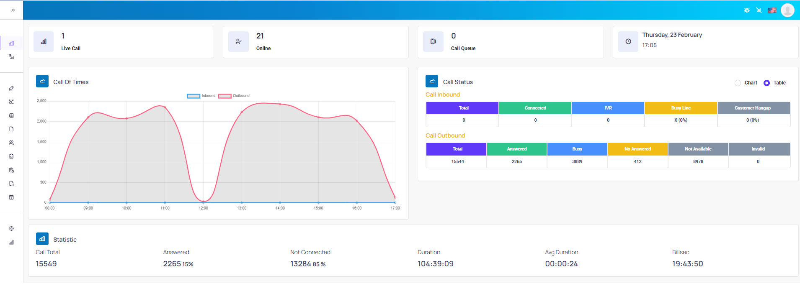
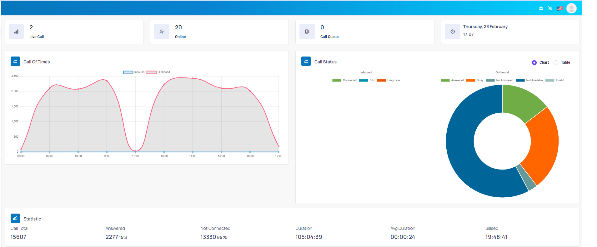

## Dashboard

Giao diện dashboard sẽ được hiển thị ngay sau khi log in account. Ở đây dashboard sẽ mô tả tổng quan web quản trị kèm các thông tin liên quan đến cuộc gọi, …





```jsx title="Giải thích thông số"
- Live call: Tổng số cuộc gọi đang diễn ra.
- Online: Tổng số agent đang trực tuyến
- Call queue: Số cuộc gọi trong hàng chờ bao gồm cả outbound trong chiến dịch Autodialer và inbound.
- Trạng thái cuộc gọi: được hiển thị dưới dạng bảng (Table) và dạng biểu đồ (Chart).
- Thống kê - Statistics: Mục này thống kê tổng số cuộc gọi (Call total), số cuộc gọi đã kết nối (Answered), chưa kết nối (Not connected), thời lượng (Duration), thời lượng trung bình (Average duration), thời lượng đàm thoại (Billsec) của các cuộc gọi trong ngày.
```