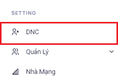
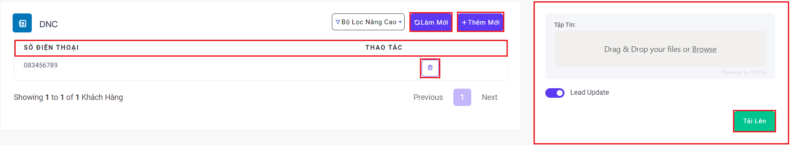
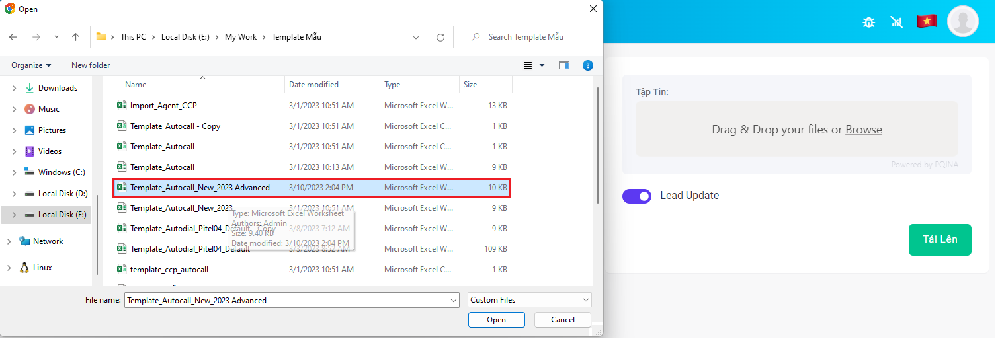
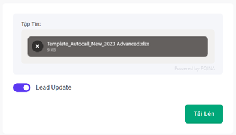
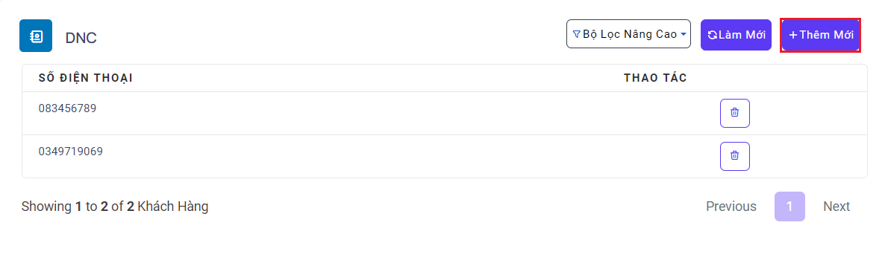
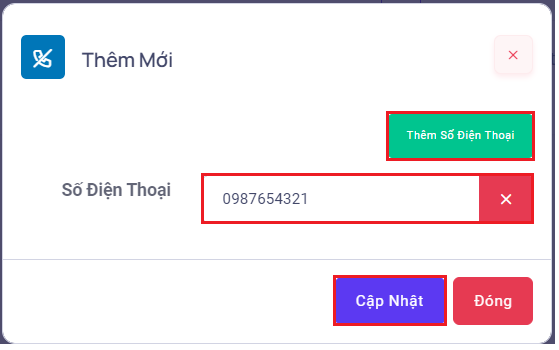
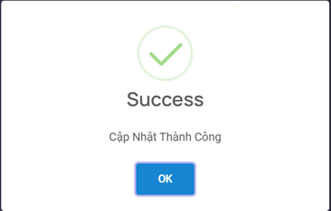
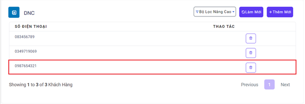

## DNC - Do Not Call

DNC (Do Not Call) được dùng để thực hiện việc không cho phép đầu số gọi các số nằm trong menu này nhằm tránh việc gây spam cho khách hàng. Thông qua đó hạn chế việc khoá đầu số.

### Bước 1: Truy cập vào thanh menu góc phải màn hình và nhấp chọn menu DNC


### Bước 2: Sau khi ấn chọn DNC, hệ thống sẽ chuyển tới màn hình DNC.

Menu này được dùng để ngăn không cho đầu số gọi tới những số đã được thiết lập trong menu này


```jsx title="Giải thích thông số"
- Số điện thoại: số thuê bao khách hàng.
- Thao tác: dùng để thu hồi đầu số không được gọi.
- Làm mới: làm mới menu DNC sau khi thu hồi các số không được gọi.
- Tập tin: được dùng để thêm một lượng lớn các số không được gọi mà không cần phải thêm từng số thủ công. Sau khi đã tải tệp lên tiến hành ấn Tải Lên.
```
Để thêm mới với số lượng lớn bằng tập tin excel, ấn vào ô “Drag & Drop your files or Browse” sau đó chọn file chứa các số DNC (có thể sử dụng với template upload lead được download trong menu Danh sách hoặc S2 của menu Thiết lập nhanh chiến dịch)



Sau khi chọn file, đảm bảo phải bật tính năng Lead update để hệ thống update status của Lead (số điện thoại KH) về DNC


### Bước 3: Tiến hành thêm mới một số DNC bằng cách ấn vào ô Thêm Mới


Ấn vào ô Thêm Số Điện Thoại sau đó điền số không được gọi vào, cuối cùng ấn Cập Nhật



Hệ thống sẽ popup thông báo thêm mới thành công



Menu sau khi đã thêm số DNC mới

