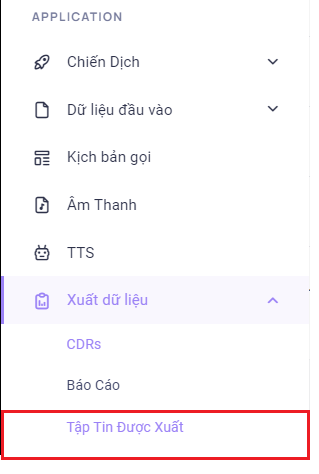
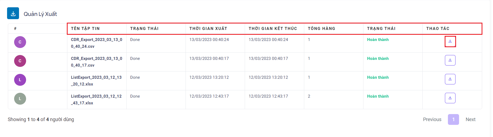
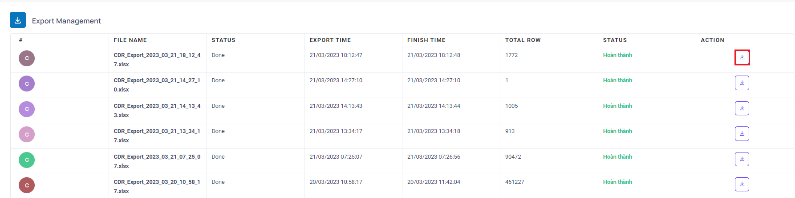

## Export File - Tập tin được xuất

Tập Tin Được Xuất là nơi lưu trữ các file được xuất từ các menu như CDRs, Report, List…. Sau khi tải xuống ở các menu liệt kê trên tiến hành vào menu Tập Tin Được Xuất để tải xuống dữ liệu đã xuất.
### Bước 1: Truy cập vào thanh menu góc phải màn hình và nhấp chọn menu Xuất dữ liệu sẽ bao gồm các menu. Ấn chọn vào menu Tập Tin Được Xuất


### Bước 2: Sau khi ấn chọn Tập Tin Được Xuất, hệ thống sẽ chuyển tới màn hình Tập Tin Được Xuất. Menu này được dùng để tải xuống các file được xuất ra từ các menu như CDRs, Report, List, …


```jsx title="Giải thích thông số"
- Tên tập tin: hiển thị tên tập tin đã xuất.
- Trạng thái: hiển thị trạng thái liên quan đến quá trình tải xuống của tập tin. Done là hoàn thành tải xuống và trong quá trình tải xuống sẽ hiển thị là In Progress kèm theo % tải xuống.
- Thời gian xuất: hiển thị thời gian xuất của tập tin.
- Thời gian kết thúc: hiển thị thời gian kết thúc quá trình tải xuống của tập tin.
- Tổng hàng: số lượng hàng trong tập tin tương ứng mỗi hàng là một dòng dữ liệu khách hàng.
- Trạng thái: trạng thái của tập tin đã được xuất hay chưa.
- Thao tác: được dùng để tải tập tin xuống thiết bị cá nhân.
```

### Bước 3: Ấn vào nút tải xuống ở cột Thao Tác để download tập tin về thiết bị cá nhân
