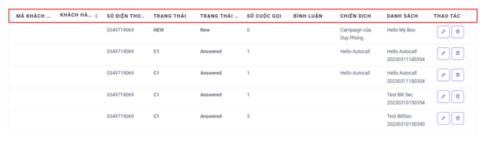

## Import Lead - Quản Lí Dữ Liệu Khách Hàng Đầu Vào

### Bước 1: Truy cập vào thanh menu góc phải màn hình và nhấp chọn menu Dữ Liệu. Ở đây có 2 menu liên quan là Danh Sách và Khách Hàng. Ấn chọn vào menu Danh Sách


### Bước 2: Sau khi ấn chọn Khách Hàng, hệ thống sẽ chuyển tới màn hình Khách Hàng. Menu này được dùng để xem, chỉnh sửa và xóa dữ liệu khách hàng một cách cụ thể từng dữ liệu


```jsx title="Giải thích thông số"
- Số điện thoại: bộ lọc số điện thoại khách hàng, dùng để lọc và tìm kiếm dữ liệu của riêng số điện thoại đó.
- Chiến dịch: bộ lọc chiến dịch dùng để lọc và tìm kiếm chiến dịch mong muốn.
- Danh sách: bộ lọc danh sách dùng để lọc và tìm kiếm danh sách mong muốn.
- Trạng thái: trạng thái dữ liệu thuê bao khách hàng được định dạng dưới chữ cái viết tắt kèm số.
- Trạng thái khách hàng: mô tả trạng thái dữ liệu thuê bao khách hàng.
- Bộ lọc: sau khi đã lựa chọn các thông tin trong các bộ lọc nêu trên ấn Bộ Lọc để thực hiện việc tìm kiếm những thông tin đã chọn
```

```
- Phân loại: phân loại thứ tự của dữ liệu khách hàng dựa trên các điều kiện như: Mới Nhất Đến Cũ Nhất, Thời Gian Cuộc Gọi Gần Nhất, Trạng Thái Cuộc Gọi Gần Nhất, Họ Tên. Sau khi lựa chọn 1 trong 4 điều kiện trên ấn Bộ Lọc hệ thống sẽ đưa các dữ liệu khách hàng đúng với những thông tin đã lọc lên trên đầu tiên của menu.
```
 
```
- Mã khách hàng: mã khách hàng tuỳ vào người dùng ghi chú.
- Khách hàng: tên của khách hàng gắn với số điện thoại đó.
- Số điện thoại: số điện thoại của khách hàng.
- Trạng thái cuộc gọi: mô tả trạng thái dữ liệu thuê bao khách hàng.
- Số cuộc gọi: số lần gọi cho một khách hàng đó
- Bình luận: ghi chú của dữ liệu khách hàng.
- Chiến dịch: dữ liệu khách hàng nằm trong chiến dịch được tạo.
- Danh sách: dữ liệu khách hàng nằm trong danh sách được tạo.
```

```
- Thao tác: có thể chỉnh sửa và xóa dữ liệu khách hàng. Để chỉnh sửa ấn vào biểu tượng cây bút và xóa thì ấn vào biểu tượng thùng rác.
```


