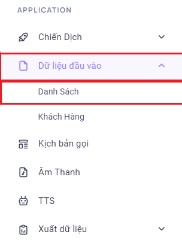
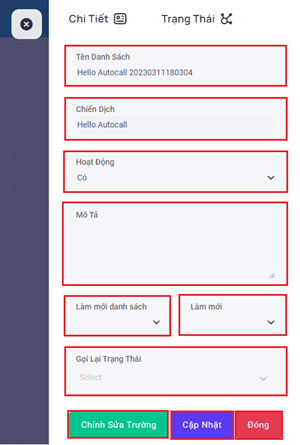
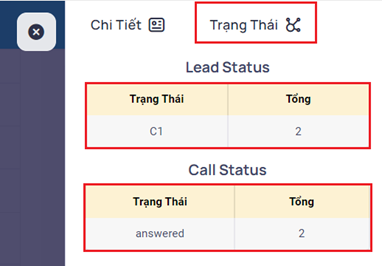
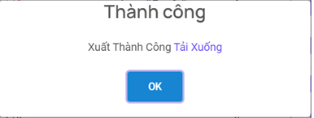
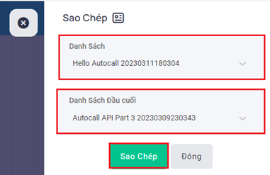
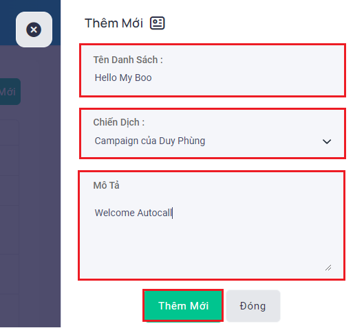
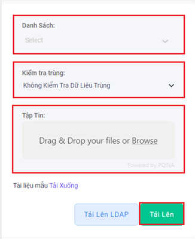
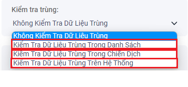
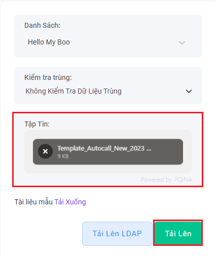
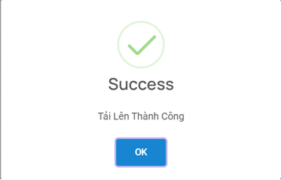

## Import List - Danh Sách Đầu Vào

### Bước 1: Truy cập vào thanh menu góc phải màn hình và nhấp chọn menu Dữ Liệu. Ở đây có 2 menu liên quan là Danh Sách và Khách Hàng. Ấn chọn vào menu Danh Sách

### Bước 2: Sau khi ấn chọn Danh Sách, hệ thống sẽ chuyển tới màn hình Danh Sách. Menu này được dùng để quản trị, theo dõi lượng dữ liệu khách hàng đã tải lên và tải dữ liệu mới cho các danh sách đã gắn với chiến dịch

```jsx title="Giải thích thông số"
Danh sách được hiểu là nơi lưu trữ dữ liệu khách hàng mà chiến dịch được gán với danh sách đó sẽ dùng chính những dữ liệu này để đổ cuộc gọi ra.
- Tên: hiển thị tên của danh sách
- Hoạt động: hiển thị trạng thái của danh sách. Ở trạng thái hoạt động chiến dịch được phép dùng dữ liệu của danh sách để gọi ra. Ngược lại ở trạng thái không hoạt động chiến dịch không thể đổ cuộc gọi ra ngoài được.
- Tổng: tổng dữ liệu danh sách khách hàng. Mỗi thuê bao khách hàng sẽ được tính là một.
- Total Success: hiển thị số lượng dữ liệu khách hàng đã tải lên thành công và thất bại. Dữ liệu khách hàng rơi vào trạng thái tải lên thất bại sẽ xuất phát từ những nguyên nhân: 
 + Cột phone_number trong file upload không có số điện thoại.
 + Sai tên, sai cột thông tin ví dụ như cột tên khách hàng mà điền số điện thoại vào.
 + Số điện thoại lớn hơn 11 số và ít hơn 8 số. 
 + Rỗng cột, format tệp tải lên sai, dư hàng tải lên.
- Chiến dịch: chiến dịch được gắn với danh sách. Chiến dịch được gán sẽ dùng dữ liệu trong danh sách để gọi ra.
- Thao tác: bao gồm tổng cộng 4 thao tác là Chỉnh Sửa Danh Sách, Xuất Danh Sách, Sao Chép Danh Sách, Bật Tắt Danh Sách.
- Chỉnh sửa danh sách được kí hiệu là cây bút dùng để chỉnh sửa dữ liệu được tải lên.
```




```jsx title="Giải thích thông số"
- Tên danh sách: hiển thị tên của danh sách.
- Chiến dịch: chiến dịch gắn với danh sách.
- Hoạt động: trạng thái hoạt động hay không hoạt động của danh sách.
- Mô tả: dùng để mô tả, ghi chú danh sách đó phục vụ cho mục đích nhận biết danh sách sử dụng.
- Làm mới danh sách: lựa chọn có cho một lần cập nhật sẽ làm mới tất cả dữ liệu tức là dữ liệu khách hàng trước đó sẽ mất tính từ thời điểm cập nhật hiện tại.
- Làm mới: sử dụng để làm mới dữ liệu khách hàng dựa vào trạng thái của dữ liệu. Có 3 cách để làm mới
 + All: làm mới tất cả dữ liệu khách hàng trong danh sách đó.
 + Only Lead Success: làm mới dữ liệu khách hàng thành công.
 + Only Lead Fail: làm mới dữ liệu khách hàng thất bại.
- Trạng thái gọi lại: các trạng thái mà một cuộc gọi có thể có được.
 + Answered: Mobile nghe máy.
 + No Answered: mobile không nghe máy.
 + Busy: mobile từ chối, mobile chặn đầu số bằng cách chặn trên thiết bị.
 + Not Available: mobile ở chế độ máy bay, không liên lạc được.
 + Invalid Number: gọi ra tới nhà mạng nhưng nhà mạng báo sai số (số mobile sai).
 + Phone Block: số thuê bao khách hàng bị khóa.
 + Congestion: đầu số gọi Autocall bị nhà mạng chặn, bị khóa.
 + Failed: template lỗi, script lỗi, script bị xoá, hết key zalo.
```
Cập Nhật: cập nhật những thay đổi.

Trạng thái: hiển thị thông tin trạng thái dữ liệu khách hàng đã tải lên và trạng thái cuộc gọi của những dữ liệu đó.


Xuất danh sách: xuất tất cả dữ liệu khách hàng đã upload từ trước cho đến thời điểm tải xuống. Tệp tải xuống được lưu dưới dạng excel và được lưu trữ ở Menu Xuất Dữ Liệu




Sao chép danh sách: sao chép được dùng để sao chép các trường thông tin từ campaign này sang campaign khác. Chỉ sao chép các trường thông tin còn dữ liệu khách hàng không được sao chép sang.




Bật tắt danh sách: được dùng để kích hoạt hoặc huỷ kích hoạt của danh sách. Nếu huỷ kích hoạt thì chiến dịch gắn với danh sách này sẽ không thể đổ cuộc gọi ra được


### Bước 3: Thêm mới một danh sách ấn vào nút Thêm Mới


### Bước 4: Điền các thông tin cần thiết để tạo một danh sách hoàn chỉnh như Tên Danh Sách, Chiến Dịch và Mô Tả. Sau đó ấn Thêm Mới để hoàn tất quá trình tạo Danh Sách


###  Bước 5: Tiến hành tải dữ liệu lên danh sách vừa mới tạo bằng cách lựa chọn danh sách trong menu Danh Sách góc phải màn hình và ấn vào chỗ “Drag & Drop your file or Browser” để tải dữ liệu từ thiết bị vào danh sách


```jsx title="Giải thích thông số"
- Danh sách: bao gồm các danh sách đã tạo.
- Kiểm tra trùng: kiểm tra dữ liệu có trùng lặp nhằm lọc bỏ để tránh việc gọi một dữ liệu khách nhiều lần gây ảnh hưởng đến thuê bao khách hàng. Kiểm tra trùng bao gồm 3 kiểu:
 + Kiểm Tra Dữ Liệu Trùng Trong Danh Sách: hệ thống sẽ kiểm tra dữ liệu khách hàng được tải lên ngay trong danh sách chọn kiểu kiểu tra này. Nếu một số điện thoại được lặp từ 2 lần trở lên hệ thống sẽ lọc bỏ chỉ còn 1.
 + Kiểm Tra Dữ Liệu Trùng Trong Chiến Dịch: hệ thống sẽ kiểm tra dữ liệu khách hàng dựa trên chiến dịch được gắn với danh sách. Một chiến dịch có thể gắn cho nhiều danh sách, đồng nghĩa hệ thống sẽ quét toàn bộ dữ liệu khách hàng trong các danh sách nào được gắn với chiến dịch đã chọn. Sau đó lọc bỏ và chỉ giữ 1 trên danh sách lựa chọn kiểu kiểm tra này.
 + Kiểm Tra Dữ Liệu Trùng Trong Hệ Thống: hệ thống sẽ kiểm tra toàn bộ hệ thống không xét điều kiện cụ thể nào miễn là trong danh sách này có dữ liệu trùng với các danh sách khác hệ thống sẽ tự động lọc bỏ các danh sách kia và giữ lại dữ liệu ở mỗi danh sách này.
```


Tập tin: tải dữ liệu từ thiết bị lên




