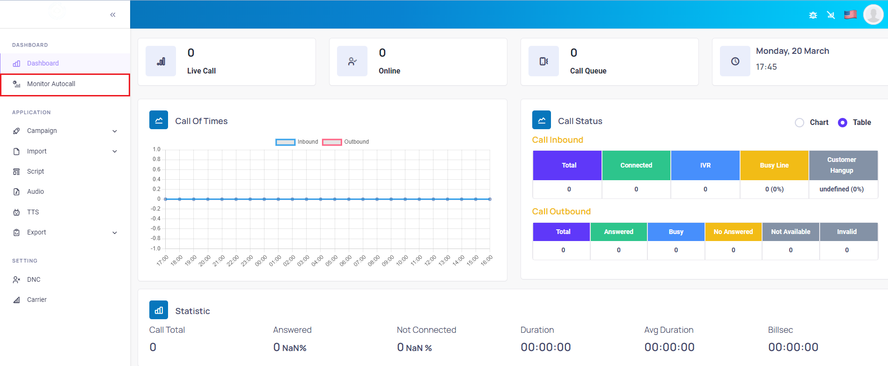
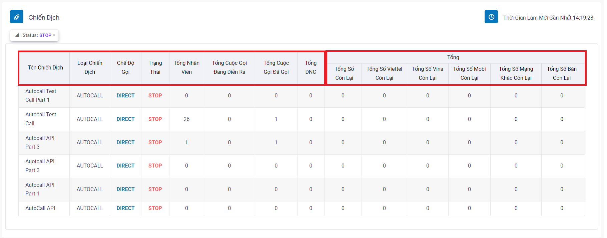
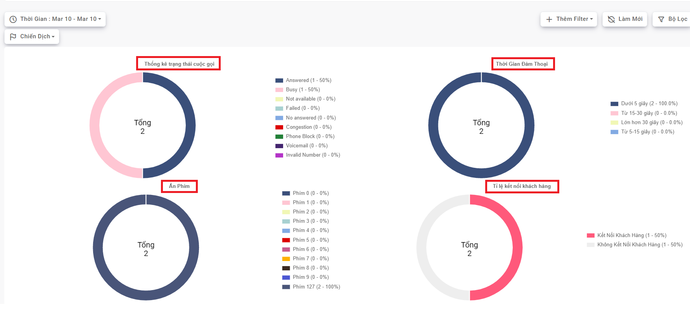
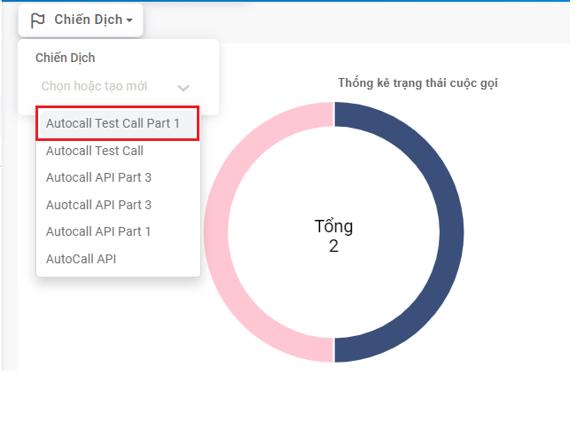

## Monitor Autocall

Bước 1: Di chuyển chuột vào thanh Menu, hệ thống sẽ hiển thị đầy đủ các Menu chức năng sau đó chọn vào Monitor Autocall.



Bước 2: Ở menu Chiến Dịch sẽ hiển thị thông tin tất cả các chiến dịch hiện có của tổng đài bao gồm tình trạng chiến dịch, tổng số khách hàng cần gọi ra, tổng cuộc gọi đã gọi … 



```jsx title="Giải thích thông số"
- Campaign Name - Tên chiến dịch: hiển thị tên chiến dịch.
- Campaign Type - Loại chiến dịch: Autocall
- Mode Call - Chế độ gọi: hệ thống Autocall bao gồm tổng cộng 2 chế độ gọi là SIP Direct và SIM song song.
- Status - Trạng thái: hệ thống Autocall bao gồm các trạng thái START, STOP, PAUSE.
- Total Lead - Tổng khách hàng: số lượng thuê bao một chiến dịch đang có.
- Total Incall - Tổng cuộc gọi đang diễn ra: tổng số lượng cuộc gọi hiện tại đang được gọi ra
- Total Called - Tổng cuộc gọi đã gọi: tổng số lượng cuộc gọi đã được gọi ra
- Total Lead Called - Tổng khách hàng đã gọi: tổng số lượng khách hàng đã được gọi ra
- Total DNC - Tổng DNC (Do not call): tổng số cuộc gọi không được gọi
- Total Remain - Tổng số gọi lại: tổng số cuộc gọi còn phải gọi.
- Total Remain Viettel - Tổng số Viettel còn lại: tổng số cuộc gọi mạng Viettel chưa được gọi
- Total Remain Vina - Tổng số Vina còn lại: tổng số cuộc gọi mạng Vinaphone chưa được gọi
- Total Remain Mobi - Tổng số Mobi còn lại:  tổng số cuộc gọi mạng Mobifone chưa được gọi
- Total Remain Offnet - Tổng số Mạng khác còn lại: tổng số cuộc gọi mạng Vietnamobile, Gtel…. chưa được gọi.
- Total Remain Tel - Tổng số bàn còn lại: tổng số cuộc gọi các số cố định chưa được gọi.
```


:::tip MYTIP
Menu biểu đồ tròn hiển thị một cách tổng quát các số liệu về cuộc gọi bao gồm 
    + Thống kê trạng thái cuộc gọi
    + Thời gian đàm thoại
    + Ấn phím
    + Tỉ lệ kết nối thành công dưới dạng hình kèm số liệu cụ thể và màu sắc biểu thị cho các thông tin đi kèm với biểu đồ đó.
:::

Bước 3: Có thể tùy chọn các chiến dịch để xem thông tin số liệu chi tiết một chiến dịch cụ thể.
