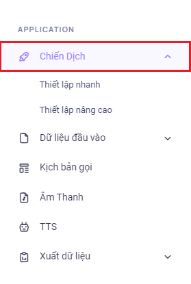

## Quick Setup - Thiết lập nhanh

### Bước 1: Truy cập vào thanh menu góc phải màn hình và nhấp chọn menu Campaign. Ở đây có kiểu thiết lập là Thiết lập nhanh và Thiết lập nâng cao.



### Bước 2: Chọn Thiết lập nhanh để tiến hành cấu hình một luồng tạo chiến dịch hoàn chỉnh và thuận tiện.


### Bước 3: Sau khi ấn chọn Thiết lập nhanh, hệ thống sẽ chuyển tới bước S0 Lựa Chọn Chiến Dịch. Ấn Thêm Mới để tạo một chiến dịch.


### Bước 4: Tiến hành điền tên chiến dịch mong muốn và chọn loại Autocall


```jsx title="Giải thích thông số"
- Tên: tên chiến dịch
- Loại Autocall: bao gồm 3 loại là Cá nhân hoá, Voice OTP, Tập tin âm thanh cố định
- Cá nhân hoá: hỗ trợ dùng cả hai định dạng audio và Text To Speech (chuyển hoá phát thoại).
- Voice OTP: dùng cho phát các loại mật khẩu, mã xác nhận
- Tập tin âm thanh cố định: cho tạo template audio trên đây có thể cấu hình thời gian chờ mobile ấn phím, số lần lặp lại IVR.
- Mô tả: điền những thông tin lưu ý đến chiến dịch.
```


### Bước 5: Sau khi ấn Lưu chiến dịch được tạo thành, hệ thống sẽ ở bước S0 ấn chọn vào action chỉnh sửa chiến dịch để tiến hành các bước tiếp theo nhằm tạo hoàn tất một chiến dịch.


### Bước 6: Tiến hành cấu hình các thông số của chiến dịch bao gồm kịch bản gọi, ưu tiên gọi lại, số lần gọi lại…. Thiết lập các cấu hình phù hợp với nhu cầu sử dụng sau đó ấn Kế tiếp.


```jsx title="Giải thích thông số"
- Chiến dịch: tên chiến dịch
- Hoạt động: bật/tắt hoạt động của chiến dịch
- Ưu tiên gọi lại: gồm hai loại ưu tiên cuộc gọi Normal, Recall
 + Normal: các cuộc gọi sẽ được ưu tiên theo thứ tự cuộc gọi trạng thái new đổ trước sau đó mới cho đổ các cuộc gọi được cấu hình gọi lại (recall).
 + Recall: các cuộc gọi sẽ ưu tiên cho các cuộc gọi được cấu hình gọi lại. Tuỳ vào thời gian thiết lập các cuộc gọi lại sẽ đổ ra và gọi ngay trong khi cuộc gọi mới đang đổ nếu chức năng Recall này được bật. 
- Trạng thái gọi lại: các trạng thái của một cuộc gọi, ấn chọn ở đây để gọi lại các cuộc gọi có trạng thái tương ứng:
 + Answered: Mobile nghe máy.
 + No Answered: mobile không nghe máy.
 + Busy: mobile từ chối cuộc gọi bằng cách chủ động ngắt máy hoặc chặn số trên thiết bị.
 + Not Available: mobile ở chế độ máy bay, không liên lạc được, thiết bị di động hư hỏng, hết pin.
 + Invalid Number: gọi ra tới nhà mạng nhưng nhà mạng báo sai số (số mobile sai).
 + Phone Block: số mobile khách hàng bị khóa.
 + Congestion: đầu số gọi auto call bị nhà mạng chặn, bị khóa.
 + Failed: template lỗi, script lỗi, script bị xoá, hết key zalo.
- Kịch bản gọi: có thể là một file audio được ghi âm sẵn hoặc một mẫu Text To Speech (chuyển đổi thoại). 
- Số lần gọi lại: số lần một thuê bao được gọi tới.
- Gọi lại khi thời gian đàm thoại nhỏ hơn: thời gian đàm thoại của những cuộc gọi nào thấp hơn thời gian quy định trong menu này thì đều được gọi lại.
- Lập lịch gọi lại: gồm 2 chế độ là Ngay lập tức và Sau bao nhiêu phút. Ở bao nhiêu phút có thể thiết lập số thời gian quy định để gọi lại. Ví dụ chỉnh là 5 phút thì 5 phút sẽ thực hiện gọi lại thuê bao đó 1 lần.
- Nhà mạng: đầu số được dùng để gọi ra
- Chế độ gọi: bao gồm 2 chế độ gọi là SIP Direct và SIM Song Song
 + SIP Direct: chế độ này cho phép gọi ra một cách trực tiếp cho tất cả các nhà mạng mà không phải chia kênh cho từng nhà mạng cụ thể. Trong khi chạy chế độ này cần quan tâm đến việc quy định số lượng cuộc gọi đồng thời đã đăng ký với nhà quản trị vì nếu điều chỉnh không đúng sẽ không đạt được kết quả như mong muốn. Chỉnh thấp hơn thì không tận dụng được tài nguyên có sẵn và cao hơn thì hệ thống không được thiết lập để đáp ứng sẽ ảnh hưởng đến quá trình sử dụng.
 + SIM Song Song: chế độ này gọi trực tiếp cho các nhà mạng thông qua việc phân chia kênh trên hệ thống. Khi gọi với chế độ này hệ thống sẽ tự động luân chuyển các kênh trống qua lại giữa các chiến dịch nhằm đảm bảo hiệu suất tối ưu và không gây lãng phí tài nguyên.
- Thời gian mobile nghe máy: thời gian đợi cho thuê bao nghe máy nếu quá thời gian này hệ thống sẽ tự động ngắt máy.
- Số cuộc gọi đồng thời: số lượng cuộc gọi đổ ra cùng một lúc.
- Lập lịch: thiết lập thời gian bắt đầu và kết thúc của một chiến dịch theo các ngày trong tuần.
```

### Bước 7: Di chuyển tới bước Danh Sách Khách Hàng, ở đây được dùng để upload dữ liệu các khách hàng cần được gọi tới. Ấn vào ô “Drag & Drop your files or Browse” để đưa dữ liệu vào sau đó ấn tải lên


Sau khi ấn vào ô trên nhấn chọn vào file dữ liệu mong muốn để đưa dữ liệu vào hệ thống.


Tải lên thành công hệ thống sẽ hiển thị dữ liệu upload ngay trung tâm bước S2 và ấn Kế Tiếp để qua bước tiếp theo


### Bước 8: Ở S3 Kịch Bản Gọi được dùng để cấu hình kịch bản tuần tự các file âm thanh, Text To Speech (chuyển đổi thoại) sẽ phát nội dung như thế nào, thứ tự ra làm sao để khi thuê bao nhấc máy lên có thể nghe được những nội dung đã thiết lập. Điền đầy đủ các thông số cấu hình sau đó ấn Kế Tiếp.

```jsx title="Giải thích thông số"
- Tên kịch bản: tên của kịch bản gọi
- Giọng nói: giọng nói của Text To Speech (chuyển đổi thoại), hệ thống hỗ trợ giọng Bắc, Nam từ Google và Zalo AI.
 + Male (North) - Google: giọng nam Bắc Google
 + Female (North) - Google: giọng nữ Bắc Google
 + Male (North) -  Zalo: giọng nam Bắc Zalo
 + Female (North) - Zalo: giọng nữ Bắc Zalo
 + Male (South) - Zalo: giọng nam Nam Zalo
 + Female (South) - Zalo: giọng nữ Nam Zalo
- Thời gian chờ nhấn phím: thời gian đợi cho thuê bao nhấn phím sử dụng trong các kịch bản có cấu hình nhấn phím phát file hoặc Text To Speech (chuyển đổi thoại).
- Tốc độ: tốc độ đọc của Text To Speech (chuyển đổi thoại)
- Số lần lặp lại IVR:
- Kịch bản lời thoại: bao gồm 4 kiểu phát tương ứng với các thao tác người dùng. Khi người dùng thao tác hành động nào thì hệ thống sẽ thực hiện phát file phù hợp với hành động đó.
 + Lời thoại khi mobile nghe máy: là lời thoại được phát ngay sau khi thuê bao nhấc máy.
 + Lời thoại khi bấm sai phím: là lời thoại được phát nếu thuê bao ấn chưa đúng các phím hệ thống ghi nhận được như * và # vì hệ thống chỉ ghi nhận phím bấm từ 0 đến 9. Ví dụ kịch bản ấn phím 1 phát cảm ơn quý khách, thuê bao ấn phím *, # thì hệ thống sẽ phát nội dung bấm sai phím. Enable được dùng để bật tắt hoạt động kịch bản này và nghe thử để nghe thử giọng đọc có đọc đúng chỉnh tả, tốc độ cài đặt.
 + Lời thoại khi kết thúc cuộc gọi: là lời thoại sẽ được phát sau khi lời thoại nhấc máy kết thúc.Enable được dùng để bật tắt hoạt động kịch bản này và nghe thử để nghe thử giọng đọc có đọc đúng chỉnh tả, tốc độ cài đặt.
 ```


```jsx title="Thêm phím điều hướng"
- Thêm các phím để thuê bao có thể tương tác trực tiếp tuỳ vào mong muốn của người thiết lập kịch bản. Có thể thêm điều hướng lấy sự quan tâm của của khách hàng, ấn phím để chuyển tiếp cuộc gọi về tổng đài viên trực hotline,…
- Thêm phím điều hướng có tổng cộng các phím từ 0 đến 9 và không thể thêm các kí tự đặc biệt như phím #, *. Ở phần Loại Thêm Phím Điều Hướng sẽ có thể lựa chọn Transfer dùng để chuyển hướng cuộc gọi vào các tổng đài viên trực hotline.
```


Có thể chỉnh sửa số phím bấm để rút ngắn thời gian lựa chọn số phím bấm phù hợp. Ví dụ khi ấn Thêm Phím Điều Hướng mặc định sẽ tạo Num0, ấn vào biểu tượng bút chì để chỉnh sửa Num 0 thành bất kỳ số nào từ 1 đến 9. Sau đó nhấn Enter để lưu lại.


```jsx
Loại: gồm 2 loại là Audio và Text To Speech
Audio: là một file âm thanh đã chuyển đổi theo đúng các thông số 16 Bit, 8000Hz, Mono có sẵn trong thiết bị hoặc download từ một nguồn âm thanh cụ thể.
Text to speech: là một đoạn văn bản được chuyển đổi thành dạng thoại với các giọng đọc khác nhau theo vùng miền và AI được sử dụng là Google, Zalo….
Nội dung: là nội dung của Text To Speech sẽ phát.
```

### Bước 9: Ở màn hình này sẽ hiển thị đầy đủ thông tin của chiến dịch gồm tên, trạng thái, nhà mạng, chế độ gọi…. Kiểm tra sau khi đúng các thông tin đã tạo thì ấn Lưu để thoát ra giao diện Thiết Lập Nhanh hoặc ấn Lưu và Chạy Ngay để thoát ra giao diện Thiết Lập Nhanh đồng thời bắt đầu chạy chiến dịch


Hệ thống sẽ popup hiển thị thông báo lưu thông tin thành công


### Bước 10: Ấn nút Start để bắt đầu chạy chiến dịch nếu trước đó ấn Lưu. Nếu trước đó ấn Lưu và Chạy Ngay thì không cần phải ấn Start
