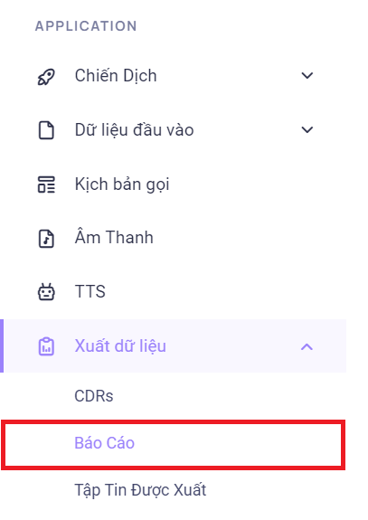
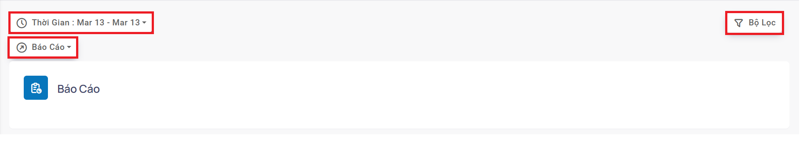
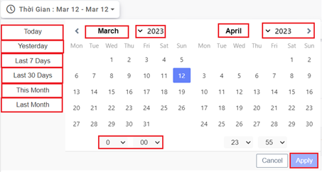
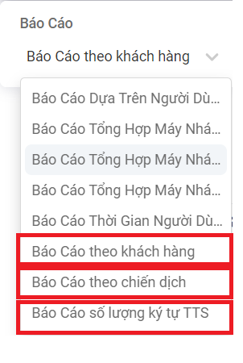
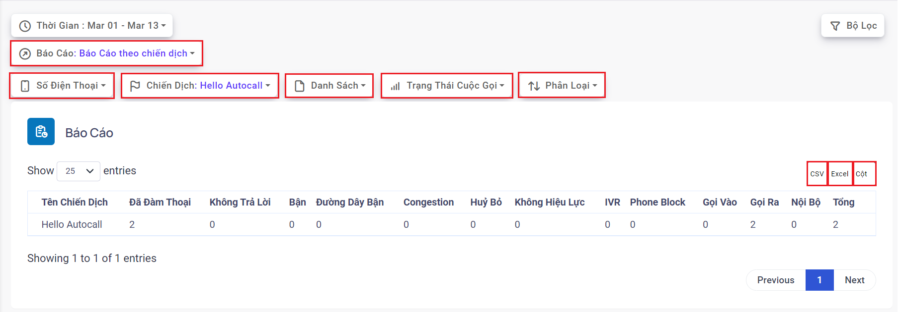
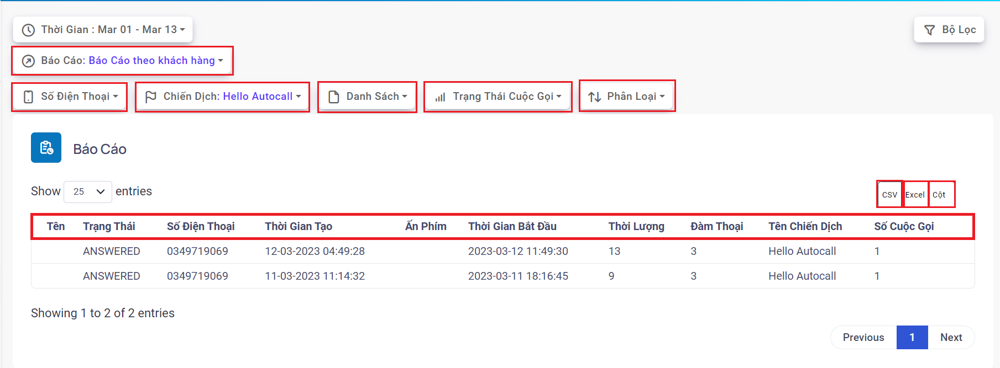
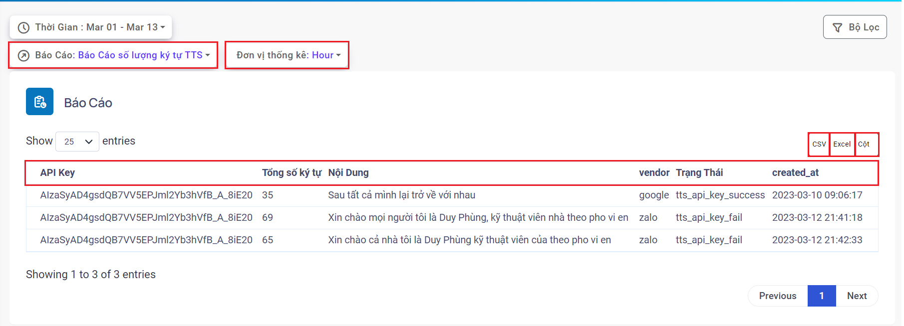

## Report - Báo cáo

### Bước 1: Truy cập vào thanh menu góc phải màn hình và nhấp chọn menu Xuất dữ liệu sẽ bao gồm các menu kèm theo. Ở đây có 3 menu liên quan là CDRs, Báo Cáo, Tập Tin Được Xuất. Ấn chọn vào menu Báo Cáo

### Bước 2: Sau khi ấn chọn Báo Cáo, hệ thống sẽ chuyển tới màn hình Báo Cáo. Menu này được dùng để tải xuống các báo cáo liên quan đến hệ thống Autocall

:::note CÁC BỘ LỌC REPORT
- Thời gian: bộ lọc thời gian dùng để điều chỉnh thời gian mong muốn xem thông tin cuộc gọi. Hệ thống hỗ trợ các khung thời gian cố định và thời gian có thể điều chỉnh.
 + Today: hôm nay
 + Yesterday: hôm qua
 + Last 7 Days: 7 ngày gần nhất
 + Last 30 Days: 30 ngày gần đây
 + This Month: tháng này
 + Last Months: tháng trước
- Báo cáo: hệ thống Autocall hỗ trợ các loại báo cáo như sau Báo Cáo Theo Khách Hàng, Báo Cáo Theo Chiến Dịch, Báo Cáo Số Lượng Ký Tự TTS.
:::

| Loại báo cáo                              | Mô tả                                                                                                                                                                                         | Giải thích thông số                                                                                                                                                                                                                                                                                                                                                                                                                                                                                                                                                                                                                                                                                                                                                           |
| ----------------------------------------- | --------------------------------------------------------------------------------------------------------------------------------------------------------------------------------------------- | ----------------------------------------------------------------------------------------------------------------------------------------------------------------------------------------------------------------------------------------------------------------------------------------------------------------------------------------------------------------------------------------------------------------------------------------------------------------------------------------------------------------------------------------------------------------------------------------------------------------------------------------------------------------------------------------------------------------------------------------------------------------------------- |
| Report Lead - Báo Cáo Theo Khách Hàng     | Hiển thị thông tin cuộc gọi với khách hàng trong chiến dịch. Bao gồm các thông tin như thời gian tải dữ liệu khách hàng lên (Thời Gian Tạo), thời gian gọi khách hàng (Thời Gian Bắt Đầu).... | Tên: Tên khách hàng - Trạng Thái: Trạng thái của cuộc gọi gần nhất - Thời Gian Tạo: Thời gian Khởi tạo của cuộc gọi gần nhất - Ấn Phím: phím bấm của cuộc gọi gần nhất - Thời Lượng: thời lượng cuộc gọi gần nhất - Đàm Thoại: thời lượng đàm thoại của của gọi gần nhất - Tên Chiến Dịch: chiến dịch chứa thông tin KH thực hiện cuộc gọi - Số Cuộc Gọi: tổng số cuộc gọi đã gọi đến KH                                                                                                                                                                                                                                                                                                                                                                                      |
| Report Campaign - Báo Cáo Theo Chiến Dịch | Hiển thị thông tin tổng số lượng cuộc gọi kèm theo các trạng thái liên quan đến cuộc gọi đó trong một chiến dịch cụ thể                                                                       | Tên chiến dịch: hiển thị tên chiến dịch - Đã đàm thoại: cuộc gọi đã được kết nối với thuê bao khách hàng - Không trả lời: cuộc gọi không được thuê bao khách hàng nghe máy - Bận: khách hàng chủ động ngắt cuộc gọi tới - Congestion: đầu số gọi autocall bị nhà mạng chặn, bị khóa, nghẽn - Huỷ bỏ: cuộc gọi không được thuê bao khách hàng nghe máy và đúng thời gian quy định hồi âm chuông ngắt máy - Không hiệu lực: gọi ra tới nhà mạng nhưng nhà mạng báo sai số (số mobile sai) - Phone Block: số mobile khách hàng bị khóa - Gọi ra: thống kê theo hướng cuộc gọi ra của chiến dịch - Gọi vào: thống kê theo hướng cuộc gọi vào của chiến dịch - Nội bộ: thống kê theo hướng cuộc gọi nội bộ trong chiến dịch- Tổng: tổng cuộc gọi đã thực hiện trong chiến dịch này | 
| Report the number of charaters TTS - Báo Cáo Số Lượng Ký Tự TTS | Hiển thị thông tin API Key chuỗi ký tự này kỹ thuật sẽ quản lý, tổng số ký tự, nội dung thoại đã chuyển đổi. Báo cáo này sẽ cung cấp thông tin trọng tâm về Text To Speech | API Key: chuỗi ký tự dùng để xác thực với Zalo AI hoặc Google TTS - Tổng số ký tự: tổng số chữ viết trong tệp thoại chuyển đổi - Nội dung: nội dung văn bản được chuyển đổi - Vendor: nhà cung cấp công nghệ TTS - Trạng thái: trạng thái tts_api_key thành công hoặc thất bại - Created_at: thời gian dùng API Key thực hiện chuyển đổi TTS |

