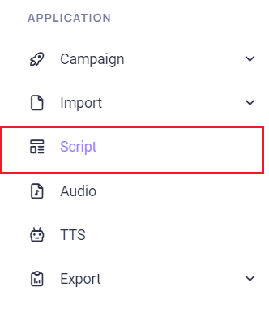
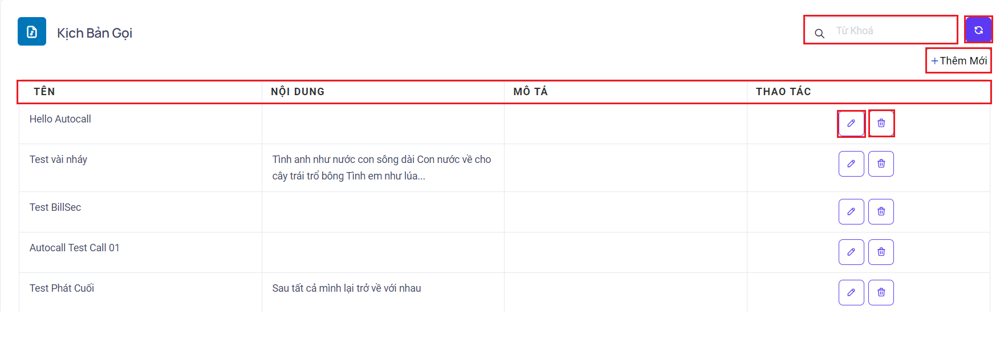
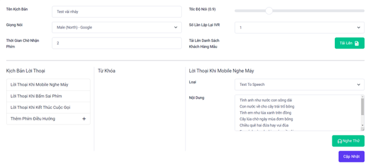
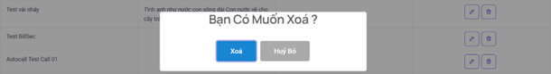
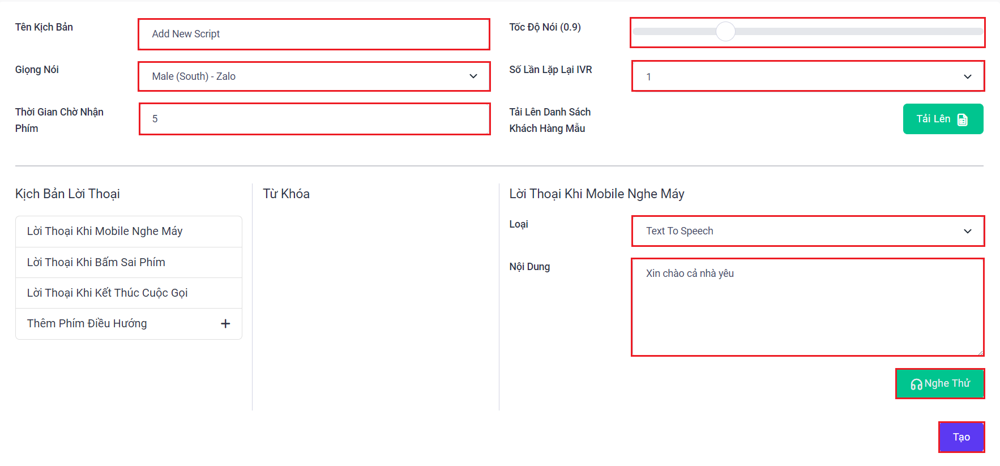

## Script - Kịch Bản gọi

Script được dùng để tạo thành kịch bản mà các chiến dịch có thể chọn để mà phát khi đổ cuộc gọi ra thuê bao. Cụ thể Script sẽ tận dụng TTS và âm thanh đã tạo, tải lên trên hệ thống. Kết hợp những dữ liệu trên thành một kịch bản để từ đó các chiến dịch có thể tuỳ chọn và thay đổi.

### Bước 1: Truy cập vào thanh menu góc phải màn hình và nhấp chọn menu Script


### Bước 2:  Ở menu Script sẽ được dùng để tạo các kịch bản mới mà các kịch bản này lấy tệp âm thanh, âm thanh chuyển đổi từ văn bản thành giọng nói để tạo thành
Ngoài việc tạo mới, Script còn cho phép xóa và chỉnh sửa kịch bản một cách nhanh chóng ngay trên giao diện chính


```jsx title="Giải thích thông số"
- Tên: hiển thị tên kịch bản.
- Nội dung: nội dung văn bản những gì đã nhập vào.
- Mô tả: được dùng để ghi chú cụ thể cho mỗi kịch bản.
- Thao tác: có 2 thao là chỉnh sửa và xóa.
```
Giao diện sau khi ấn chỉnh sửa



Thông báo xác nhận trước khi xóa



```
- Tải Lên Danh Sách Khách Hàng Mẫu: sử dụng file import mẫu để lấy các từ khóa - keyword cá nhân hóa từ tên cột trong file upload và có được data mẫu để nghe thử kịch bản.
- Từ khoá: là các thẻ, keyword cá nhân hóa được lấy từ file data upload để truyền vào kịch bản khi gọi.
- Thêm mới: tạo mới chiến dịch
```
