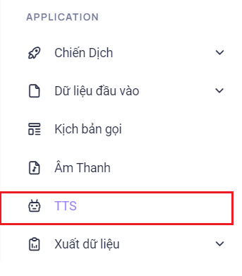
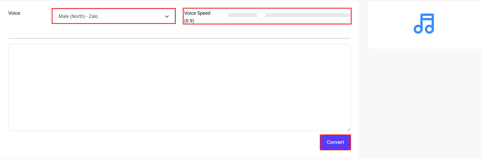
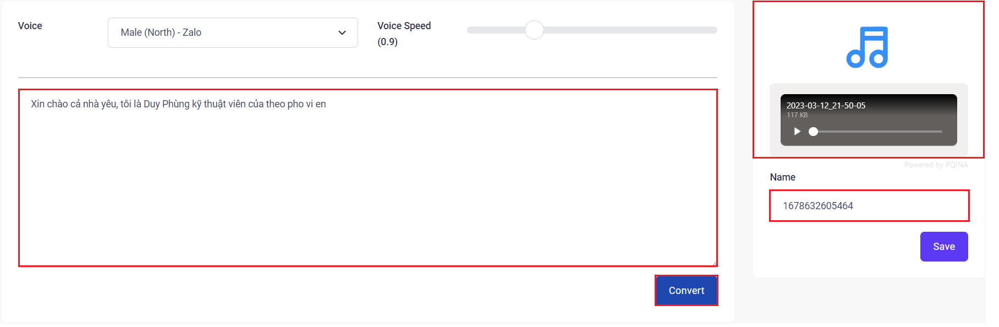

## Text To Speech - Chuyển đổi văn bản thành giọng nói

Text To Speech (Chuyển đổi văn bản thành giọng nói) là một ứng dụng dùng để chuyển đổi những nội dung văn bản được nhập thành một đoạn âm thanh. Đoạn âm thanh này có thể tinh chỉnh được tốc độ đọc, giọng vùng miền, công nghệ âm thanh đến từ nhà phát triển như Google, Zalo tuỳ thuộc vào nhu cầu sử dụng. Bên cạnh đó, những mẩu Chuyển đổi văn bản thành giọng nói này có thể sử dụng được nhiều lần cho nhiều chiến dịch trong hệ thống tổng đài.

### Bước 1: Truy cập vào thanh menu góc phải màn hình và nhấp chọn menu TTS (Text To Speech)


### Bước 2:  Ở menu TTS sẽ được dùng để tạo các mẫu thoại bằng cách chuyển đổi các nội dung văn bản thành một tệp thoại


```jsx title="Giải thích thông số"
- Voice: giọng đọc, hệ thống hỗ trợ tổng cộng là 6 giọng đọc.
 + Male (North) - Google: giọng nam Bắc Google
 + Female (North) - Google: giọng nữ Bắc Google
 + Male (North) -  Zalo: giọng nam Bắc Zalo
 + Female (North) - Zalo: giọng nữ Bắc Zalo
 + Male (South) - Zalo: giọng nam Nam Zalo
 + Female (South) - Zalo: giọng nữ Nam Zalo
- Voice speed: tốc độ đọc.
- Convert: chuyển đổi nội dung văn bản.
```

### Bước 3: Tiến hành nhập nội dung văn bản và chuyển đổi thành mẫu thoại có thể sử dụng được. Ấn Save để lưu lại mẫu thoại đã chuyển đổi
