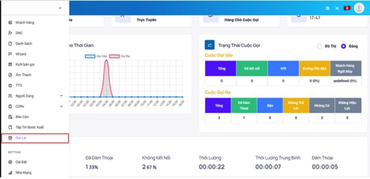
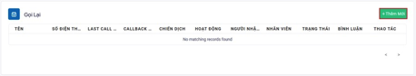
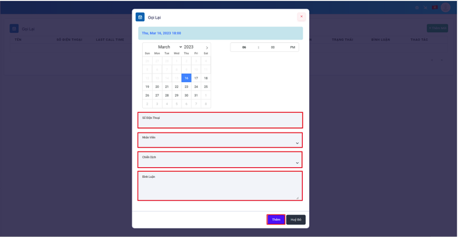
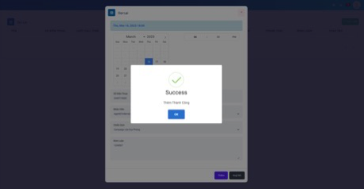
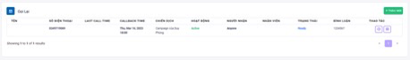

## Gọi Lại
Gọi lại có chức năng nhắc nhở nhân viên gọi lại các cuộc gọi có trạng thái nhỡ, lỗi, không liên lạc được. Khi cài đặt thêm mới gọi lại hệ thống sẽ cảnh báo nhân viên bằng các thông báo ngay giao diện làm việc của nhân viên.

### Bước 1: Truy cập vào thanh menu góc trái màn hình và nhấp chọn menu Gọi Lại.


### Bước 2: Ấn vào Thêm Mới để tạo ra cảnh báo Gọi Lại


### Bước 3: Điền đầy đủ các thông tin cần thiết để hoàn tất quá trình tạo cuộc Gọi Lại. Sau đó ấn Thêm


```jsx title="Giải thích thông số"
- Số điện thoại: số điện thoại khách hàng cần gọi lại
- Nhân viên: nhân viên được phân bổ gọi lại
- Chiến dịch: chiến dịch có chứa dữ liệu khách hàng đó
- Bình luận: dùng để mô tả, ghi chú chiến dịch đó phục vụ cho mục đích nhận biết chiến dịch sử dụng.
```

### Bước 4: Hoàn tất quá trình tạo cuộc Gọi Lại.


