## Chiến Dịch Autodialer

### Bước 1: Truy cập vào thanh menu góc trái màn hình và nhấp chọn menu Chiến Dịch.

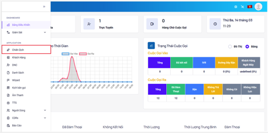

### Bước 2: Hệ thống sẽ chuyển tới màn hình Chiến Dịch. Menu này được dùng để tiến hành tạo mới chiến dịch, điều chỉnh và thay đổi cấu hình chiến dịch đã được tạo.

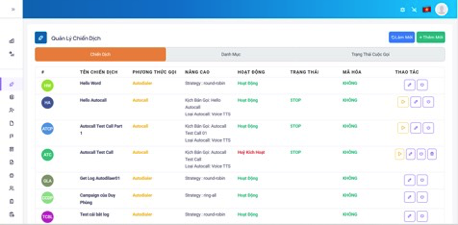

### Bước 3: Để tạo mới một chiến dịch ấn vào Thêm Mới sau đó tiến hành điền tên chiến dịch mong muốn và chọn phương thức gọi là Autodial sau đó ấn Save.


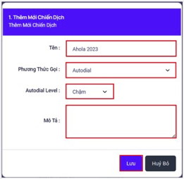

```jsx title="Giải thích thông số"
- Tên: hiển thị tên chiến dịch.
- Phương thức gọi: Autodial cho phép nhân viên gọi số khách hàng một cách tự động khi nhân viên chuyển trạng thái trên giao diện Web sang Sẵn Sàng. Hệ thống sẽ tự động gọi ra nếu thuê bao khách hàng nhấc máy, hệ thống sẽ kết nối tới nhân viên. 
- Autodial Level: được dùng để cài đặt và điều chỉnh tốc độ gọi của Autodial (chỉ áp dụng khi Phương Thức Gọi là Autodial)
 + Slow (x1) mỗi phút sẽ có số lượng cuộc gọi đổ ra phụ thuộc vào số lượng Nhân Viên đã chọn vào Sẵn Sàng (Nhân Viên trong trạng thái Sẵn Sàng), ví dụ có 3 Nhân Viên đã login vào hệ thống và ấn vào sẵn sàng, mỗi phút sẽ có 3 cuộc gọi đổ ra, nếu có 1 Nhân Viên đang đàm thoại và 1 Nhân Viên Tạm Dừng lại thì mỗi phút chỉ còn 1 cuộc gọi đổ ra
 + Normal (x2) mỗi phút sẽ có số lượng cuộc gọi đổ ra phụ thuộc vào số lượng
Nhân Viên đã chọn vào Sẵn Sàng (Nhân Viên trong trạng thái Sẵn Sàng), ví dụ có 3 Nhân Viên đã đăng nhập vào hệ thống và ấn vào Sẵn Sàng, mỗi phút sẽ có 6 cuộc gọi đổ ra, nếu có 1 Nhân Viên đang đàm thoại và 1 Nhân Viên Tạm Dừng  lại thì mỗi phút chỉ còn 2 cuộc gọi đổ ra
 + High (x3) tương tự Slow và Normal nhưng hệ số là x3
 + Advance dùng để tùy chỉnh tốc độ theo ý muốn. Có các mức độ: 1.0, 1.5, 2.0, 3.0, 4.0 và 5.0 (x1, x1.5, x2, x3, x4, x5)
- Mô tả: dùng để mô tả, ghi chú chiến dịch đó phục vụ cho mục đích nhận biết chiến dịch sử dụng.
```

### Bước 4: Sau khi đã tạo chiến dịch thành công ấn vào biểu tượng Chỉnh Sửa để tiến hành điều chỉnh và cài đặt các thông số cấu hình trong chiến dịch. Chỉnh sửa ở mục Nâng Cao.

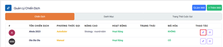

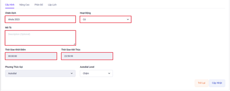

```jsx title="Giải thích thông số"
- Chiến dịch: hiển thị tên chiến dịch.
- Hoạt động: kích hoạt/huỷ kích hoạt chiến dịch.
- Mô tả: dùng để mô tả, ghi chú chiến dịch đó phục vụ cho mục đích nhận biết chiến dịch sử dụng.
- Thời gian khởi điểm: thời gian chiến dịch bắt đầu gọi được. Nếu gọi trước thời gian này thì cuộc gọi sẽ không được thực hiện
- Thời gian kết thúc: thời gian chiến dịch kết thúc và không gọi được. Nếu gọi sau thời gian này thì cuộc gọi sẽ không được thực hiện.
```

### Bước 5: Tiến hành chỉnh sửa và cấu hình ở mục Nâng Cao

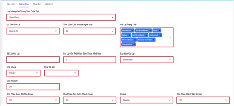

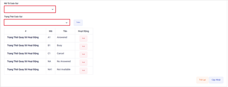

```jsx title="Giải thích thông số"
- Loại hàng chờ trung tâm cuộc gọi: chế độ đổ chuông các nhân viên đang sẵn sàng. Cần setup khi Dial Method của chiến dịch là Autodial. Có các chế độ đổ cuộc gọi vào nhân viên như Round Robin(xoay vòng có nhớ thứ tự), Ring All(xoay vòng có nhớ thứ tự), nhân viên có ít cuộc gọi( Ưu tiên nhân viên có ít cuộc gọi nhất), Từ trên xuống( Gọi nhân viên từ trên xuống), Ngẫu nhiên (đổ cuộc gọi vào ngẫu nhiên các nhân viên trong nhóm)
- Ưu tiên gọi lại: mặc định để là không có
- Thời gian chờ nghe máy: 
- Gọi lại trạng thái: gọi lại các số điện thoại khách hàng có các trạng thái đã được lựa chọn. Các trạng thái đó bao gồm: 
 + Answered: cuộc gọi đã được kết nối với thuê bao khách hàng.
 + No Answered: cuộc gọi không được thuê bao khách hàng nghe máy
 + Busy: khách hàng chủ động ngắt cuộc gọi tới
 + Congestion: đầu số gọi bị nhà mạng chặn, bị khóa
 + Cancel: cuộc gọi không được thuê bao khách hàng nghe máy và đúng thời gian quy định hồi âm chuông ngắt máy.
 + Invalid number: gọi ra tới nhà mạng nhưng nhà mạng báo sai số (số mobile sai)
 + Phone Block: số điện thoại khách hàng bị khóa.
 + Not available số điện thoại khách hàng đang nằm trong vùng phủ sóng yếu, sim bị khoá, thiết bị hết pin, hư hỏng….
 + Voicemail: số điện thoại khách hàng có đăng ký hộp thư thoại khi gọi đến cuộc gọi được chuyển vào hộp thư thoại nên không thể thực hiện kết nối giữa nhân viên và khách hàng.
- Số lần gọi lại: số lần một thuê bao được gọi tới.
- Gọi lại khi thời gian đàm thoại nhỏ hơn: thời gian đàm thoại của những cuộc gọi nào thấp hơn thời gian quy định trong menu này thì đều được gọi lại.
- Lập lịch gọi lại: gồm 2 chế độ là Ngay lập tức và Sau bao nhiêu phút. Ở bao nhiêu phút có thể thiết lập số thời gian quy định để gọi lại. Ví dụ chỉnh là 5 phút thì 5 phút sẽ thực hiện gọi lại thuê bao đó 1 lần.
- Nhà mạng: đầu số được dùng để gọi ra và nhận cuộc gọi vào nếu có thiết lập kịch bản gọi vào.
- Chế độ gọi: bao gồm 2 chế độ gọi là SIP Direct và SIM Song Song
 + SIP Direct: chế độ này cho phép gọi ra một cách trực tiếp cho tất cả các nhà mạng mà không phải chia kênh cho từng nhà mạng cụ thể. Trong khi chạy chế độ này cần quan tâm đến việc quy định số lượng cuộc gọi đồng thời đã đăng ký với nhà quản trị vì nếu điều chỉnh không đúng sẽ không đạt được kết quả như mong muốn. Chỉnh thấp hơn thì không tận dụng được tài nguyên có sẵn và cao hơn thì hệ thống không được thiết lập để đáp ứng sẽ ảnh hưởng đến quá trình sử dụng.
 + SIM Song Song: chế độ này gọi trực tiếp cho các nhà mạng thông qua việc phân chia kênh trên hệ thống. Khi gọi với chế độ này hệ thống sẽ tự động luân chuyển các kênh trống qua lại giữa các chiến dịch nhằm đảm bảo hiệu suất tối ưu và không gây lãng phí tài nguyên.
- Max hopper: hàng chờ cuộc gọi trong chiến dịch. Ví dụ khi cài đặt hopper là 20 thì hệ thống sẽ đưa 20 số điện thoại khách hàng vào hàng chờ để khi nhân viên ấn sẵn sàng thì sẽ đổ cuộc gọi ra. 
- Cho phép quay số thủ công: dùng để bật/tắt chức năng nhập số trên giao diện web để gọi ra.
- Cho phép tìm kiếm khách hàng: tính năng này được bật lên cho phép nhân viên có thể nhấn chọn khách hàng nào trong danh sách dữ liệu khách hàng tải lên mà không cần phải theo thứ tự.
- Mã hoá thuê bao: thực hiện việc mã hoá số điện thoại khách hàng hàng một chuỗi ký tự chữ kèm số trên giao diện Web của nhân viên.
- Cho phép cảnh báo gọi lại: Cho phép bật cảnh báo để nhắc nhở nhân viên gọi lại cho những khách hàng có quan tâm
- Kịch bản cuộc gọi: một đoạn văn bản có nội dung xoay quanh cuộc hội thoại sẽ hiển thị lên khi nhân viên trong chiến dịch này kết nối đến khách hàng. Thông qua đó nhân viên sẽ dựa vào đây để diễn giải nhằm hoàn thành tốt nghiệp vụ. 
- Trạng thái cuộc gọi: kết quả cuộc gọi sẽ được nhân viên chọn sau khi cuộc gọi kết thúc để phù hợp với trạng thái của cuộc gọi đó.
```

### Bước 6: Tiến hành phân bổ các nhân viên vào trong chiến dịch sau đó ấn Update để hoàn thành việc cấu hình chiến dịch Autodial.

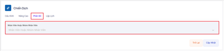

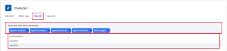

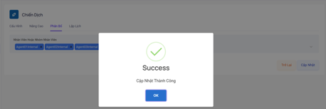

### Bước 7: Lập lịch cho chiến dịch nâng cao có thể sử dụng lập lịch này để thiết lập chiến dịch bắt đầu và kết thúc gọi vào thời gian cụ thể.

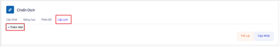

### Bước 8: Ấn vào thêm mới và tiến hành điều chỉnh thời gian sau đó ấn Cập Nhật.

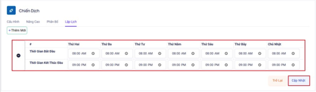

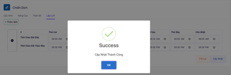