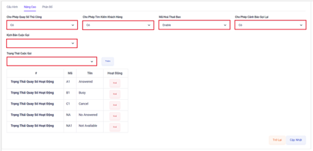

## Chiến Dịch Manual

### Bước 1: Truy cập vào thanh menu góc trái màn hình và nhấp chọn menu Chiến Dịch.


### Bước 2: Hệ thống sẽ chuyển tới màn hình Chiến Dịch. Menu này được dùng để tiến hành tạo mới chiến dịch, điều chỉnh và thay đổi cấu hình chiến dịch đã được tạo.


### Bước 3: Để tạo mới một chiến dịch ấn vào Thêm Mới sau đó tiến hành điền tên chiến dịch mong muốn và chọn phương thức gọi là Manual sau đó ấn Save.


```jsx title="Giải thích thông số"
- Tên: hiển thị tên chiến dịch.
- Phương thức gọi: Manual ở phương thức này này cho phép nhân viên nhập số khách hàng trên giao diện Web để gọi ra hoặc tải dữ liệu khách hàng lên từ đó có thể chủ động ấn gọi vào những dữ liệu khách hàng mình mong muốn. 
- Mô tả: dùng để mô tả, ghi chú chiến dịch đó phục vụ cho mục đích nhận biết chiến dịch sử dụng.
```

### Bước 4: Sau khi đã tạo chiến dịch thành công ấn vào biểu tượng Chỉnh Sửa để tiến hành điều chỉnh và cài đặt các thông số cấu hình trong chiến dịch. Chỉnh sửa ở mục Nâng Cao


```jsx title="Giải thích thông số"
- Chiến dịch: hiển thị tên chiến dịch.
- Hoạt động: kích hoạt/huỷ kích hoạt chiến dịch.
- Mô tả: dùng để mô tả, ghi chú chiến dịch đó phục vụ cho mục đích nhận biết chiến dịch sử dụng.
```

### Bước 5: Tiến hành chỉnh sửa và cấu hình ở mục Nâng Cao


```jsx title="Giải thích thông số"
- Cho phép quay số thủ công: dùng để bật/tắt chức năng nhập số trên giao diện web để gọi ra.
- Cho phép tìm kiếm khách hàng: tính năng này được bật lên cho phép nhân viên có thể nhấn chọn khách hàng nào trong danh sách dữ liệu khách hàng tải lên mà không cần phải theo thứ tự.
- Mã hoá thuê bao: thực hiện việc mã hoá số điện thoại khách hàng hàng một chuỗi ký tự chữ kèm số trên giao diện Web của nhân viên.
- Cho phép cảnh báo gọi lại: Cho phép bật cảnh báo để nhắc nhở nhân viên gọi lại cho những khách hàng có quan tâm.
- Kịch bản cuộc gọi: một đoạn văn bản có nội dung xoay quanh cuộc hội thoại sẽ hiển thị lên khi nhân viên trong chiến dịch này kết nối đến khách hàng. Thông qua đó nhân viên sẽ dựa vào đây để diễn giải nhằm hoàn thành tốt nghiệp vụ. 
- Trạng thái cuộc gọi: kết quả cuộc gọi sẽ được nhân viên chọn sau khi cuộc gọi kết thúc để phù hợp với trạng thái của cuộc gọi đó.
```

### Bước 6: Tiến hành phân bổ các nhân viên vào trong chiến dịch sau đó ấn Update để hoàn thành việc cấu hình chiến dịch Manual


