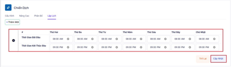

## Danh Mục

### Bước 1: Truy cập vào thanh menu góc trái màn hình và nhấp chọn menu Chiến Dịch.



### Bước 2: Hệ thống sẽ chuyển tới màn hình Chiến Dịch. Ấn chọn vào Danh Mục.


### Bước 3: Menu này được dùng để tạo ra các một danh mục chứa kết quả, trạng thái cuộc gọi để nhân viên có thể chọn sau khi kết thúc cuộc gọi. Tiến hành ấn thêm mới để tạo mới danh mục.


### Bước 4: Điền các thông tin cần thiết vào bảng Thêm Mới để hoàn tất quá trình tạo Danh Mục.


Nếu tạo có thông tin mã trùng với mã của Danh Mục đã có hệ thống sẽ báo lỗi.


```jsx title="Giải thích thông số"
- Mã: ID danh mục.
- Tên: hiển thị tên danh mục.
- Mô tả: dùng để mô tả, ghi chú chiến dịch đó phục vụ cho mục đích nhận biết danh mục sử dụng.
- ID danh mục: hiển thị ID danh mục 
- Tên danh mục: hiển thị tên danh mục
- Mô tả: dùng để mô tả, ghi chú chiến dịch đó phục vụ cho mục đích nhận biết danh mục sử dụng.
- Thao tác: có 2 thao tác chính với mục Danh Mục là chỉnh sửa và xóa
```

### Bước 5: Tiến hành thao tác chỉnh sửa với các Danh Mục đã tạo. Ấn vào biểu tượng cây bút để chỉnh và biểu tượng thùng rác để xoá.


Chỉnh sửa Danh Mục sẽ chỉnh sửa các trường thông tin của Danh Mục


Xóa Danh Mục

