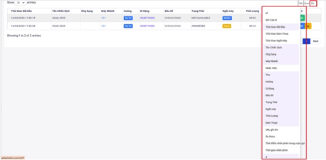

## CDRS - Lịch Sử Cuộc Gọi
CDRs (Call Detail Records) hồ sơ chi tiết cuộc gọi nơi lưu trữ các cuộc gọi đã thực hiện bao gồm trạng thái thời gian cuộc gọi, đầu số gọi ra, thuê bao được gọi tới…. Và bao gồm một số chức năng liên quan tới CDRs.

### Bước 1: Truy cập vào thanh menu góc trái màn hình và nhấp chọn menu CDRs tiếp theo chọn vào mục CDRs


### Bước 2: Chọn vào bộ lọc những lựa chọn thông tin nào cần lọc.


### Bước 3: Tiến hành thêm filter ấn vào mục Thêm Filter


### Bước 4: Trong menu CDRs muốn thêm hoặc bớt các thông tin ấn vào mục Column để thực hiện điều này.


### Bước 5: Mục Lịch sử cuộc gọi thể hiện các thông tin của lịch sử cuộc gọi


```jsx title="Giải thích thông số"
- Thời gian bắt đầu: thời gian bắt đầu thực hiện cuộc gọi
- Tên chiến dịch: hiển thị tên chiến dịch:
- Máy nhánh: máy nhánh của nhân viên.
- Di động: số điện thoại khách hàng.
- Đầu số: đầu số dùng để gọi ra.
- Hướng: hướng cuộc gọi bao gồm 3 hướng chính là gọi ra, gọi vào và gọi nội bộ.
- Trạng thái: trạng thái cuộc gọi.
 + Answered: cuộc gọi đã được kết nối với thuê bao khách hàng.
 + No Answered: cuộc gọi không được thuê bao khách hàng nghe máy
 + Busy: khách hàng chủ động ngắt cuộc gọi tới
 + Busy line: Mobile gọi vào nhưng chưa được kết nối đến nhân viên (áp dụng cho chiến dịch Inbound, Autodialer)
 + IVR: Mobile gọi vào IVR chưa nhấn phím đã mobile ngắt máy (áp dụng cho chiến dịch Inbound, Autodialer)
 + Failed: Template lỗi, script lỗi, script bị xoá, hết key zalo.
 + Congestion: đầu số gọi bị nhà mạng chặn, bị khóa.
 + Cancel: cuộc gọi không được thuê bao khách hàng nghe máy và đúng thời gian quy định hồi âm chuông ngắt máy.
 + Invalid number: gọi ra tới nhà mạng nhưng nhà mạng báo sai số (số mobile sai)
 + Phone Block: số điện thoại khách hàng bị khóa.
 + Not available: số điện thoại khách hàng đang nằm trong vùng phủ sóng yếu, sim bị khoá, thiết bị hết pin, hư hỏng….
 + Voicemail: số điện thoại khách hàng có đăng ký hộp thư thoại khi gọi đến cuộc gọi được chuyển vào hộp thư thoại nên không thể thực hiện kết nối giữa nhân viên và khách hàng.
- Ứng dụng: Ứng dụng vào cuộc gọi bao gồm các ứng dụng Dial, Autocall, Click to call, Inbound.
 + Dial: quay số gọi thông thường
 + Click to call: ấn gọi từ giao diện web sẽ đổ tín hiệu vào ứng dụng softphone và gọi ra ngoài số điện thoại khách hàng.
 + Inbound: cuộc gọi vào.
 + Autocall: sử dụng để lọc bên hệ thống Autocall (Hệ thống này không hỗ trợ).
- Thời lượng: tính từ lúc khởi tạo cuộc gọi đến lúc kết thúc cuộc gọi
- Đàm thoại: thời gian đàm thoại giữa nhân viên và khách hàng.
- #: Các thao tác với cuộc gọi như nghe ghi âm, tải ghi âm và xem thông tin cuộc gọi
```

### Bước 6: Để nghe file ghi âm cuộc gọi, biểu tượng File Audio 


### Bước 7: Để tải file ghi âm, chọn vào biểu tượng Download


Tại đây, có thể chỉnh sửa một số thông tin của CDR cuộc gọi


### Bước 8: Xuất lịch sử cuộc gọi, chọn các mục CSV, Excel để xuất theo file csv hoặc excel.


:::note MY NOTE
- Nếu xuất trực tiếp sẽ gây tải cao đến server, sau khi xuất xong sẽ tự động tải về máy.
- Nếu xuất phía server thì sau khi chọn hệ thống sẽ popup thông báo Đang xuất dữ liệu hệ thống sẽ chạy background đỡ gây tải cao cho phía server. 
:::

### Bước 9: Truy cập vào thanh menu góc trái màn hình ấn chọn vào Tập Tin Được Xuất


### Bước 10: Ấn vào nút Download để tải file về


