## Chỉnh Sửa Trường Trong Danh Sách
Chỉnh sửa trường cho phép tạo thêm nhiều trường thông tin tạo thành một Phiếu Thông Tin Khách Hàng - thông tin bổ sung ngoài các trường mặc định của hệ thống. Phiếu Thông Tin Khách Hàng sẽ tải dữ liệu đã được tải lên khi cuộc gọi đổ vào nhân viên hoặc nhân viên thực hiện thao tác gọi đến một số điện thoại có trong danh sách, cho phép nhân viên kiểm tra, chỉnh sửa và cập nhật các thông tin của số điện thoại đó.

### Bước 1: Truy cập vào thanh menu góc trái màn hình và nhấp chọn menu Danh Sách.
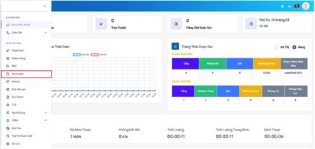

### Bước 2: Thêm các trường thông tin trong danh sách ấn vào thao tác chọn chỉnh sửa danh sách. Sau đó chọn vào Chỉnh Sửa Trường
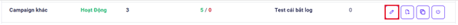

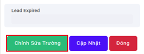

### Bước 3: Sau khi đã vào giao diện Chỉnh Sửa Trường. Điền các thông tin liên quan vào mục Bảng, Hàng, Tên Trường….
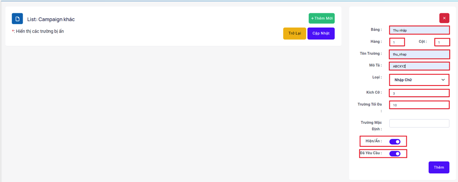

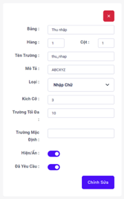
```jsx title="Giải thích thông số"
- Bảng: hiển thị tên trường trên giao diện web
- Hàng: Thứ tự hiển thị từ trên xuống trong một dãy trường thông tin, số thấp nhất sẽ nằm trên cùng, số cao nhất sẽ nằm dưới cùng trong một dãy
- Cột: là thứ tự hiển thị từ trái sang phải nếu có hai trường thông tin mà chung một xếp hạng với nhau, số thấp nhất sẽ nằm ngoài cùng bên trái, số cao nhất sẽ nằm ngoài cùng bên phải
- Tên trường: tên file sẽ thêm vào trong file excel để tải dữ liệu lên vào danh sách để khi gọi sẽ dùng dữ liệu trong trường thông tin để hiển thị lên trên giao diện web, nên đặt hoàn toàn chữ thường và không có khoảng cách và dấu. Ví dụ: ten_khach_hang, so_dien_thoai
- Mô tả: là thông tin mô tả của trường đó, được hiển thị trên giao diện của Admin/Supervisor
- Loại: sẽ quyết định dạng dữ liệu gì sẽ được hiển thị trên giao diện của nhân viên
```

#### Các loại form, trường thông tin
- Nhập chữ: nhập văn bản vào trường thông tin có chọn loại này.

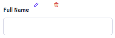

- Nhập số: nhập dữ liệu số vào trường thông tin có chọn loại này.

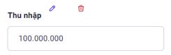

- Nhập vùng: nhập nơi sinh sống, cư trú vào trường thông tin có chọn loại này.

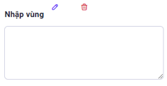

- Checkbox: cho phép tạo ra các ô để nhân viên có thể tích chọn 

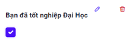

- Chọn ngày giờ: khi chọn vào trường này, sẽ hiển thị ra lịch thời gian cho phép nhân viên  chọn ngày tháng năm, không cần phải nhập thủ công.


- Chọn mẫu: được dùng để tạo ra các lựa chọn dưới dạng nội dung cho nhân viên lựa chọn.

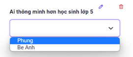

- Nhập kịch bản: là khung để hiển thị văn bản, hoặc đoạn script code từ HTML,... và không thể edit nhưng có thể dùng biến như trong menu Script.

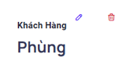

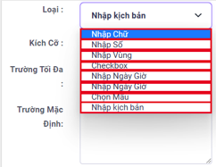

```
- Kích cỡ: có thể sẽ khác nhau tùy theo trường cần hiển thị dữ liệu lớn nhỏ. - Một Hàng sẽ có tổng cộng 12 cột, kích cỡ sẽ tính theo số cột. 
- Trường mặc định: sẽ là thông tin mặc định nếu không nhập vào bất kỳ dữ liệu gì
- Hiện/Ẩn: dùng để hiển thị hoặc ẩn trường thông tin
- Bắt buộc: sẽ dùng để bắt buộc nhân viên phải nhập hoặc phải chọn dữ liệu nếu đặt là Có. Mặc định sẽ trống - tương ứng với Không
```
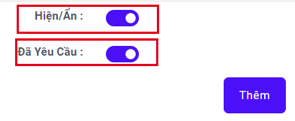

### Bước 4: Sau khi đã điền đầy đủ các thông tin ấn vào thêm mới.
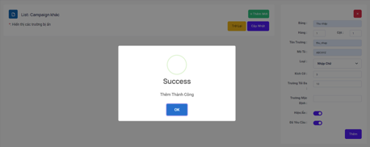