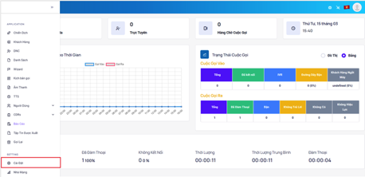

## Quản Lý Phòng Ban
Phòng ban được tạo ra để chứa nhóm, một phòng ban có thể chứa nhiều nhóm và một nhóm có thể chứa nhiều nhân viên.

### Bước 1: Truy cập vào thanh menu góc trái màn hình và nhấp chọn menu Cài Đặt.


### Bước 2: Hệ thống sẽ chuyển tới màn hình Cài Đặt. Chọn vào mục Phòng Ban.


### Bước 3: Ấn vào Thêm Mới để khởi tạo Phòng Ban mới và tiến hành điền các thông tin liên quan.


### Bước 4: Ấn Thêm Mới để hoàn tất quá trình tạo.


```jsx tilter="Giải thích thông số"
- Phòng ban: hiển thị tên phòng ban.
- Mô tả: dùng để mô tả, ghi chú phòng bạn đó phục vụ cho mục đích nhận biết phòng ban.
- Số lượng nhóm: hiển thị số lượng nhóm trong một phòng ban.
- Số lượng người dùng: hiển thị số lượng người dùng là nhân viên. Trong một phòng ban.
- Thao tác: có 2 thao tác chính là chỉnh sửa và xóa. 
```

### Bước 5: Chỉnh sửa hoặc xóa Phòng Ban ấn vào biểu tượng cây bút để chỉnh hoặc biểu tượng thùng rác để xoá.


- Chỉnh sửa Phòng Ban


- Xóa Phòng Ban


