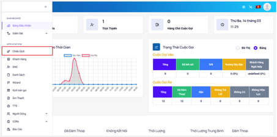
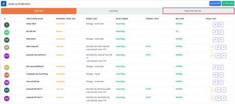
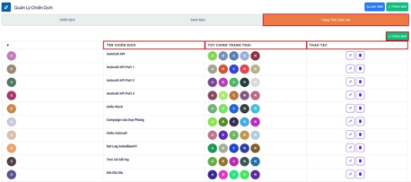
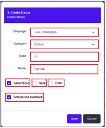
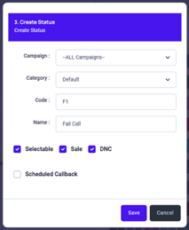
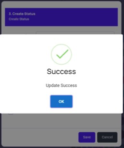
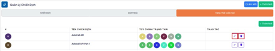
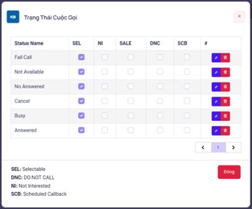
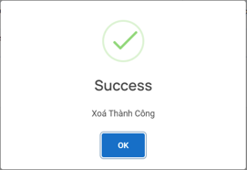

## Trạng Thái Cuộc Gọi - Call Result

### Bước 1: Truy cập vào thanh menu góc trái màn hình và nhấp chọn menu Chiến Dịch.



### Bước 2: Hệ thống sẽ chuyển tới màn hình Chiến Dịch. Ấn chọn vào Trạng Thái Cuộc Gọi.



### Bước 3: Menu này được dùng để tạo ra các kết quả, trạng thái cuộc gọi mà nhân viên có thể chọn sau khi kết thúc cuộc gọi. Tiến hành ấn thêm mới để tạo mới các kết quả, trạng thái sau cuộc gọi.



### Bước 4:  Điền các thông tin cần thiết vào bảng Thêm Mới để hoàn tất quá trình tạo các kết quả, trạng thái sau cuộc gọi.







```jsx title="Giải thích thông số"
- Chiến dịch: Chọn ALL CAMPAIGNS nếu muốn áp dụng cho tất cả chiến dịch hiện có. Chọn cho từng chiến dịch đơn lẻ thì ấn vào mục Campaign và chọn riêng cho chiến dịch đó.
- Danh mục: Lựa chọn danh mục (Category) đã tạo cần thêm các kết quả, trạng thái cuộc gọi (Disposition)
- Code: Dùng để phân biệt giữa các kết quả, trạng thái cuộc gọi. Mỗi kết quả, trạng thái cuộc gọi chỉ có 1 mã và không được trùng với các kết quả, trạng thái cuộc gọi khác và danh mục.
- Selectable: Cho phép chọn trong bảng
- Scheduled Callback: Cho phép lên lịch gọi lại
- DNC: khi kết quả, trạng thái cuộc gọi tạo có bật tính năng này, khi nhân viên gọi và chọn đúng kết quả, trạng thái cuộc gọi thì hệ thống sẽ đưa số có kết quả, trạng thái cuộc gọi này vào danh sách DNC - Do Not Call.
- Sale: khi trạng thái có bật tính năng này hệ thống sẽ đưa số có trạng thái vào danh sách có Sale đơn hàng trong ngày. Dựa vào đó có thể thống kê được số lượng đơn hàng được Sale.
```
### Bước 5: Tiến hành thao tác chỉnh sửa với các kết quả, trạng thái cuộc gọi đã tạo. Ấn vào biểu tượng cây bút để chỉnh và biểu tượng thùng rác để xoá.



Chỉnh sửa các kết quả, trạng thái cuộc gọi



Xóa các kết quả, trạng thái cuộc gọi

