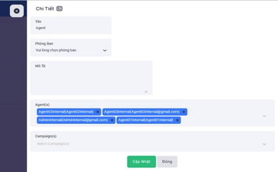

## Quản Lý Nhóm
Nhóm được tạo ra để chứa các nhân viên trong một đội thông qua qua đó người quản trị có thể phân bổ công việc cho các nhân viên trong một nhóm và xem hồ sơ cuộc gọi trong từng nhóm riêng biệt.

### Bước 1: Truy cập vào thanh menu góc trái màn hình và nhấp chọn menu Cài Đặt.


### Bước 2: Hệ thống sẽ chuyển tới màn hình Cài Đặt. Chọn vào mục Nhóm.


### Bước 3: Ấn vào Thêm Mới để khởi tạo Nhóm mới và tiến hành điền các thông tin liên quan.


### Bước 4: Ấn Thêm Mới để hoàn tất quá trình tạo.


```jsx tilter="Giải thích thông số"
- Tên: hiển thị tên nhóm.
- Số lượng: số lượng nhân viên trong nhóm.
- Phòng ban: trực thuộc phòng ban nào.
- Mô tả: dùng để mô tả, ghi chú phòng bạn đó phục vụ cho mục đích nhận biết phòng ban.
- Thao tác: bao gồm 2 thao tác chính là chỉnh sửa và xóa.
```

### Bước 5: Chỉnh sửa hoặc xóa Nhóm ấn vào biểu tượng cây bút để chỉnh hoặc biểu tượng thùng rác để xoá.


- Chỉnh sửa Nhóm




- Xóa Nhóm


