## Khách Hàng - Lead

### Bước 1: Truy cập vào thanh menu góc trái màn hình và nhấp chọn menu Khách Hàng.

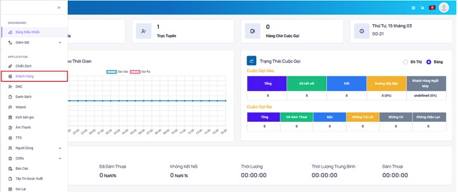

### Bước 2: Hệ thống sẽ chuyển tới giao diện Khách Hàng. Menu này sẽ giám sát được thông tin khách hàng, các trạng thái cuộc gọi của khách hàng, nhân viên hỗ trợ khách hàng….

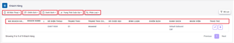

```jsx title="Giải thích thông số"
- Số điện thoại: lọc tên số điện thoại của khách hàng.
- Chiến dịch: lọc tên chiến dịch có dữ liệu khách hàng.
- Danh sách: lọc tên danh sách gắn với chiến dịch chứa dữ liệu khách hàng.
- Status: trạng thái cuộc gọi.
 + Answered: cuộc gọi đã được kết nối với thuê bao khách hàng.
 + No Answered: cuộc gọi không được thuê bao khách hàng nghe máy
 + Busy: khách hàng chủ động ngắt cuộc gọi tới
 + Busy line: Mobile gọi vào nhưng chưa được kết nối đến nhân viên (áp dụng cho chiến dịch Inbound, Autodialer)
 + IVR: Mobile gọi vào IVR chưa nhấn phím mobile đã ngắt máy (áp dụng cho chiến dịch Inbound, Autodialer)
 + Failed: Template lỗi, script lỗi, script bị xoá, hết key zalo.
 + Congestion: đầu số gọi bị nhà mạng chặn, bị khóa.
 + Cancel: cuộc gọi không được thuê bao khách hàng nghe máy và đúng thời gian quy định hồi âm chuông ngắt máy.
 + Invalid number: gọi ra tới nhà mạng nhưng nhà mạng báo sai số (số mobile sai)
 + Phone Block: số điện thoại khách hàng bị khóa.
 + Not available: số điện thoại khách hàng đang nằm trong vùng phủ sóng yếu, sim bị khoá, thiết bị hết pin, hư hỏng….
 + Voicemail: số điện thoại khách hàng có đăng ký hộp thư thoại khi gọi đến cuộc gọi được chuyển vào hộp thư thoại nên không thể thực hiện kết nối giữa nhân viên và khách hàng.
```
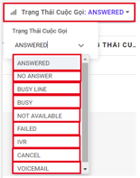

```
- Phân loại: hệ thống phân loại khách hàng theo các điều kiện như sau: Mới nhất cho tới cũ nhất, Thời gian cuộc gọi gần nhất, Trạng thái cuộc gọi gần nhất, Họ tên.
```
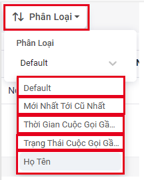

```
- Mã khách hàng: mã khách hàng bao gồm chữ và số. 
- Khách hàng: hiển thị tên khách hàng.
- Trạng thái: trạng thái cuộc gọi khách hàng viết tắt thành mã trạng thái gồm chữ và số.
- Trạng thái cuộc gọi: trạng thái cuộc gọi khách hàng được chú thích.
- Số cuộc gọi: số lần gọi tới số điện thoại khách hàng
- Bình luận: ghi chú với khách hàng.
- Danh sách: hiển thị tên danh sách chứa dữ liệu khách hàng.
- Nhân viên: hiển thị tên nhân viên trao đổi trực tiếp với khách hàng.
- Thao tác: bao gồm 2 thao tác chính là chỉnh sửa và xóa.
```

### Bước 3: Sử dụng bộ lọc bằng cách nhập các thông tin vào sau đó ấn nút Bộ Lọc để hiển thị ra các dữ liệu cần tìm kiếm.

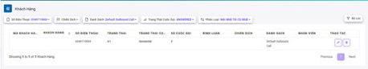

### Bước 4: Xem hoặc chỉnh sửa thông tin khách hàng ấn vào biểu tượng cây bút.
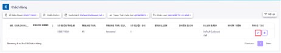

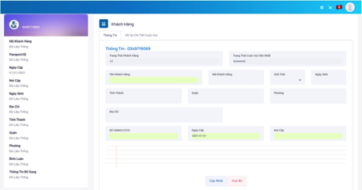

### Bước 5: Ấn vào hồ sơ chi tiết cuộc gọi để xem hồ sơ lịch sử tất cả có liên quan đến thuê bao.
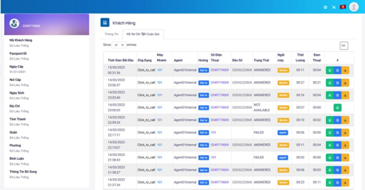

### Bước 6: Ở menu Hồ Sơ Chi Tiết Cuộc Gọi có thể được các thao tác như nghe ghi âm, tải xuống ghi âm và xem chi tiết cuộc gọi.
Xem chi tiết cuộc gọi

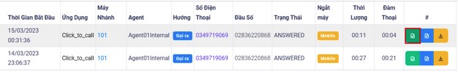

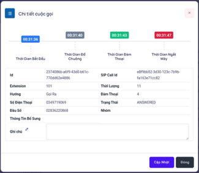

Nghe ghi âm

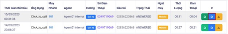

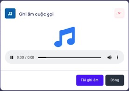

Tải xuống ghi âm

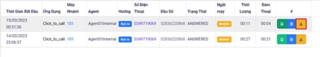

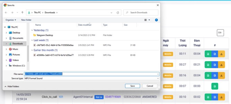

### Bước 7: Sau khi xem và chỉnh sửa thông tin khách hàng ấn Cập Nhật để lưu lại các thông tin mới.
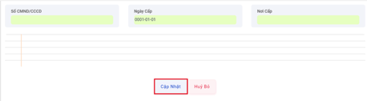