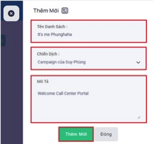

## Danh Sách

### Bước 1: Truy cập vào thanh menu góc trái màn hình và nhấp chọn menu Danh Sách.


### Bước 2: Hệ thống sẽ chuyển tới màn hình Danh Sách. Menu này được dùng để quản trị, theo dõi lượng dữ liệu khách hàng đã tải lên và tải dữ liệu mới cho các danh sách đã gắn với chiến dịch.


```jsx title="Giải thích thông số"
- Danh sách được hiểu là nơi lưu trữ dữ liệu khách hàng mà chiến dịch được gán với danh sách đó sẽ dùng chính những dữ liệu này để đổ cuộc gọi ra.
- Tên: hiển thị tên của danh sách
- Hoạt động: hiển thị trạng thái của danh sách. Ở trạng thái hoạt động chiến dịch được phép dùng dữ liệu của danh sách để gọi ra. Ngược lại ở trạng thái không hoạt động chiến dịch không thể đổ cuộc gọi ra ngoài được.
- Tổng: tổng dữ liệu danh sách khách hàng. Mỗi thuê bao khách hàng sẽ được tính là một.
- Total Success: hiển thị số lượng dữ liệu khách hàng đã tải lên thành công và thất bại. Dữ liệu khách hàng rơi vào trạng thái tải lên thất bại sẽ xuất phát từ những nguyên nhân: 
 + Cột phone_number trong file upload không có số điện thoại.
 + Sai tên, sai cột thông tin ví dụ như cột tên khách hàng mà điền số điện thoại vào.
 + Số điện thoại lớn hơn 11 số và ít hơn 8 số. 
 + Rỗng cột, format tệp tải lên sai, dư hàng tải lên.
- Chiến dịch: chiến dịch được gắn với danh sách. Chiến dịch được gán sẽ dùng dữ liệu trong danh sách để gọi ra.
- Trường: các trường thông tin được thêm vào với mục đích bổ trợ thêm thông tin liên quan đến khách hàng. Ví dụ như địa chỉ, nơi sinh, nguyên quán….
- Thao tác: bao gồm tổng cộng 4 thao tác là Chỉnh Sửa Danh Sách, Xuất Danh Sách, Sao Chép Danh Sách, Bật Tắt Danh Sách. 
```

#### Chỉnh sửa danh sách được kí hiệu là cây bút dùng để chỉnh sửa dữ liệu được tải lên.


```jsx title="Chi Tiết Danh Sách"
- Tên danh sách: hiển thị tên của danh sách.
- Chiến dịch: hiển thị tên chiến dịch gắn với danh sách.
- Hoạt động: trạng thái hoạt động hay không hoạt động của danh sách.
- Mô tả: dùng để mô tả, ghi chú danh sách đó phục vụ cho mục đích nhận biết danh sách sử dụng.
- Làm mới danh sách: lựa chọn có cho một lần cập nhật sẽ làm mới tất cả dữ liệu tức là dữ liệu khách hàng trước đó sẽ mất tính từ thời điểm cập nhật hiện tại.
- Làm mới: sử dụng để làm mới dữ liệu khách hàng dựa vào trạng thái của dữ liệu. Có 3 cách để làm mới
 + All: làm mới tất cả dữ liệu khách hàng trong danh sách đó.
 + Only Lead Success: làm mới dữ liệu khách hàng thành công.
 + Only Lead Fail: làm mới dữ liệu khách hàng thất bại.
```

```
- Trạng thái: trạng thái cuộc gọi.
 + Answered: cuộc gọi đã được kết nối với thuê bao khách hàng.
 + No Answered: cuộc gọi không được thuê bao khách hàng nghe máy
 + Busy: khách hàng chủ động ngắt cuộc gọi tới
 + Busy line: Mobile gọi vào nhưng chưa được kết nối đến nhân viên (áp dụng cho chiến dịch Inbound, Autodialer)
 + IVR: Mobile gọi vào IVR chưa nhấn phím đã mobile ngắt máy (áp dụng cho chiến dịch Inbound, Autodialer)
 + Failed: Template lỗi, script lỗi, script bị xoá, hết key zalo.
 + Congestion: đầu số gọi bị nhà mạng chặn, bị khóa.
 + Cancel: cuộc gọi không được thuê bao khách hàng nghe máy và đúng thời gian quy định hồi âm chuông ngắt máy.
 + Invalid number: gọi ra tới nhà mạng nhưng nhà mạng báo sai số (số mobile sai)
 + Phone Block: số điện thoại khách hàng bị khóa.
 + Not available: số điện thoại khách hàng đang nằm trong vùng phủ sóng yếu, sim bị khoá, thiết bị hết pin, hư hỏng….
 + Voicemail: số điện thoại khách hàng có đăng ký hộp thư thoại khi gọi đến cuộc gọi được chuyển vào hộp thư thoại nên không thể thực hiện kết nối giữa nhân viên và khách hàng.
```


```
- Chỉnh sửa trường: được dùng để thêm hoặc xoá trường vào trong trong danh sách
```

```
- Cập Nhật: cập nhật những thay đổi.
- Trạng thái danh sách: hiển thị thông tin trạng thái dữ liệu khách hàng đã tải lên và trạng thái cuộc gọi của những dữ liệu đó.
```


#### Xuất danh sách xuất tất cả dữ liệu khách hàng đã upload từ trước cho đến thời điểm tải xuống. Tệp tải xuống được lưu dưới dạng excel và được lưu trữ ở Menu Xuất Dữ Liệu.


#### Sao chép danh sách: sao chép được dùng để sao chép các trường thông tin từ campaign này sang campaign khác. Chỉ sao chép các trường thông tin còn dữ liệu khách hàng không được sao chép sang.


#### Bật tắt danh sách: được dùng để kích hoạt hoặc huỷ kích hoạt của danh sách. Nếu huỷ kích hoạt thì chiến dịch gắn với danh sách này sẽ không thể đổ cuộc gọi ra được.


### Bước 3: Thêm mới một danh sách ấn vào nút Thêm Mới


### Bước 4: Điền các thông tin cần thiết để tạo một danh sách hoàn chỉnh như Tên Danh Sách, Chiến Dịch và Mô Tả. Sau đó ấn Thêm Mới để hoàn tất quá trình tạo Danh Sách.




### Bước 5: Tiến hành tải dữ liệu lên danh sách vừa mới tạo bằng cách lựa chọn danh sách trong menu Danh Sách góc trái màn hình và ấn vào chỗ “Drag & Drop your file or Browser” để tải dữ liệu từ thiết bị vào danh sách.


```jsx title="Giải thích thông số"
- Danh sách: bao gồm các danh sách đã tạo.
- Kiểm tra trùng: kiểm tra dữ liệu có trùng lặp nhằm lọc bỏ để tránh việc gọi một dữ liệu khách nhiều lần gây ảnh hưởng đến thuê bao khách hàng. Kiểm tra trùng bao gồm 3 kiểu:
 + Kiểm Tra Dữ Liệu Trùng Trong Danh Sách: hệ thống sẽ kiểm tra dữ liệu khách hàng được tải lên ngay trong danh sách chọn kiểu kiểm tra này. Nếu một số điện thoại được lặp từ 2 lần trở lên hệ thống sẽ lọc bỏ chỉ còn 1.
 + Kiểm Tra Dữ Liệu Trùng Trong Chiến Dịch: hệ thống sẽ kiểm tra dữ liệu khách hàng dựa trên chiến dịch được gắn với danh sách. Một chiến dịch có thể gắn cho nhiều danh sách, đồng nghĩa hệ thống sẽ quét toàn bộ dữ liệu khách hàng trong các danh sách nào được gắn với chiến dịch đã chọn. Sau đó lọc bỏ và chỉ giữ 1 trên danh sách lựa chọn kiểu kiểm tra này.
 + Kiểm Tra Dữ Liệu Trùng Trong Hệ Thống: hệ thống sẽ kiểm tra toàn bộ hệ thống không xét điều kiện cụ thể nào miễn là trong danh sách này có dữ liệu trùng với các danh sách khác hệ thống sẽ tự động lọc bỏ các danh sách kia và giữ lại dữ liệu ở mỗi danh sách này.
```


```
- Tập tin: tải dữ liệu từ thiết bị lên
```


 

### Bước 6: Copy danh sách
Copy (Sao chép danh sách): tính năng này dùng để sao chép các trường thông tin từ danh sách này sang danh sách khác, chỉ sao chép các trường thông tin, không sao chép dữ liệu. Để thực hiện tính năng này, Leader/Manager nhấn vào icon sao chép và lựa chọn thông tin như sau:
 - List: là danh sách có các trường thông tin muốn sao chép
 - List Destination: là danh sách được thêm các trường từ List


