## Quản Lý Máy Nhánh

### TẠO MÁY NHÁNH
Máy nhánh được hiểu như là một mã định danh gắn liền với nhân viên được dùng để kết nối với tổng đài nhằm thực hiện cuộc gọi ra và đón cuộc gọi vào.  Menu này hỗ trợ tạo máy nhánh và cung cấp mã QR để chuyển hoá việc đăng nhập máy nhánh nhanh hơn.

### Bước 1: Truy cập vào thanh menu góc trái màn hình và nhấp chọn menu Người Dùng tiếp theo chọn vào mục Máy Nhánh
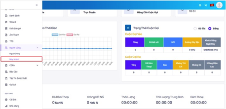

### Bước 2: Trong menu Quản Lý Máy Nhánh, ấn vào Thêm Mới để thực hiện việc tạo mới máy nhánh
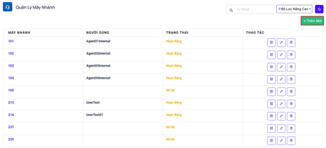

### Bước 3: Điền đầy đủ các thông tin cần thiết và chọn nhân viên gắn với máy nhánh đó ở mục người dùng.

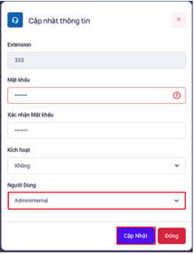

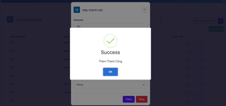

```jsx title="Giải thích thông số"
- Máy nhánh: máy nhánh gắn với nhân viên dùng để nghe gọi.
- Mật khẩu: mật khẩu dùng để đăng nhập máy nhánh
- Xác nhận mật khẩu: xác nhận mật khẩu.
- Kích hoạt: bật/tắt trạng thái hoạt động của người máy nhánh
- Người dùng: gắn với nhân viên chưa có máy nhánh.
```
### Bước 5: Sử dụng mã QR của máy nhánh ấn vào biểu tượng mã QR. Ấn Generate để nhận mã QR sau đó dùng thiết bị di động quét mã để chuyển hóa việc đăng nhập máy nhánh nhanh chóng.
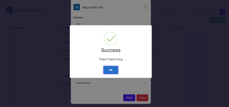

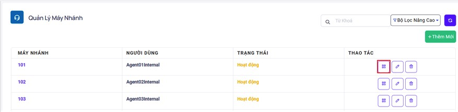

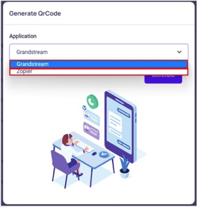

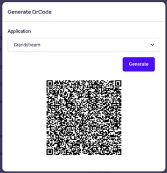

### Bước 6: Xoá máy nhánh
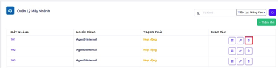

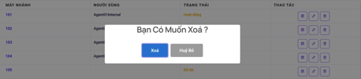

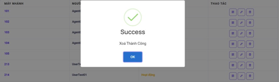

### Bước 7: Sử dụng bộ tìm kiếm điền vào ô từ xoá sau đó ấn biểu tượng làm mới ký hiệu là mũi tên xoay chiều
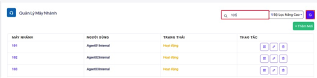

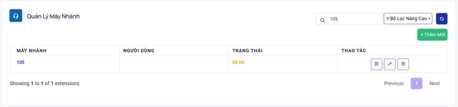