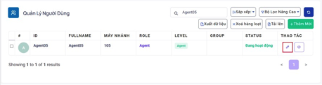

## Quản Lý Người Dùng

### Bước 1: Truy cập vào thanh menu góc trái màn hình và nhấp chọn menu Người Dùng

### Bước 2: Trong menu Quản Lý Người Dùng, người dùng Admin có thể quản lý được tất cả người cấp Manager/Leader/nhân viên trên hệ thống 
Người dùng Admin có thể xem và chỉnh sửa được các thông tin: Tên người dùng, username, email, số máy nhánh, vai trò, cấp độ và trạng thái của các người dùng trên hệ thống.

Ngoài ra, có thể filter user dựa vào Username hoặc Email của user bằng cách nhập thông tin username hoặc Email vào ô Username/Email sau đó nhấn vào nút Refresh

### Bước 3: Chỉnh sửa cập nhật thông tin người ấn vào biểu tượng cây bút

### Bước 4: Ấn cập nhật để hoàn tất quá trình cập nhật thông tin người dùng

Tắt hoạt động của người dùng không cho người đó đăng nhập để thực hiện cuộc gọi hoặc đón cuộc gọi

### TẮT HOẠT ĐỘNG NGƯỜI DÙNG THỦ CÔNG

### Bước 1: Truy cập vào thanh menu góc trái màn hình và nhấp chọn menu Người Dùng

### Bước 2: Trong menu Quản Lý Người Dùng ấn vào biểu tượng công tắc để bật/tắt hoạt động của người dùng

### Bước 3: Hệ thống sẽ hiển thị thông báo yêu cầu xác nhận tắt hoạt động của người dùng ấn vào Tắt để hoàn tất quá trình.

### TẮT HOẠT ĐỘNG NGƯỜI DÙNG QUA FILE EXCEL
### Bước 1: Truy cập vào thanh menu góc trái màn hình và nhấp chọn menu Người Dùng

### Bước 2: Chuẩn bị file dùng để tải dữ liệu người dùng với các thông tin người dùng cần tạo.
Template Import User: [DownLoad](https://docs.google.com/spreadsheets/d/1JH8JKsRsLuM1txnVAIMRQ1cf_VcxBvAv/edit#gid=1447860682)

### Bước 3: Trong menu Quản Lý Người Dùng ấn vào nút Tải Lên để tải file excel dùng để tắt hoạt động của nhiều người dùng cùng một lúc.

### Bước 4: Sau khi ấn Tải Lên hệ thống hiển thị bảng Import File ấn vào ô “Drag & Drop Your Files or Browse” để chọn File cần tải lên sau đó nhấn Open.

### Bước 5: Sau khi ấn Import hệ thống sẽ hiển thị một thông báo báo đã upload danh sách thành công

### XOÁ NGƯỜI DÙNG

#### XOÁ MỘT NGƯỜI DÙNG CỤ THỂ
Trước khi xóa user cần phải disable các user cần xóa bằng cách import file disable chứa các user đó hoặc disable trên từng user.

##### Bước 1: Truy cập vào thanh menu góc trái màn hình và nhấp chọn menu Người Dùng

##### Bước 2: Trong menu Quản Lý Người Dùng ấn tắt hoạt động của người dùng trước sau đó tiến hành xóa.

##### Bước 3: Ấn xoá để hoàn tất quá trình xoá người dùng.

#### XOÁ NGƯỜI DÙNG HÀNG LOẠT
Trong menu Quản lý người dùng, tích chọn vào các user - người dùng cần xóa. Sau đó chọn vào nút Xóa hàng loạt

##### Bước 1: Truy cập vào thanh menu góc trái màn hình và nhấp chọn menu Người Dùng

##### Bước 2: Trong menu Quản Lý Người Dùng ấn tắt hoạt động của người dùng trước sau đó tiến hành xóa. Tích chọn các người dùng cần xoá và ấn vào nút xóa hàng loạt

##### Bước 3: Hệ thống sẽ hiển thị thông báo xác nhận rằng sẽ xoá các người dùng đã được chọn. Ấn xoá để hoàn tất quá trình.

