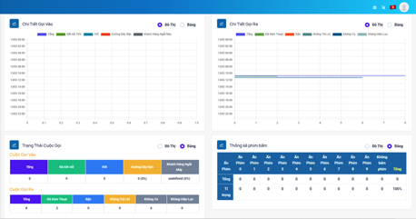

## Giám Sát Call Center

### Bước 1: Truy cập vào thanh menu góc trái màn hình và nhấp chọn menu Xuất dữ liệu sẽ bao gồm các menu kèm theo. Ở đây có 2 menu liên quan là Call Center và Cuộc Gọi Tự Động. Ấn chọn vào menu Call Center.


### Bước 2: Hệ thống sẽ chuyển tới màn hình Giám Sát. Menu này sẽ hiển thị các thông tin tập trung vào cuộc gọi và giám sát quá trình làm việc của tổng đài viên với các menu như Giám Sát Người Dùng, Chi Tiết Gọi Vào, Chi Tiết Gọi Ra…. Ấn chọn vào các biểu đồ cần hiển thị


### Bước 3: Chọn thời gian cần giám sát ấn vào mục thời gian ngày tháng. Bộ lọc thời gian dùng để điều chỉnh thời gian mong muốn xem thông tin cuộc gọi.

:::note MY NOTE
Hệ thống hỗ trợ các khung thời gian cố định và thời gian có thể điều chỉnh:
+ Today: hôm nay
+ Yesterday: hôm qua
+ Last 7 Days: 7 ngày gần nhất
+ Last 30 Days: 30 ngày gần đây
+ This Month: tháng này
+ Last Months: tháng trước
:::


### Bước 4: Chọn đơn vị thời gian cần filter. Nếu chọn giá trị filter là giờ thì hệ thống sẽ hiển thị thống kê theo giờ. Nếu chọn giá trị filter là ngày thì hệ thống hiển thị thống kê theo từng ngày ngày.


### Bước 5: Nhấn nút làm mới được ký hiệu mũi tên xoay chiều để làm mới trạng thái của nhân viên.


### Bước 6: Tuỳ chỉnh khoảng thời gian hệ thống tự động làm mới trạng thái nhân viên.


### Bước 7: Sau khi đã thực hiện các bước cài đặt như trên. Hệ thống sẽ hiển thị tất cả các menu thông tin được hỗ trợ với 2 dạng là bảng và biểu đồ.





### Các chức năng thống kê, giám sát Call Center

#### a.	Giám sát nhân viên (Monitor Agent)
Giám sát nhân viên được dùng để giám sát trực tiếp các trạng thái của nhân viên, thời gian làm việc, thời lượng đàm thoại với khách hàng…. từ đó giúp người quản trị quản lý nhân viên một cách dễ dàng.


```jsx title="Giải thích thông số"
- Nhân viên: hiển thị tên của nhân viên, tổng đài viên trực line.
- Máy nhánh: được hiểu như mã định danh của nhân viên được dùng để thực hiện cuộc gọi ra và đón cuộc gọi vào nếu có thiết lập.
- Chiến dịch: hiển thị tên chiến dịch mà nhân viên đang đăng nhập.
- Trạng thái:  trạng thái hiện tại của nhân viên đang thao tác với hệ thống. Có những trạng thái như sau Sẵn Sàng (Ready), Chưa Sẵn Sàng (Not Ready), Trạng thái sau cuộc gọi (Dispo)
 + Ready: trạng thái sẵn sàng để thực hiện cuộc gọi.
 + Not Ready: trạng thái chưa sẵn sàng để thực hiện cuộc gọi.
 + Talk: trạng thái đang đàm thoại với khách hàng.
 + After call: trạng thái đang xử lý ghi chú sau cuộc gọi.
 + Hang up: trạng thái ngắt cuộc gọi giữa nhân viên và khách hàng.
- MM:ss: thời gian hoạt động của nhân viên tính từ lúc trạng thái Ready, Talk, Hangup và After call. Kết thúc một cuộc gọi thông số này sẽ tự động làm mới về 0.
- Đợi: thời gian đợi cuộc gọi của nhân viên.
- Đăng nhập: thời gian agent login chiến dịch (tính từ lần login gần nhất, sẽ được làm mới khi agent login/logout chiến dịch.
- Thao tác: dùng để chuyển trạng thái hiện tại của nhân viên từ Not Sẵn Sàng sang Sẵn Sàng và ngược lại hoặc thu hồi nhân viên ra khỏi chiến dịch.
 + Sẵn Sàng/Chưa Sẵn Sàng ký hiệu là tam giác nằm ngang được dùng để chuyển trạng thái giữa Sẵn Sàng và Not Sẵn Sàng.
 + Thu hồi nhân viên khỏi chiến dịch được ký hiệu là mũi tên trong ô màu đỏ được dùng để thu hồi nhân viên đang đăng nhập trong một chiến dịch cụ thể.
 ```


### b.	Báo cáo tổng hợp (Report Summary)
Báo cáo tổng hợp hiển thị các thông tin liên quan cuộc gọi bao gồm số lượng cuộc gọi được phân chia theo hướng gọi ra, gọi vào, gọi nội bộ theo từng khung thời gian trong một ngày.


Nhấn vào nút Làm mới để làm mới dữ liệu ngay lập tức hoặc sau thời gian đã tùy chỉnh


Dữ liệu thống kê cuộc gọi của hệ thống sẽ được cập nhật


User Leader/Manager có thể filter đối với từng nhóm agent cụ thể, nhấn vào Nhóm để lựa chọn nhóm agent muốn filter, sau đó nhấn nút Refresh để làm mới dữ liệu.


### c.	Cuộc gọi theo thời gian - Call By Time
Hệ thống thống kê 2 dạng cuộc gọi Inbound và Outbound theo thời gian. Có 2 dạng hiển thị thống kê là thống kê dưới dạng bảng và biểu đồ

- Cuộc gọi theo thời gian dạng biểu đồ (chart)


- Cuộc gọi theo thời gian dạng bảng (Table)


### d.	Chi tiết cuộc gọi vào (Inbound Detail)
Thống kê chi tiết theo từng trạng thái các cuộc gọi vào trong một ngày hoặc trong một khoảng thời gian cố định tùy vào điều chỉnh thời gian, bao gồm các trường thông tin: Total (tổng số lượng cuộc gọi), Kết nối Nhân Viên, IVR, Busy Line, Khách hàng ngắt máy.
Thống kê chi tiết cuộc gọi vào theo thời gian có 2 dạng hiển thị thống kê là thống kê dạng bảng và thống kê dạng biểu đồ.

- Thống kê dạng bảng (Table)


- Thống kê dạng biểu đồ (chart)


### e.	Chi tiết cuộc gọi ra (Outbound Detail)
Thống kê chi tiết theo từng trạng thái của cuộc gọi ra trong một ngày hoặc trong một khoảng thời gian cố định tùy vào điều chỉnh thời gian, bao gồm các trường thông tin: Total (tổng số lượng cuộc gọi), Kết nối Nhân Viên, Bận, Không nghe máy, Không liên lạc được và Lỗi.
Thống kê chi tiết cuộc gọi ra theo thời gian có 2 dạng hiển thị thống kê là thống kê dạng bảng và thống kê dạng biểu đồ.

- Thống kê dạng bảng (table)


- Thống kê dạng biểu đồ (chart)


### f.	Trạng thái cuộc gọi (Call Status)
Thống kê số lượng các trạng thái cuộc gọi trong một khoảng thời gian. Bao gồm cuộc gọi Inbound (Tổng số lượng cuộc gọi, Đã kết nối Nhân Viên, IVR, Đường dây bận) và Outbound (Tổng số lượng cuộc gọi, Đã kết nối, Bận, Không trả lời, Không có, Không hiệu lực).
Thống kê trạng thái cuộc gọi có 2 dạng hiển thị thống kê là thống kê dạng bảng và thống kê dạng biểu đồ.

- Thống kê dạng bảng (table)


- Thống kê dạng biểu đồ (chart)


### g.	Thống kê phím bấm (Key press statistics)
Thống kê trạng thái bấm phím tại IVR trong một khoảng thời gian, bao gồm: Phím 1, Phím 2, Phím 3, Phím 4, Phím 5, Phím 6, Phím 7, Phím 8, Phím 9, Phím 0, ... và Không nhấn phím. Trong các dữ liệu trên, nếu thống kê nào không có dữ liệu sẽ không hiển thị vào thống kê
Thống kê phím bấm có 2 dạng hiển thị thống kê là thống kê dạng bảng và thống kê dạng biểu đồ.

- Thống kê dạng bảng (table)


- Thống kê dạng biểu đồ (chart)


### h.	Thống kê kết nối lần đầu (First initial inbound calls)
Thống kê các thông tin: Tổng cuộc gọi vào tổng đài, SL SĐT được kết nối lần đầu (Số lượng số điện thoại được kết nối lần đầu), Tỷ trọng SĐT kết nối lần đầu, SL SĐT được kết nối từ lần 2, Tỷ trọng SĐT được kết nối từ lần 2.

