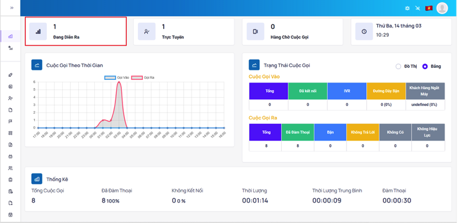
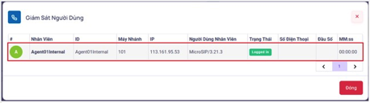
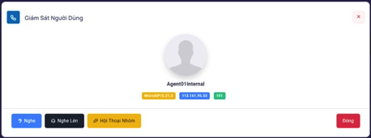

## Giám Sát Nhân Viên

### Bước 1: Người dùng với vai trò là Admin đăng nhập vào hệ thống cùng với một máy nhánh (extension) đã được cung cấp. Quan sát tình trạng trực tuyến của nhân viên chọn vào mục Đang Diễn Ra trong Dashboard



### Bước 2: Sau khi ấn vào mục Đang Diễn Ra sẽ thấy được số lượng nhân viên đang trực tuyến. Chọn vào nhân viên muốn thao tác



### Bước 3: Thực hiện các thao tác với cuộc gọi của nhân viên



```jsx title="Giải thích thông số"
- Listen: Admin/Supervisor nghe lén cuộc gọi
- Whisper: Admin/Supervisor đàm thoại với Nhân Viên
- Barge: Cuộc hội thoại 3 bên
```