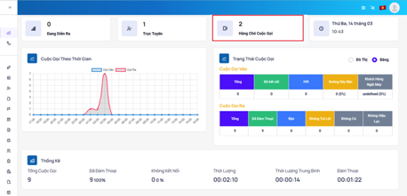
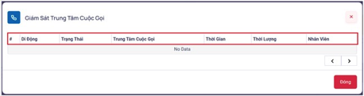

## Hàng Chờ Cuộc Gọi

### Bước 1: Người dùng với vai trò là Admin đăng nhập vào hệ thống cùng với một máy nhánh (extension) đã được cung cấp. Quan sát hàng chờ cuộc gọi vào và ra chọn vào mục Hàng Chờ Cuộc Gọi



### Bước 2: Trong bảng Hàng Chờ Cuộc Gọi sẽ hiện trạng thái tất cả các cuộc gọi đến



```jsx title="Giải thích thông số"
- Di động: hiển thị số điện thoại khách hàng.
- Trạng thái: các trạng thái khi cuộc gọi vào Hàng Chờ Cuộc Gọi bao gồm các trạng thái:
 + Connecting (Đang kết nối): Nhân viên đang nghe máy
 + Not Connected (Không kết nối): Không có nhân viên nào nhấc máy hoặc nhân viên huỷ cuộc gọi và phía thuê bao ngắt máy trước khi gặp nhân viên.
 + Waiting (Đợi): Cuộc gọi vào nhưng chưa nhân viên nào nhấc máy, trạng thái này sẽ tồn tại đến khi cuộc gọi kết thúc hoặc chuyển sang trạng thái Connecting.
- Trung tâm cuộc gọi:
- Thời gian: thời gian đàm thoại giữa nhân viên và khách hàng tính từ lúc cuộc gọi được kết nối giữa 2 bên.
- Thời lượng: tính từ lúc khởi tạo cuộc gọi đến lúc kết thúc cuộc gọi
- Nhân viên: hiển thị tên nhân viên.
```