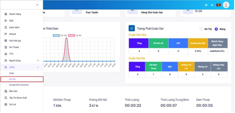
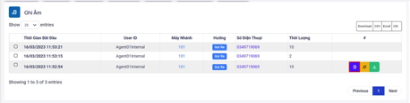
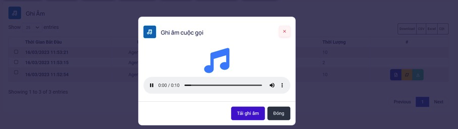
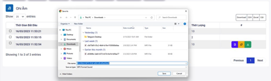

## Ghi Âm

### Bước 1: Truy cập vào thanh menu góc trái màn hình và nhấp chọn menu CDRs tiếp theo chọn vào mục Ghi âm


### Bước 2: Chọn vào bộ lọc những lựa chọn thông tin nào cần lọc.


```jsx tilte="Giải thích thông số"
- Extension: máy nhánh của nhân viên.
- Phone: số điện thoại khách hàng.
- Hotline: đầu số dùng để gọi ra.
- Direction: hướng cuộc gọi bao gồm 3 hướng chính là gọi ra, gọi vào và gọi nội bộ.
- Trạng thái: trạng thái cuộc gọi.
 + Answered: cuộc gọi đã được kết nối với thuê bao khách hàng.
 + No Answered: cuộc gọi không được thuê bao khách hàng nghe máy
 + Busy: khách hàng chủ động ngắt cuộc gọi tới
 + Busy line: Mobile gọi vào nhưng chưa được kết nối đến nhân viên (áp dụng cho chiến dịch Inbound, Autodialer)
 + IVR: Mobile gọi vào IVR chưa nhấn phím đã mobile ngắt máy (áp dụng cho chiến dịch Inbound, Autodialer)
 + Failed: Template lỗi, script lỗi, script bị xoá, hết key zalo.
 + Congestion: đầu số gọi bị nhà mạng chặn, bị khóa.
 + Cancel: cuộc gọi không được thuê bao khách hàng nghe máy và đúng thời gian quy định hồi âm chuông ngắt máy.
 + Invalid number: gọi ra tới nhà mạng nhưng nhà mạng báo sai số (số mobile sai)
 + Phone Block: số điện thoại khách hàng bị khóa.
 + Not available: số điện thoại khách hàng đang nằm trong vùng phủ sóng yếu, sim bị khoá, thiết bị hết pin, hư hỏng….
 + Voicemail: số điện thoại khách hàng có đăng ký hộp thư thoại khi gọi đến cuộc gọi được chuyển vào hộp thư thoại nên không thể thực hiện kết nối giữa nhân viên và khách hàng.
- Application: Ứng dụng vào cuộc gọi bao gồm các ứng dụng Dial, Autocall, Click to call, Inbound.
- Duration: thời lượng cuộc gọi tính từ lúc có tín hiệu chuông.
```

### Bước 3: Để nghe file ghi âm cuộc gọi, chọn vào nút có màu tím để nghe file ghi âm




### Bước 4: Để tải file ghi âm, chọn vào biểu tượng màu xanh lá để tải về file ghi âm.


