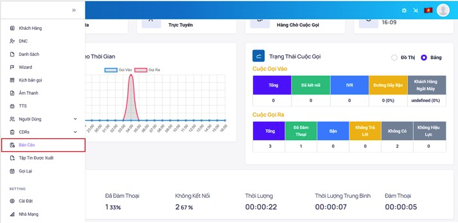
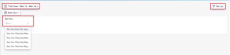
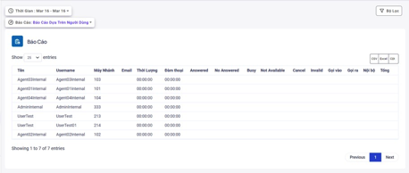
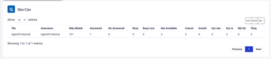
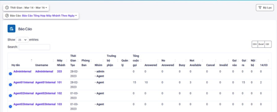
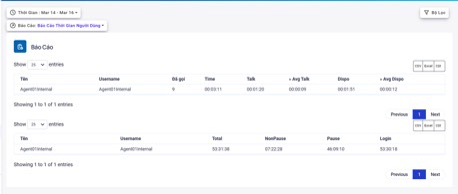
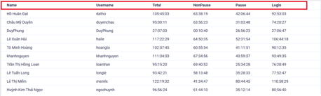
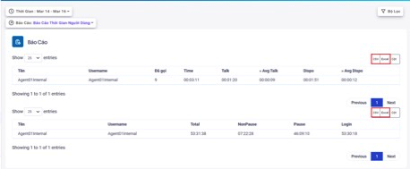
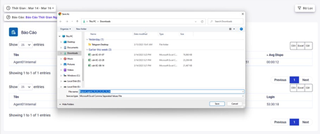

## Báo Cáo

### Bước 1: Truy cập vào thanh menu góc trái màn hình và nhấp chọn menu Báo Cáo.


### Bước 2: Chọn vào Báo cáo để chọn loại báo cáo và chọn thời gian muốn xuất báo cáo tại mục Thời gian. Sau đó chọn Bộ Lọc


#### Các loại báo cáo:

##### Báo cáo dựa trên người dùng
- Báo cáo dựa trên người dùng cung cấp các thông tin liên quan đến cuộc gọi của người dùng bao gồm các trạng thái cuộc gọi và cung cấp số liệu cụ thể mỗi cuộc gọi với từng trạng thái.


```jsx tilte="Giải thích thông số"
- Tên: Tên của nhân viên
- Username (Tên người dùng): thông tin tên người dùng dùng để đăng nhập hệ thống.
- Máy nhánh: số máy nhánh của nhân viên sử dụng để thực hiện cuộc gọi
- Thời lượng: tính từ lúc khởi tạo cuộc gọi đến lúc kết thúc cuộc gọi
- Đàm thoại: tính từ lúc nghe máy đến lúc kết thúc cuộc gọi
- Thống kê số lượng cuộc gọi theo trạng thái cuộc gọi: Answered, No Answered, Busy, Not Available, Cancel, Invalid
- Thống kê theo hướng cuộc gọi: Gọi vào, Gọi ra, Nội bộ
- Tổng: là tổng số cuộc gọi của nhân viên trong thời gian lọc
```

##### Báo cáo tổng hợp máy nhánh
- Báo cáo dựa trên người dùng cung cấp các thông tin liên quan đến cuộc gọi của người dùng bao gồm các trạng thái cuộc gọi và cung cấp số liệu cụ thể mỗi cuộc gọi với từng trạng thái.


```jsx tilte="Giải thích thông số"
- Ngày: ngày thống kê
- Họ tên: Tên của nhân viên
- Username (Tên người dùng): username của nhân viên sử dụng
- Máy nhánh: số máy nhánh của nhân viên sử dụng để thực hiện cuộc gọi
- Thống kê số lượng cuộc gọi theo trạng thái cuộc gọi:  Answered, No Answered, Busy, Not Available, Cancel, Invalid
- Thống kê theo hướng cuộc gọi: Gọi vào, Gọi ra, Nội bộ
- Tổng: là tổng số cuộc gọi của nhân viên trong thời gian lọc
```

##### Báo cáo tổng hợp máy nhánh theo ngày
- Cung cấp các thông tin liên quan đến cuộc gọi kèm tình trạng và nhân viên phụ trách bên cạnh đó có thêm thông tin bộ phận, phòng ban quản lý kèm theo thời gian cụ thể của từng số lượng cuộc gọi.


```jsx tilte="Giải thích thông số"
- Họ tên: Tên của nhân viên
- Username: username của nhân viên sử dụng
- Extension: số máy nhánh của nhân viên sử dụng để thực hiện cuộc gọi
- Ngày tạo: ngày user - extension được tạo
- Phòng ban: Phòng ban - Department trực thuộc
- Nhóm: nhóm của nhân viên trực thuộc
- Quản lý: các user có quyền quản lý nhân viên - các user được tạo với cấp độ / level Manager
- Trưởng bộ phận: user có quyền quản lý nhân viên - các user được tạo với cấp độ / level Leader
- Tổng số cuộc gọi: tổng số lượng cuộc gọi của nhân viên trong khoảng thời gian lọc
- Thống kê số lượng cuộc gọi theo trạng thái cuộc gọi:  Answered, No Answered, Busy, Not Available, Cancel, Invalid
- Thống kê theo hướng cuộc gọi: Gọi vào, Gọi ra, Nội bộ
```

##### Báo cáo thời gian người dùng
- Báo cáo cụ thể các thông tin liên quan đến hiệu suất làm việc của nhân viên gồm thời gian tổng, thời gian trung bình gọi, thời gian xử lý sau cuộc gọi và tổng số lượng cuộc gọi nhân viên gọi trong ngày.





```jsx tilte="Giải thích thông số"
- Tên: Tên của nhân viên
- Username (tên người dùng): tên đăng nhập của nhân viên dùng để đăng nhập hệ thống
- Đã gọi: số cuộc gọi đã thực hiện, đã nghe máy
- Time: là tổng thời thời gian đàm thoại (Talk) và thời gian xử lý sau cuộc gọi (Dispo).
- Talk (Đàm thoại): là thời gian nhân viên trong cuộc gọi, đàm thoại với khách hàng.
- Avg Talk (Đàm thoại trung bình): Thời gian trung bình nhân viên trong cuộc gọi, đàm thoại với khách hàng.
- Dispo: là thời gian nhân viên trong bảng chọn trạng thái cuộc gọi.
- Avg Dispo: Thời gian trung bình nhân viên trong bảng chọn trạng thái cuộc gọi
-Total (Tổng): là tổng thời gian nhân viên trên hệ thống
- Tạm ngưng: là tổng thời gian chờ cuộc gọi, đàm thoại và xử lý sau cuộc gọi
tạm ngưng: thời gian nhân viên trong trạng thái Tạm dừng, Tạm nghỉ ( Not-sẵn sàng, tạm ngưng)
- Login (Đăng nhập): là tổng của thời gian chờ cuộc gọi, xử lý sau cuộc gọi và tạm nghỉ (không tính thời gian đàm thoại)
- Nonpause: tổng thời gian chờ cuộc gọi, đàm thoại và xử lý sau cuộc gọi. 
- Pause: tổng thời gian tạm nghỉ của Agent.
```

### Bước 3: Xuất báo cáo cuộc gọi, chọn các mục CSV, Excel để xuất theo file csv hoặc excel. Print để in báo cáo cuộc gọi.


