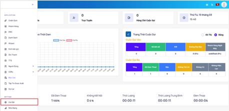
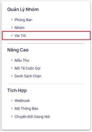
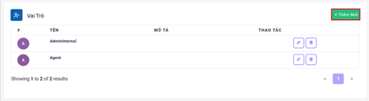
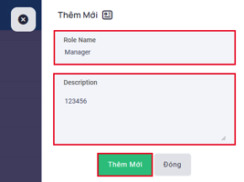
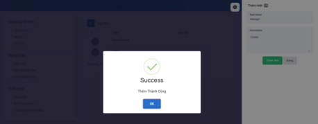
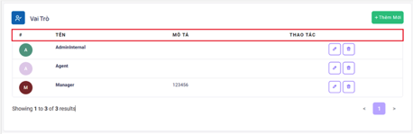
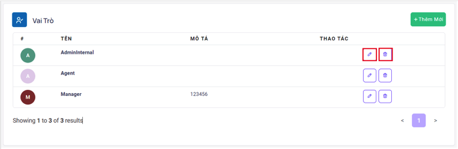
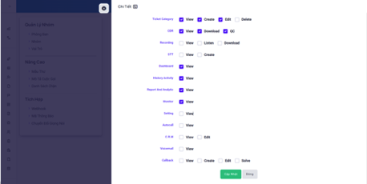
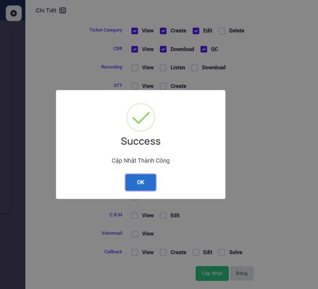
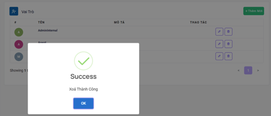

## Vai Trò - Role

Vai trò được sử dụng để tạo mới, điều chỉnh và giới hạn các quyền tương tác với hệ thống cho từng mức độ người dùng từ vị trí cao tới thấp. Căn cứ vào vai trò ở giao diện làm việc của mỗi người dùng tương ứng với mức độ của họ sẽ thay đổi ít nhiều.

### Bước 1: Truy cập vào thanh menu góc trái màn hình và nhấp chọn menu Cài Đặt.


### Bước 2: Hệ thống sẽ chuyển tới màn hình Cài Đặt. Chọn vào mục Vai Trò.


### Bước 3: Ấn vào Thêm Mới để khởi tạo Vai Trò mới và tiến hành điền các thông tin liên quan.




### Bước 4: Ấn Thêm Mới để hoàn tất quá trình tạo.




```jsx tilter="Giải thích thông số"
- Tên: hiển thị tên vai trò.
- Mô tả: dùng để mô tả, ghi chú phòng bạn đó phục vụ cho mục đích nhận biết phòng ban.
- Thao tác: có 2 thao tác chính là chỉnh sửa và xóa
```

### Bước 5: Chỉnh sửa hoặc xóa Vai Trò ấn vào biểu tượng cây bút để chỉnh hoặc biểu tượng thùng rác để xoá.


Chỉnh sửa Vai Trò, tại mục phân quyền tích vào để phân quyền cho vai trò để các người dùng thuộc vai trò này truy cập được vào các menu được phân quyền. Sau đó ấn Cập Nhật.





Xử lý tương tự cho các Vai trò khác như Leader. Riêng nhân viên chỉ cần phân quyền View - Download CDR, View - Listen - Download Recording để để nhân viên có thể sử dụng menu CDRs xem lịch sử cuộc gọi của nhân viên Site.


:::note MY NOTE
- All: full tất cả các quyền - sẽ hiển thị tất cả menu
- Mỗi user sẽ có 1 vai trò, vai trò sẽ quyết định các menu nào sẽ được truy cập
:::

- Xóa vai trò

