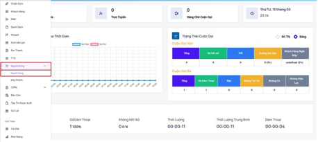

## Tạo Người Dùng

Tạo người dùng được sử dụng để tạo tài khoản thông tin nhân viên nhằm tương tác với hệ thống, thực hiện cuộc gọi ra và trực cuộc gọi vào. Người dùng sẽ được thiết lập dưới các vai trò khác nhau thông qua đó giao diện làm việc cũng sẽ thay đổi ít nhiều.
Tạo user sẽ có 2 cách: tạo manual từng user và import qua file excel

### TẠO NGƯỜI DÙNG THỦ CÔNG

### Bước 1: Truy cập vào thanh menu góc trái màn hình và nhấp chọn menu Người Dùng.


### Bước 2: Hệ thống chuyển tới giao diện Người Dùng. Ấn vào Thêm Mới để tạo người dùng mới.


### Bước 3: Tiến hành điền các thông tin cần thiết vào menu Tạo Mới


```jsx tilter="Giải thích thông số"
- ID: hiển thị tên dùng để đăng nhập hệ thống.
- Cấp bậc: cấp bậc của người dùng, mỗi cấp bậc khác nhau sẽ có các quyền thao tác với hệ thống khác nhau và bị giới hạn ở một số quyền trừ Admin.
 + Admin: cấp cao nhất trong 4 cấp có toàn quyền thao tác với hệ thống. Đứng ở vai trò Admin có thể xem được báo cáo của các cấp bậc Manager, Leader và theo dõi trạng thái hoạt động, hồ sơ cuộc gọi của nhân viên.
 + Manager: quyền thao tác với hệ thống sau Admin, truy cập được các menu phân trong vai trò, giám sát và xem báo cáo, hồ sơ cuộc gọi của các người dùng cấp Leader và nhân viên trong nhóm mà user được phân bổ.
 + Leader: truy cập được các menu được phân trong role, giám sát và xem báo cáo, hồ sơ cuộc gọi của các người dùng nhân viên trong nhóm mà người dùng được phân bổ.
 + Agent: user thuộc level này khi login sẽ được chuyển thẳng vào trang dành cho nhân viên.
- Vai trò: vai trò của user cần tạo - vai trò quyết định user có thể truy cập những menu nào - khuyến nghị để vai trò giống với cấp bậc của user
- Tên: hiển thị tên của nhân viên
- Email: email cá nhân của nhân viên - không bắt buộc điền.
- Mật khẩu: mật khẩu đăng nhập hệ thống
- Xác nhận mật khẩu: nhập lại mật khẩu đăng nhập.
- Kích hoạt: bật/tắt hoạt động của người dùng.
- Tạo máy nhánh: tạo máy nhánh gắn liền với người dùng.
- Máy nhánh: được hiểu như mã định danh của nhân viên được dùng để thực hiện cuộc gọi ra và đón cuộc gọi vào nếu có thiết lập.
- Dùng WebRTC: bật tính năng WebRTC nhân viên có thể thực hiện cuộc gọi ra ngoài và đón cuộc gọi vào trực tiếp trên giao diện Web.
```

### Bước 4: Ấn Thêm Mới để hoàn tất quá trình tạo Người Dùng


### TẠO NGƯỜI DÙNG VÀ THÊM NGƯỜI DÙNG VÀO GROUP ĐÃ TẠO QUA FILE EXCEL

### Bước 1: Truy cập vào thanh menu góc trái màn hình và nhấp chọn menu Người Dùng.


### Bước 2: Chuẩn bị file dùng để tải dữ liệu người dùng với các thông tin người dùng cần tạo.
Template Import User: [Download](https://docs.google.com/spreadsheets/d/1JH8JKsRsLuM1txnVAIMRQ1cf_VcxBvAv/edit#gid=1447860682)

```jsx tilte="Giải thích thông số"
- disabled: no: tạo user, yes: disable user
- group: Group của user, tạo group trên web admin. Các user chung group thì user nào level cao hơn sẽ quản lý được các user cấp thấp hơn. Nếu một user Leader, Manager nằm ở nhiều group thì sẽ format là: Group1, Group2, Group3. Vd: user "sale1" level nhân viên và user "TP1" level Leader chung group Khối 1, user TP1 level cao hơn nên TP1 sẽ quản lý được sale1
- role_name: có 4 option: Admin/ Leader/ Manager/nhân viên
- username: username login web Call Center Portal. Nguyên tắc: Không nhập dấu cách, không nhập chữ có dấu, không nhập ký tự đặc biệt
- password: password dùng để login trang Call Center Portal và để login thiết bị SIP (IPPhone, softphone) - nếu có tạo máy nhánh.
- extension: số máy nhánh để cấu hình trên thiết bị SIP (IPPhone, softphone) để nhân viên sử dụng để nghe gọi. Nếu để Yes nhưng không đặt số Extension thì hệ thống sẽ tự Generate ra số extension.
- last_name: tên nhân viên
- level: Có 4 level : 
 + agent: nhân viên
 + leader: Trưởng phòng, trưởng nhóm
 + manager: Phó giám đốc, quản lý
 + admin: Superadmin, Giám đốc
*** Lưu ý: level chữ thường, không dấu, không dư dấu cách, mỗi user chỉ có 1 level (agent/leader/manager/admin)
- create_extension: yes: có tạo máy nhánh cho user này hay không, no sẽ không tạo extension
- email: user phải có email để nhận mã QR đăng nhập
```

### Bước 3: Hệ thống chuyển tới giao diện Người Dùng. Ấn vào Tải Lên để có thể tải số lượng nhiều nhân viên lên cùng một lúc đồng thời tạo mới sau đó.


### Bước 4: Sau khi ấn Tải Lên hệ thống hiển thị bảng Import File ấn vào ô “Drag & Drop Your Files or Browse” để chọn File cần tải lên sau đó nhấn Open.


### Bước 5: Sau khi ấn Import hệ thống sẽ hiển thị một thông báo báo đã upload danh sách thành công


Nếu user đã tồn tại thì hệ thống chỉ update lại thông tin user và không tạo user mới


Nếu bị lỗi, hệ thống sẽ popup kèm thông tin lỗi - cần kiểm tra lại format của file import