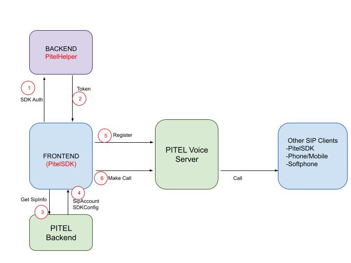

## Giới thiệu

Cùng với sự phát triển của công nghệ VoIP, nhu cầu về việc tích hợp tính năng thoại và video trên các ứng dụng ngày càng phổ biến và đa dạng. Tuy nhiên, việc lập trình các tính năng thoại tương đối phức tạp và tốn nhiều công sức đối với các developer, đặc biệt các developer không có nhiều kinh nghiệm về tổng đài.

Thấu hiểu được điều đó, hệ thống tổng đài Pitel cho ra đời PitelSDK (bộ kit phát triển) giúp cho các developer dễ dàng tích hợp tính năng thoại và video sử dụng tổng đài Pitel lên các ứng dụng web/mobile một cách nhanh chóng và tiện lợi mà không đòi hỏi nhiều logic phức tạp.

Mọi thắc mắc cũng như thông tin hỗ trợ, vui lòng liên hệ [support@tel4vn.com](mailto:support@tel4vn.com).

## Mô hình tổng quan

:::note MY NOTE
_BACKEND_ và _FRONTEND_ là server side và client side của ứng dụng cần tích hợp.  
PitelHelper_ được cung cấp dưới dạng module, cung cấp hàm tạo token từ API_KEY cho BACKEND.  
PitelSDK_ được cung cấp dưới dạng thư viện cho từng nền tảng: Web (JS), iOS, Android.  
_Pitel Backend_ Còn gọi là portal, quản lý SDK và xử lý hầu hết các tác vụ.  
_Pitel Voice Server_ Hệ thống voice Pitel.  
:::

:::warning ACTIVE  
Để sử dụng PitelSDK, mỗi ứng dụng sẽ được cấp một cặp API_KEY / API_SECRET (có thể đăng ký và tạo tại [https://portal.tel4vn.com](https://portal.tel4vn.com))  
Lưu ý: Bảo mật API_SECRET và không truyền xuống FRONTEND dưới mọi hình thức.
- *FRONTEND* sau khi chứng thực sẽ request để nhận token từ *BACKEND*, token này được tạo ra từ *API_KEY* và *API_SECRET* thông qua thuật toán được cung cấp bởi *PitelHelper*  
- Token này sẽ truyền vào *PitelSDK*, cùng với số máy nhánh (extension) để giao tiếp với *Pitel Backend*.    
- *PitelSDK* sau đó sẽ tự động kết nối SIP với Pitel Voice để thực hiện các tính năng thoại
:::
