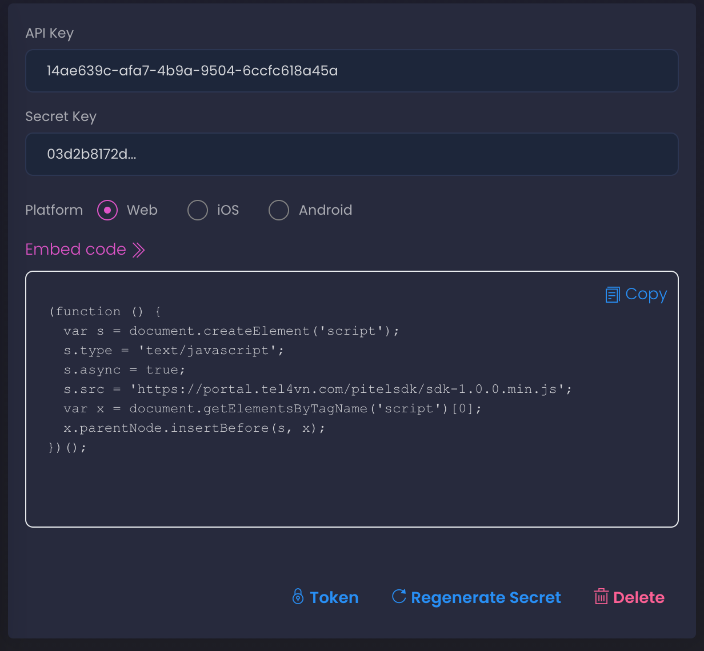

Để sử dụng PitelSDK cho ứng dụng, có thể thực hiện các bước đơn giản sau:

- Đăng nhập vào portal  
- Chọn project đã tạo trước đây  
- Chọn API_KEY đã tạo trước đó và copy đoạn Embed code nhúng vào website trước thẻ đóng &lt;/body&gt;



- Trong project, sau khi đã chứng thực và nhận được Token từ BACKEND, khởi tạo và sử dụng PitekSDK

*let pitelSDK = new PitelSDK(API_KEY, pitelToken, sipUsername, sipDelegates, sdkOptions)*

**Trong đó:**  
*API_KEY*: API_KEY đã tạo trên portal   
*pitelToken*: token được tạo ra sau khi chứng thực   
*sipUsername*: Sip account 
*sipDelegates*: Một object gồm các hàm callback để nhận các sự kiện được trả về từ SDK. Các hàm này là tùy chọn.  
*sipOptions*: Các tùy chọn cấu hình SDK gồm:   

Thuộc tính | Kiểu dữ liệu | Chi tiết
--------- | ------- | -----------
enableWidget | boolean | Sử dụng hoặc không sử dụng widget 
sipOnly | boolean | Tùy chọn sử dụng SDK thông qua pitel portal hoặc sip account 
sipDomain | string | Thông tin sip domain (Sử dụng khi sipOnly=true)
wsServer | string | Thông tin websocket (Sử dụng khi sipOnly=true)  
sipPassword | string | Thông tin sip password (Sử dụng khi sipOnly=true)


```javascript
const sipDelegates = {
 onRegistered: function() {
   console.log('SIP Register success!')
  //Demo call out, make sure SIP already registered
   pitelSDK.call('502');
 },
 onUnregistered: function() {
   console.log('SIP Unregister success!')
 },
 onCallReceived: function(remoteNumber) {
   //do something
 }
}

let pitelSDK = new PitelSDK(API_KEY, pitelToken, sipUsername, sipDelegates, sdkOptions)

```

**Các hàm Delegates:**

Các sự kiện được gọi thông qua delegates mô tả như bảng sau:  

Tên hàm | Tham số | Chi tiết
--------- | ------- | -----------
onRegistered | | | Được gọi khi đăng ký SIP đến voice server thành công
onUnregistered | | Được gọi khi hủy đăng ký SIP thành công
onCallReceived | | *remoteNumber*: số điện thoại hoặc số nội bộ đầu xa | Được gọi khi có cuộc gọi đến
onCallCreated | | *remoteNumber*: số điện thoại hoặc số nội bộ đầu xa | Được gọi khi cuộc gọi đang được thực hiện (gọi đi)
onCallAnswered | | Được gọi khi cuộc gọi thông thoại
onCallHangup | | Được gọi khi cuộc gọi kết thúc
onCallHold | held: true (tạm dừng), false (tiếp tục) | Được gọi khi cuộc gọi tạm dừng hoặc tiếp tục

**Các phương thức:**  
PitelSDK Web hỗ trợ các phương thức sau:

Tên hàm | Tham số | Chi tiết
--------- | ------- | -----------
call | *number*: số điện thoại hoặc số nội bộ được gọi | Thực hiện cuộc gọi đến số *number*
unregister | | Hủy đăng ký
decline | | Từ chối cuộc gọi đến
accept | | Trả lời cuộc gọi đến
hangup | | Kế thúc cuộc gọi
mute | | Tạm tắt kênh thoại chiều truyền đi, vẫn nghe âm thanh từ phía còn lại
unmute | Mở lại kênh thoại truyền đi, âm thanh 2 chiều
hold | | Tạm dừng cuộc gọi
unhold | Tiếp tục cuộc gọi sau khi tạm dừng
dtmf | *key*: phím dtmf cần gửi. Chấp nhận [0-9*#] | Gửi phím DTMF khi đang trong cuộc gọi