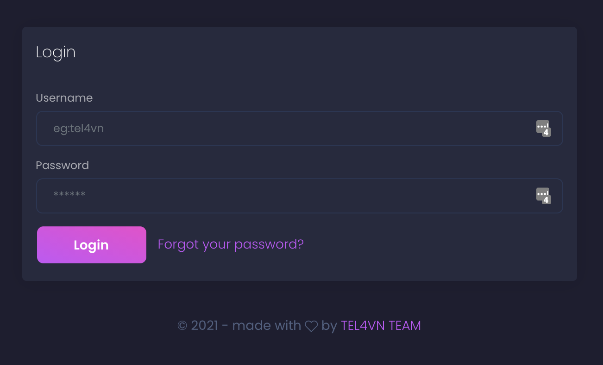
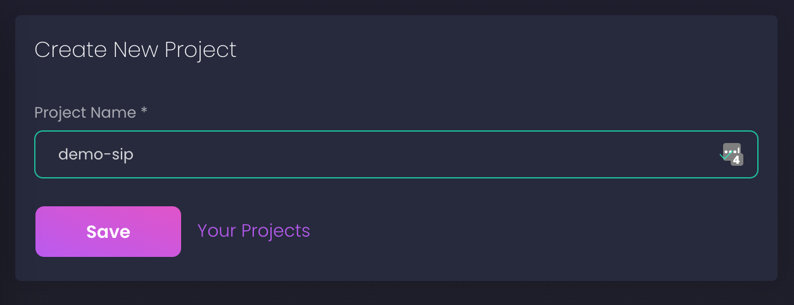
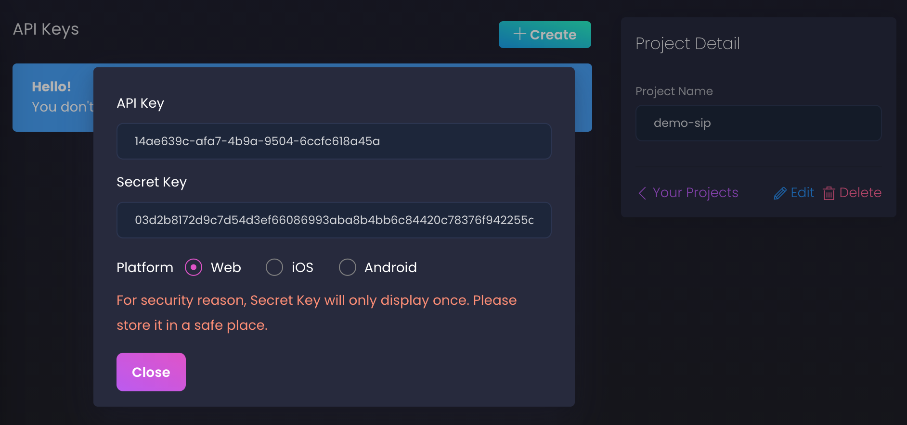

## Đăng ký API_KEY

Nhà phát triển (Developer) có thể dễ dàng đăng ký API_KEY thông qua portal

### Bước 1: Đăng nhập vào portal  
Truy cập vào trang [https://portal.tel4vn.com](https://portal.tel4vn.com) và tiến hành đăng nhập với username/password, nếu chưa có tài khoản thì tiến hành đăng ký.  

### Bước 2: Tạo một project mới  

### Bước 3: Tạo API_KEY cho project vừa tạo  
Chọn create API_KEY, sau đó lưu lại và cập nhật cho BACKEND để sử dụng.

